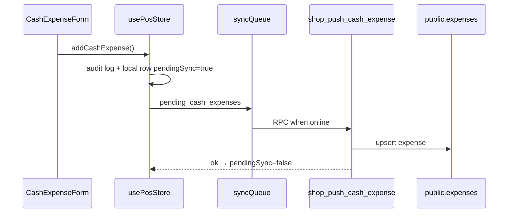

# Waka POS — Cash Expenses (Cash Withdrawals)

**Date:** 2026-05-28  
**Status:** Specification + schema migration (`069_cash_expenses.sql`). UI/sync implementation follows this doc.  
**User-facing name:** **Cash Expenses** (subtitle: *Record money taken from the drawer*)

---

## Problem

Cash leaves the drawer for lunch, transport, utilities, etc., without being recorded. Owners see sales vs counted cash mismatches and blame staff. This feature records each withdrawal so **expected cash** matches reality.

---

## 1. Database changes

### Existing foundation

- Table `public.expenses` exists (`006_receipts_expenses_subscriptions.sql`) with: `id`, `shop_id`, `category`, `amount_ugx`, `description`, `paid_on`, `created_by`, `created_at`.
- RLS: shop members read; **writes today require `user_can_manage_shop`** (owners/managers only).
- Monthly reporting already sums `expenses.amount_ugx` (`061` / `064`).
- Client type `Expense` exists in `src/types.ts` but **is not wired** into `usePosStore` yet; cloud pull only **counts** expense rows (no merge).

### Migration `069_cash_expenses.sql`

| Addition | Purpose |
|----------|---------|
| `expense_type text default 'cash_drawer'` | Distinguish drawer expenses from any future non-cash rows |
| `updated_at`, `updated_by` | Edit audit + incremental sync |
| `approved_by`, `approved_at` | Optional owner approval |
| `deleted_at` | Soft delete (audit trail preserved) |
| `recorded_by_staff_id`, `recorded_by_label` | Offline staff actor |
| `metadata jsonb` | Client sync flags, device id |
| Trigger `trg_expenses_updated` | Auto `updated_at` |
| `_report_cash_drawer_expenses_ugx(shop, start, end)` | Reporting helper (non-deleted, `cash_drawer` only) |
| `shop_push_cash_expense` | Transactional upsert RPC (cashier+) |
| Patched `shop_get_daily_sales_summary` | Adds `cash_expenses_ugx`, `expected_cash_in_drawer_ugx` |
| Patched `shop_get_monthly_sales_summary` | Expenses exclude soft-deleted rows |
| `shop_get_cash_expense_insights` | Today / week / month totals + top categories |

### Row shape (logical model)

| Field | Source |
|-------|--------|
| Expense ID | `id` (UUID, client-generated) |
| Shop ID | `shop_id` |
| Amount | `amount_ugx` |
| Category | `category` (text; preset or custom) |
| Description | `description` |
| Created By | `created_by` + `recorded_by_*` |
| Approved By | `approved_by` (optional) |
| Date | `paid_on` (Kampala date) + `created_at` |
| Updated At | `updated_at` |
| Sync Status | Client: `pendingSync` / `lastSyncError`; server row is source of truth after RPC |

### Phase 2 (not in `069`)

- **`cash_injections`** table (owner adds cash to drawer) for full formula:  
  `Expected = Cash sales − Expenses + Injections − Refunds`
- Expense receipt printing

---

## 2. Sync design

Mirror **sale returns** (`062` + `pushReturnToCloud` + `pending_returns` queue).



| Step | Detail |
|------|--------|
| **Offline** | Append to `cashExpenses[]` in persisted snapshot; queue `pending_cash_expenses` |
| **Push** | `shop_push_cash_expense(p_shop_id, payload)` — idempotent on `id` |
| **Pull** | Extend `pullExpensesIncremental` → full row merge into store (replace count-only) |
| **Immediate sync** | `syncCashExpenseImmediately(id)` after save (like sales) |
| **Backup / export** | Add `cashExpenses` to `PersistedSnapshot`, `buildExportEnvelope`, `cloudSnapshotSync` |
| **Checkpoints** | Use `updated_at` (after `069`) for `lastExpensesSyncAt` |
| **Multi-device** | Last-write-wins on `updated_at`; audit log for edits/deletes |

### Payload (push)

```json
{
  "id": "uuid",
  "category": "Lunch",
  "amount_ugx": 20000,
  "description": "Cashier lunch",
  "paid_on": "2026-05-28",
  "created_at": "2026-05-28T12:00:00.000Z",
  "recorded_by_staff_id": "staff:abc",
  "recorded_by_label": "Jane",
  "metadata": { "wakaClient": true }
}
```

### Queue kind

Add sync kind `pending_cash_expenses` (keep `pending_expenses` for **supplier payments** only).

---

## 3. Reporting changes

### Server RPC fields (daily)

After `069`, `shop_get_daily_sales_summary` returns:

| Field | Meaning |
|-------|---------|
| `cash_collected_ugx` | Cash from completed sales |
| `returns_refunds_ugx` | Cash refunds (returns) |
| `cash_expenses_ugx` | Sum of cash drawer expenses that day |
| `expected_cash_in_drawer_ugx` | `cash − returns − expenses` (+ injections when phase 2) |

### Client surfaces

| Surface | Change |
|---------|--------|
| **Reports page** | Show expenses line + expected cash for today/week/month |
| **Owner dashboard** | Cards: today / week / month expenses; top categories via `shop_get_cash_expense_insights` |
| **Close day / shift close** | Include day expenses in `expectedCashUgx` (`recordDayClose`, `shiftExpectedCash`) |
| **Profit view** | Keep P&amp;L `net_earnings` (profit − expenses) — already in monthly RPC |

### Weekly

Extend `shop_get_weekly_sales_summary` in a follow-up patch (same helper) with `cash_expenses_ugx` per day object optional — phase 1b if not in `069`.

---

## 4. Permission changes

New permissions in `src/lib/permissions.ts` (bump `PERM_MATRIX_VERSION`):

| Permission | Owner | Manager | Supervisor | Cashier | Stock |
|------------|:-----:|:-------:|:----------:|:-------:|:-----:|
| `expenses.record` | ✓ | ✓ | ✓ | configurable | — |
| `expenses.edit` | ✓ | ✓ | ✓ | — | — |
| `expenses.delete` | ✓ | — | — | — | — |
| `expenses.approve` | ✓ | — | — | — | — |

**Staff toggle** (`ShopPreferences`):

```ts
staffCanRecordCashExpenses?: boolean; // default false
```

When `true`, cashiers with `expenses.record` (granted via effective permissions helper) can open the form. Owners/managers always record.

**RLS alignment (`069`):**

- `SELECT`: `user_can_access_shop`
- `INSERT`: `user_is_cashier_or_above` (RPC is primary path)
- `UPDATE` / soft delete: `user_can_manage_shop`

**Audit actions** (extend `AuditAction`):

- `cash_expense_created`
- `cash_expense_updated`
- `cash_expense_deleted`

---

## 5. UI mockup

**Entry:** Office hub → **Cash Expenses** card (replaces “coming later” hint). POS quick action optional (v2).

```
┌─────────────────────────────────────────────┐
│  ← Office          Cash Expenses            │
│  Record money taken from the cash drawer    │
├─────────────────────────────────────────────┤
│  Today’s expenses          UGX 45,000       │
│  Expected cash in drawer   UGX 455,000      │
│     (sales UGX 500,000 − expenses)          │
├─────────────────────────────────────────────┤
│  [ + Record expense ]                       │
├─────────────────────────────────────────────┤
│  Today                                      │
│  ┌─────────────────────────────────────┐   │
│  │ Lunch          UGX 20,000    12:04  │   │
│  │ Cashier lunch · Jane                 │   │
│  └─────────────────────────────────────┘   │
│  ┌─────────────────────────────────────┐   │
│  │ Transport      UGX 25,000    09:15  │   │
│  └─────────────────────────────────────┘   │
└─────────────────────────────────────────────┘

┌─ Record expense (sheet) ────────────────────┐
│  Amount *     [ 20,000        ] UGX       │
│  Category *   [ Lunch        ▼]           │
│               [ Custom…      ]            │
│  Description  [ Cashier lunch ] (opt)     │
│  Recorded by  Jane (automatic)            │
│  Date         28 May 2026 (automatic)     │
│              [ Save expense ]             │
└───────────────────────────────────────────┘
```

**Owner dashboard snippet:**

```
┌──────────────────┐ ┌──────────────────┐
│ Today expenses   │ │ Top category     │
│ UGX 45,000       │ │ Lunch (3)        │
└──────────────────┘ └──────────────────┘
```

**Labels (EN):** Primary **Cash Expenses**; button **Record expense**; avoid “withdrawal” in main nav (use in help text if needed).

---

## 6. Categories

Default presets (align `EXPENSE_CATEGORIES` in `types.ts`):

- Lunch, Transport, Electricity, Water, Rent, Delivery, Cleaning Supplies, Airtime, Miscellaneous

**Custom:** If user picks “Other” or types in custom field, persist trimmed text (max 64 chars). No separate table in v1.

---

## 7. Cash reconciliation formula

**Shift / day close (client):**

```
expectedCash =
  cashSalesUgx
  - cashRefundsUgx
  - cashExpensesUgx
  + cashInjectionsUgx   // 0 until phase 2
```

**Server daily RPC (`expected_cash_in_drawer_ugx`):**

```
cash_collected_ugx - returns_refunds_ugx - cash_expenses_ugx
```

Variance at close: `countedCash - expectedCash` (unchanged UX, better expected).

---

## 8. Implementation phases

| Phase | Work |
|-------|------|
| **A** | Apply `069_cash_expenses.sql` |
| **B** | Types, permissions, store, audit, i18n |
| **C** | `CashExpensesPage` + office nav + dashboard widgets |
| **D** | Sync push/pull + snapshot/backup |
| **E** | Reporting UI + close-day integration |
| **F** | Weekly RPC + cash injections (optional) |

---

## 9. Test plan

### Database

- [ ] Insert expense via `shop_push_cash_expense` as cashier → success
- [ ] Same `id` twice → upsert, no duplicate
- [ ] Soft delete sets `deleted_at`; excluded from `_report_cash_drawer_expenses_ugx`
- [ ] Cross-shop `p_shop_id` → `forbidden`

### Sync

- [ ] Offline create → queued → online → `pendingSync` cleared
- [ ] Device A creates, device B pull → row appears
- [ ] Backup export/import includes `cashExpenses`

### Reporting

- [ ] Daily RPC: expenses reduce `expected_cash_in_drawer_ugx`
- [ ] Monthly `expenses_ugx` matches sum of drawer expenses
- [ ] Insights RPC: top categories ordered by amount

### Permissions

- [ ] Cashier + `staffCanRecordCashExpenses` off → no record button
- [ ] Cashier + toggle on → can create, cannot delete
- [ ] Owner can edit/delete; audit entries present

### Reconciliation

- [ ] Day with sales 500k, expense 20k → expected 480k (minus returns if any)
- [ ] Owner dashboard “today expenses” matches list total

### Regression

- [ ] Supplier `pending_expenses` queue still works
- [ ] Sales/returns sync unaffected

---

## 10. Files reference

| Area | Path |
|------|------|
| Migration | `supabase/migrations/069_cash_expenses.sql` |
| Spec | `docs/CASH_EXPENSES_FEATURE_SPEC.md` |
| Types (update) | `src/types.ts` |
| Permissions (update) | `src/lib/permissions.ts` |
| Store (implement) | `src/store/usePosStore.ts` |
| Sync (implement) | `src/offline/cloudSync.ts` |
| UI (implement) | `src/pages/CashExpensesPage.tsx` (new) |
| Prototype reference | `lovable-import/lovable-ui/src/routes/_authenticated/expenses.tsx` |
