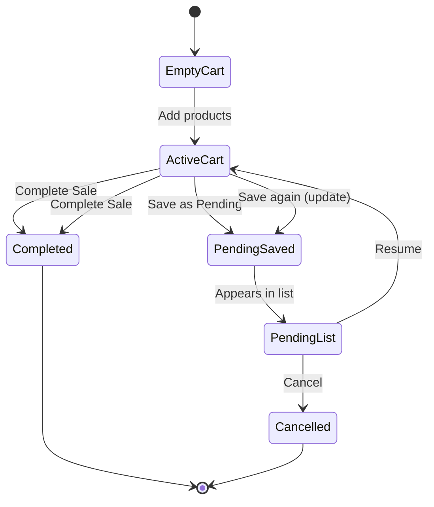

# WAKA POS — Pending Sales (Hold Cart) System

**Feature name (UI):** **Pending Sales**  
**Internal code / DB:** `sales.status = 'draft'` (already exists — UI never says “draft”)  
**Audience:** Ugandan kiosks, bars, restaurants, retail shops, pharmacies, boutiques  
**Goal:** One cashier serves many customers at once without losing carts or confusing the till.

---

## Executive summary

Today Waka POS assumes one customer → one cart → pay → done. Real shops hold carts while customers fetch money, order more at a table, or wait in line.

**Pending Sales** lets staff **save the current cart**, serve someone else, then **resume and complete** (or cancel) later.

Good news: the **database already models this** (`sales.status`: `draft | completed | void | refunded`). Stock on the server only moves when status becomes `completed`. Server reports already filter `status = 'completed'`. The main work is **client UX**, **local stock rules**, **sync RPCs**, and **report guards** on the app side.

---

## 1. UX design

### 1.1 Wording (business-friendly)

| Use | Avoid |
|-----|--------|
| Pending Sales | Draft Sale, Saved Cart |
| Save as Pending | Hold, Suspend transaction |
| Complete Sale | Finalize, Checkout (keep existing Complete Sale at payment) |
| Cancel Pending | Delete draft |
| Customer / Reference | Cart ID, Session |

### 1.2 Sell screen changes

**Checkout strip (when cart has items):**

```
[ Save as Pending ]     [ Complete Sale → ]
```

- **Save as Pending** — primary secondary action (amber/outline), always visible when lines > 0.
- Tap opens a **fast sheet** (one screen, no wizard):
  - **Reference** (optional, single field): placeholder *“Table 5, John, Red shirt…”*
  - **Save** (large) · **Back**
- No required fields — empty reference shows as **“Waiting customer”** in the list.

**If cart came from resuming a pending sale:**

- Show chip: `Pending · Table 5` with **× Cancel pending** (owner/manager or permitted staff).
- **Save as Pending** updates the same pending record (same ID).
- **Complete Sale** runs existing payment flow → marks **completed**.

**Guard — cart in progress vs pending list:**

- If user taps **Pending Sales** while current cart has unsaved lines → prompt:
  - *“Save this cart as pending first, or clear it to open another.”*
  - Actions: **Save as Pending** · **Clear cart** · **Stay here**

### 1.3 Pending Sales list

**Entry points:**

- Sell screen: badge button **Pending (3)** top-right (always visible to permitted roles).
- Optional: quick link on Home for owners (“3 pending sales”).

**List screen** (`/pending-sales` or modal full-screen on mobile):

| Column | Example |
|--------|---------|
| Reference | Table 2 · John · Waiting customer |
| Amount | UGX 35,000 |
| Items | 4 items |
| Time | 2:14 PM · Today |
| Cashier | Denis |

- Sort: **newest first**, then amount.
- Search/filter: reference text (client-side).
- Swipe / long-press actions: **Resume** · **Cancel** (permission-gated).
- Empty state: *“No pending sales. Use **Save as Pending** on Sell when a customer steps away.”*

### 1.4 Resume flow

1. Cashier taps a row → **Resume**.
2. If another cart is active → conflict prompt (see above).
3. Cart restores: lines, line discounts, cart discount, linked customer (if any).
4. User adds/removes items (bar/restaurant “+ 3 beers” case).
5. **Save as Pending** (update) or **Complete Sale**.

### 1.5 Bars & restaurants

- Reference field encourages **Table 3**, **VIP corner**, **Balcony**.
- Same pending sale ID across the evening — each resume **merges** new lines into existing pending record.
- Running total visible on list row and checkout strip.

### 1.6 Shops & kiosks

Typical phrases map to references:

| Customer says | Cashier types |
|---------------|---------------|
| “Keep these first” | Waiting customer |
| “Let me get money” | John |
| “I'm sending mobile money” | Mobile money · Grace |
| “Friend bringing cash” | Friend coming |
| “I'm coming back” | Coming back |

One tap save — no extra forms.

### 1.7 Cancelled pending

- **Cancel** sets status `cancelled` (DB: extend enum or map to `void` without payment — see §2).
- Confirmation: *“Cancel this pending sale? Items return to stock.”*
- No receipt, no revenue, audit log `pending_sale_cancelled`.

### 1.8 Settings (Owner → Selling or Shop)

**Pending sales**

- **Auto-remove pending sales after:** 24 hours · 3 days · **7 days (default)** · Never  
- **Staff can manage pending sales:** on/off (default **on** for cashier role when owner enables)

### 1.9 Mobile-first layout

```
┌─────────────────────────────┐
│  Sell          Pending (2) │  ← badge
├─────────────────────────────┤
│  [product grid]             │
├─────────────────────────────┤
│  Cart · UGX 28,000 · 5 items│
│  [ Save as Pending ] [ Pay ]│  ← 48px min height
└─────────────────────────────┘
```

- Pending list: full-screen sheet, large rows (min 64px), thumb-friendly actions.
- Reference input: numeric keyboard for table numbers; free text otherwise.

### 1.10 Flow diagram



---

## 2. Database design

### 2.1 What already exists

From `005_customers_and_sales.sql`:

```sql
status text check (status in ('draft', 'completed', 'void', 'refunded'))
payment_status text check (payment_status in ('pending', 'partial', 'paid', 'refunded'))
```

From `007_functions_and_triggers.sql`:

- Stock movements run only when `status` changes **to** `completed`.
- Pending/draft rows **do not** touch server stock.

From `061_shop_server_reporting.sql`:

- All revenue RPCs use `and s.status = 'completed'`.

**UI label:** Pending Sale · **DB value:** `draft` (no rename required).

### 2.2 Recommended migration `071_pending_sales.sql`

| Change | Purpose |
|--------|---------|
| Add `reference_label text` on `sales` | “Table 5”, “John” — fast cashier label |
| Add `expires_at timestamptz` on `sales` | Auto-cleanup target (null = use shop default at cancel job) |
| Add `cancelled_at timestamptz` | Audit / list filtering |
| Extend `status` check to include `'cancelled'` **or** reuse `'void'` for cancelled pending with `payment_status = 'pending'` and no payments | Prefer explicit `'cancelled'` for clarity |
| Index `(shop_id, status, updated_at desc) where status = 'draft'` | Fast pending list pull |
| Store `sold_by` / `reference` in `metadata` until columns exist | Backward-compatible client payloads |

**Metadata shape (client → server):**

```json
{
  "wakaClient": true,
  "referenceLabel": "Table 5",
  "soldByLabel": "Denis",
  "soldByUserId": "staff:abc",
  "pendingOnly": true
}
```

### 2.3 New RPC: `shop_push_pending_sale(p_shop_id, p_payload)`

Lightweight upsert — **no** `product_pre_stock`, **no** payments, **no** transition to `completed`.

- Insert/update `sales` with `status = 'draft'`, `payment_status = 'pending'`, `completed_at = null`.
- Replace `sale_line_items` for that sale id.
- **Does not** call stock triggers (status stays draft).

### 2.4 Complete from pending: extend `shop_push_sale_complete`

Accept optional flag `finalize_from_pending: true`:

1. If sale exists as `draft`, apply pre-stock + lines + payments as today.
2. Set `status = 'completed'`, `completed_at = now()` → trigger applies stock once.

Idempotent if already completed (existing behaviour).

### 2.5 Cancel RPC: `shop_cancel_pending_sale(p_shop_id, p_sale_id)`

- Allowed if `status = 'draft'`.
- Set `status = 'cancelled'`, `cancelled_at = now()`.
- Delete line items optional (or keep for audit — recommend keep with cancelled status).

---

## 3. Sync strategy

### 3.1 Client data model

Extend `Sale` type:

```typescript
type SaleStatus = 'pending' | 'completed' | 'cancelled'; // UI pending = DB draft

type Sale = {
  // ...existing fields...
  status: SaleStatus;           // default 'completed' for legacy rows
  referenceLabel?: string | null;
  expiresAt?: string | null;
  updatedAt?: string;
  soldByLabel?: string | null;
};
```

**Storage:**

- Option A (recommended): keep single `sales[]` array; filter helpers:
  - `completedSales(sales)` → reports, receipts, day close
  - `pendingSales(sales)` → pending list UI
- Migrate existing rows: `status: 'completed'` on hydrate if missing.

**Do not** use the old single `draftStorage` cart for multi-pending — keep `draftStorage` only for **in-progress** cart crash recovery (active session), keyed by optional `activePendingSaleId`.

### 3.2 Offline behaviour

| Action | Offline |
|--------|---------|
| Save as Pending | ✓ Local immediately, `pendingSync: true` |
| Resume | ✓ Pure local |
| Add items & save again | ✓ Upsert same id |
| Complete Sale | ✓ Local stock decrement + queue `shop_push_sale_complete` |
| Cancel | ✓ Local status + queue cancel RPC |

### 3.3 Sync queue

| Operation | Queue bucket |
|-----------|--------------|
| Save/update pending | `pending_sales` → `shop_push_pending_sale` |
| Complete | existing `pending_sales` / sale push |
| Cancel | `pending_sales_cancel` → `shop_cancel_pending_sale` |

Merge on pull: same as sales — **newer `updated_at` wins** per sale id. Device A saves pending, Device B pulls on sync → sees it in Pending list.

### 3.4 Pull / incremental sync

Include `status = 'draft'` (and `cancelled` if needed) in sale pull queries — today pull may only fetch completed; extend filter:

```sql
where shop_id = $1 and updated_at > $since
  and status in ('draft', 'completed', 'void', 'refunded', 'cancelled')
```

Client routes rows into correct UI buckets by status.

### 3.5 Backup & restore

- Include pending sales in `PersistedSnapshot.sales` (with status).
- Restore must not assign receipt numbers to pending rows.
- After restore, run expiry cleanup once.

### 3.6 Conflict rules

| Scenario | Resolution |
|----------|------------|
| Two devices edit same pending | Last `updated_at` wins (full cart replace) |
| Device A completes, Device B saves pending update | Server rejects update if already `completed` |
| Offline complete + offline cancel same id | Queue order + server status check |

---

## 4. Reporting impact

### 4.1 Must exclude pending

| Report | Rule |
|--------|------|
| Daily / weekly / monthly revenue | `status === 'completed'` only |
| Profit | completed only |
| Cash in drawer / day close expected cash | completed cash only |
| Owner dashboard KPIs | completed only |
| Receipts list | completed only (pending hidden) |
| Top products / slow movers | completed only |
| Cashier performance | completed only |

### 4.2 Client files to guard

- `src/lib/localReporting.ts` — add `isCompletedSale(s)` filter in `salesInRange` and aggregations
- `src/lib/monthlyBusinessReport.ts`
- `src/lib/homeProfit.ts` / dashboard widgets
- `src/store/usePosStore.ts` — `recordDayClose`, `scanTodaySalesHead` (receipt seq)
- `src/pages/ReportsPage.tsx`, `OwnerDashboardPage.tsx`, `ReceiptsPage.tsx`

### 4.3 Server

Already safe if using `061_shop_server_reporting.sql` RPCs (`status = 'completed'`).

### 4.4 Optional owner insight (v2, not v1)

Separate card: **“Pending right now: UGX X (N carts)”** — informational only, not revenue.

---

## 5. Mobile-first workflow (day in the life)

### Kiosk (two customers)

1. Customer A: sugar + soap in cart → customer steps out → **Save as Pending** → “Waiting customer”.
2. Customer B: served and **Complete Sale**.
3. Customer A returns → **Pending (1)** → **Resume** → **Complete Sale**.

### Bar (table service)

1. Table 3 first round → **Save as Pending** → “Table 3”.
2. Later: **Resume Table 3** → add 3 beers → **Save as Pending** (same row, UGX updates).
3. Close tab → **Resume** → **Complete Sale**.

### Restaurant

- Same as bar; reference = table number.
- Optional future: link to `customers` record when regular is known.

### Pharmacy / boutique

- “Keep these items” → reference = customer name or phone last 4 digits.
- Expiry default 7 days avoids stale holds clogging list.

---

## 6. Permissions

| Role | Create pending | Edit/resume | Complete | Cancel | Settings |
|------|----------------|---------------|----------|--------|----------|
| Owner | ✓ | ✓ | ✓ | ✓ | ✓ |
| Manager | ✓ | ✓ | ✓ | ✓ | ✓ |
| Supervisor | ✓ | ✓ | ✓ | ✓ | view |
| Cashier | configurable | configurable | ✓ (sell) | configurable | — |
| Stock keeper | — | — | — | — | — |

**New permission:** `pending_sales.manage`  
**Shop setting:** `staffCanManagePendingSales` (default `true`) — when false, cashiers can only complete their own active cart, not open Pending list (owner override).

Matrix update in `permissions.ts` v9:

```typescript
owner: [..., 'pending_sales.manage'],
manager: [..., 'pending_sales.manage'],
cashier: [..., 'pending_sales.manage'], // gated by staffCanManagePendingSales in UI
```

Audit actions:

- `pending_sale_saved`
- `pending_sale_resumed`
- `pending_sale_completed`
- `pending_sale_cancelled`
- `pending_sale_expired`

---

## 7. Stock & revenue rules (critical)

| Event | Stock | Revenue |
|-------|-------|---------|
| Save as Pending | **No change** (v1) | No |
| Update pending | No | No |
| Complete Sale | Decrement (local + server on sync) | Yes |
| Cancel pending | No change (never decremented) | No |
| Auto-expire | No | No |

**v1 note:** No soft-reservation of stock (keeps implementation simple). Optional v2: warn on Sell if product appears on another pending cart (“2 items held on other pending sales”).

**Client change required:** `finalizeDraftSale` today decrements stock immediately — split into:

- `savePendingSale()` — no stock movement
- `finalizeDraftSale()` — stock movement (unchanged)

---

## 8. Auto-cleanup

On app open + every 6 hours while app active:

```typescript
function expireStalePendingSales(sales, prefs) {
  const ttl = prefs.pendingSalesTtl ?? '7d';
  if (ttl === 'never') return;
  // cancel sales where status pending and createdAt/updatedAt older than TTL
}
```

Default TTL: **7 days**. Cancelled rows remain in audit/archive optional; hidden from default list.

---

## 9. Migration plan (rollout)

### Phase 0 — Design sign-off (this document)

- Confirm UI strings: **Pending Sales**, **Save as Pending**.
- Confirm no stock reservation in v1.

### Phase 1 — Database (1 migration, no pilot break)

1. Apply `071_pending_sales.sql` in Supabase staging.
2. Deploy RPCs: `shop_push_pending_sale`, `shop_cancel_pending_sale`.
3. Extend `shop_push_sale_complete` for draft → completed path.
4. Verify reporting RPCs still `completed`-only.

### Phase 2 — Client core (1 release)

1. Extend `Sale` type + hydrate defaults for legacy data.
2. Implement `savePendingSale`, `resumePendingSale`, `cancelPendingSale`.
3. Refactor stock: only on complete.
4. Pending Sales list UI + Sell screen buttons.
5. Reporting guards (`isCompletedSale`).
6. Sync queue + pull filter for draft rows.
7. Snapshot / backup / restore.
8. i18n EN + LG.

### Phase 3 — Settings & permissions

1. `pendingSalesTtl`, `staffCanManagePendingSales` in preferences.
2. Settings UI.
3. Expiry job on hydrate.

### Phase 4 — Pilot shops

1. Enable for 2–3 shops (bar + kiosk).
2. Train: *“Save as Pending = keep items while customer is away.”*
3. Monitor: pending count, time-to-complete, sync errors.

### Phase 5 — General availability

1. In-app tip on first empty pending list.
2. Optional short video in Support.

### Rollback

- Feature flag `preferences.pendingSalesEnabled` (default true after stable).
- If off: hide UI; existing draft rows remain in DB harmless; reports unchanged.

---

## 10. Implementation checklist (engineering)

| Area | Task |
|------|------|
| DB | `071_pending_sales.sql` |
| RPC | `shop_push_pending_sale`, cancel, complete-from-draft |
| Types | `Sale.status`, `referenceLabel`, `expiresAt` |
| Store | `savePendingSale`, `resumePendingSale`, `cancelPendingSale`, `expireStalePendingSales` |
| POS UI | Save button, reference sheet, pending badge |
| Page | `PendingSalesPage.tsx` |
| Sync | push/pull/merge draft sales |
| Reports | filter completed only (client) |
| Permissions | `pending_sales.manage` + staff toggle |
| i18n | pending* keys |
| Tests | save → resume → add → complete; offline queue; report exclusion |

---

## 11. Why this fits Ugandan retail

- **Interruption is normal** — mobile money delays, friends sent for change, queue at the counter.
- **Plain language** — “Pending Sales” matches how owners describe held items.
- **Fast input** — one optional field, no CRM required.
- **Multi-device shops** — sync lets back office or second phone see the same pending tab.
- **Honest till** — nothing hits revenue or stock until money is taken, matching how owners think about “real sales.”

---

## 12. Related code today

| Piece | Location | Gap |
|-------|----------|-----|
| Single crash-recovery cart | `src/offline/draftStorage.ts` | Not multi-customer |
| Complete sale + stock | `usePosStore.finalizeDraftSale` | Always completes |
| DB draft status | `005_customers_and_sales.sql` | Unused by client |
| Server stock trigger | `007_functions_and_triggers.sql` | Ready for pending → complete |
| Server reports | `061_shop_server_reporting.sql` | Already completed-only |
| Transactional sync | `063_shop_push_sale_transactional.sql` | Always finalizes to completed |

This feature closes the gap between **how Ugandan shops operate** and **how Waka POS records sales**.
