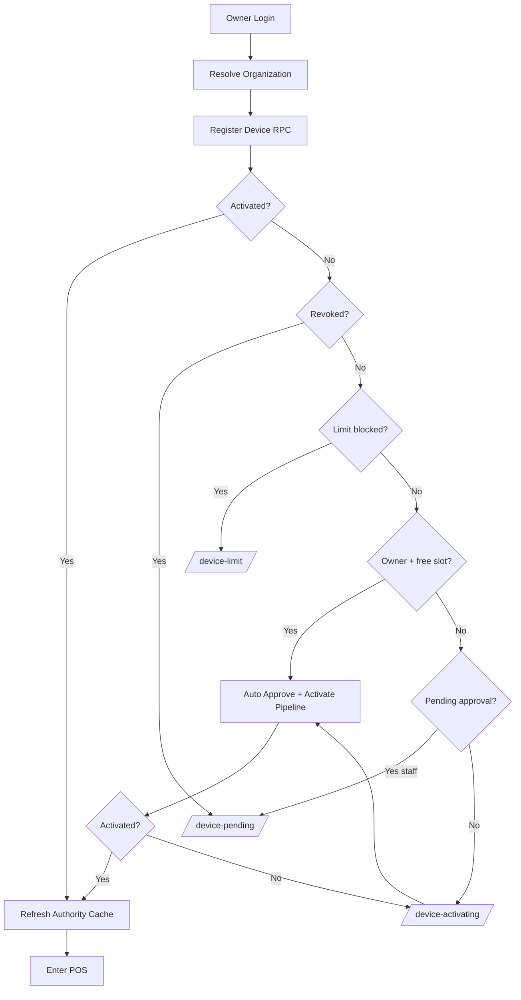

# Phase 20.2 — Enterprise Device Activation Completion

**Date:** July 2026  
**Status:** Complete  
**Build:** `npm run build` ✅  
**Tests:** `npm test` — 1574 passed ✅

---

## 1. Enterprise Device Activation Report

### Architecture after completion

The device lifecycle is **approval-based with automatic owner activation**. There is no Primary Device gate.

```
Owner Login
  → Resolve organization (shopId)
  → registerShopDeviceOnLogin (RPC 138)
  → If activated → refreshDeviceAuthorityContext → Enter POS

  → If not activated && owner && slot free:
      → tryOwnerApproveCurrentDevice (approve + ensure activation)
      → Retry pipeline (up to 3 attempts with backoff)
      → refreshDeviceAuthorityContext → Enter POS

  → If limit_blocked || at_limit → /device-limit (replacement only)
  → If staff/non-owner pending → /device-pending
  → If revoked → /device-pending (revoked state)
  → If owner + free slot + still failing → /device-activating (auto-retry UI)
```

### Key changes

| Area | Before (20.1A) | After (20.2) |
|------|----------------|--------------|
| Failed activation routing | Default `retry` → `/device-limit` | Only `limit` → `/device-limit` |
| Free-slot UX | "Connect this device" + optional disconnect | `/device-activating` with preparing/connecting copy |
| Owner bypass | Fake `activated: true` without cloud sync | Real approve + activate + authority refresh |
| Authority cache (cold) | Permissive (`true` when null) | Strict (`false` when null) |
| Store vs context | Could disagree | Unified via `refreshDeviceAuthorityContext` + subscribers |
| `OWNER_BYPASS_DEVICE_PENDING_ON_LOGIN` | Enabled | **Removed** |

---

## 2. Login Flow Diagram



---

## 3. Authorization Report

After successful activation, **the same authority cache** drives:

| Surface | Mechanism | Immediate after login? |
|---------|-----------|------------------------|
| POS entry | `DeviceActivationContext.activated` | ✅ |
| Staff Management | `DeviceApprovedGate` + `isDeviceAuthorizedForManagementSync` | ✅ (after refresh) |
| Backup | `authorizeBackupRestore` + `DeviceApprovedGate` | ✅ |
| Settings / Devices | Owner role + device list RPCs | ✅ |
| Store mutations | `isDeviceAuthorizedForManagementSync()` | ✅ (cache seeded on refresh) |

**Refresh chain:** `resolveLoginDeviceActivation` → `refreshDeviceAuthorityContext` → `subscribeDeviceAuthorityRefresh` → `DeviceAuthorityProvider.refresh()`.

---

## 4. Legacy Cleanup Report

### Removed

| Item | Location |
|------|----------|
| `OWNER_BYPASS_DEVICE_PENDING_ON_LOGIN` | `deviceAuthorityPolicy.ts` |
| `ownerBypass` outcome field | `deviceActivation.ts` |
| `showRetryPrimary` variable | `DeviceLimitReachedPage.tsx` |
| Free-slot disconnect UI | `DeviceLimitReachedPage.tsx` |
| `not_primary_device` rollback branch | `shopStaffCloud.ts` |
| Stale "primary device only" comment | `staffRecovery.ts` |
| Generic `retry` → `/device-limit` routing | `DeviceActivationGateOutlet.tsx` |

### Intentionally retained

| Item | Reason |
|------|--------|
| SQL stub RPCs (`primary_device_deprecated`) | Rollback / migration compat |
| `device_authority`, `is_primary` columns | Schema compat (138) |
| `registerModePrimaryDevice` i18n | Offline register mode (unrelated) |
| Legacy i18n keys (`deviceLimitSlotAvailable*`) | Unused but harmless; can drop in 20.3 |

### Added

| Item | Purpose |
|------|---------|
| `deviceActivationDiagnostics.ts` | Stage logging |
| `DeviceActivatingPage.tsx` | Free-slot activation UX |
| `refreshDeviceAuthorityContext()` | Post-activation cache sync |
| `subscribeDeviceAuthorityRefresh()` | Context notification |
| `deviceAuthorityTestFixtures.ts` | Test helper |

---

## 5. Regression Report

| System | Changed? | Notes |
|--------|----------|-------|
| Subscriptions | ❌ No | Plan limits unchanged |
| Permissions / RBAC | ❌ No | Same `settings.shop` gate |
| Sync engine | ❌ No | No cloudSync changes |
| POS selling | ❌ No | Activation gate only |
| Inventory / payments | ❌ No | Untouched |
| Internal Admin | ❌ No | Untouched |
| Multi-shop | ❌ No | `PrimaryShopSelector` unchanged |
| Offline register mode | ❌ No | `primaryRegisterMode.ts` unchanged |
| Device limits (SQL) | ❌ No | 138 RPCs unchanged |
| Approval workflow | ⚠️ Minor | Owner auto-approve on login when slot free (policy already existed) |

---

## 6. Verification

```
npm run build  ✅
npm test       ✅ 1574 passed
```

### Manual test checklist

- [ ] Owner login, first device → direct POS
- [ ] Owner login, 3/4 devices → `/device-activating` then POS (not `/device-limit`)
- [ ] Owner login, 4/4 devices → `/device-limit` with disconnect workflow only
- [ ] Staff login, pending device → `/device-pending`
- [ ] Staff Management immediately after owner login
- [ ] Backup immediately after activation
- [ ] Android cold launch + cleared WebView storage

---

## Files changed (summary)

- `src/lib/deviceActivation.ts` — activation pipeline rewrite
- `src/lib/deviceActivationDiagnostics.ts` — new
- `src/lib/deviceAuthority.ts` — refresh + strict cold cache
- `src/context/DeviceActivationContext.tsx` — block kinds + finalize
- `src/context/DeviceAuthorityContext.tsx` — refresh subscription
- `src/components/DeviceActivationGateOutlet.tsx` — routing
- `src/pages/DeviceActivatingPage.tsx` — new
- `src/pages/DeviceLimitReachedPage.tsx` — at-limit only
- `src/pages/DevicePendingApprovalPage.tsx` — owner redirect to activating
- `src/lib/deviceAuthorityPolicy.ts` — removed bypass flag
- `src/lib/shopStaffCloud.ts`, `src/lib/staffRecovery.ts` — cleanup
- `src/lib/i18n.ts` — activating strings
- `src/App.tsx`, `EmailVerificationGateOutlet.tsx` — route
- Tests updated for strict authority cache
