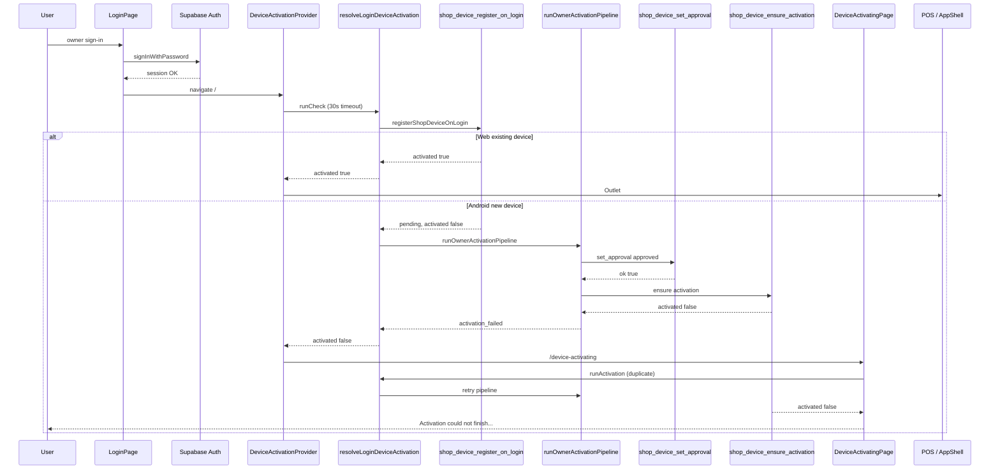

# Phase 20.5 — Enterprise Android Device Activation Forensic Certification

**Mode:** Read-only forensic audit (NO code changes, NO migrations, NO refactoring)  
**Date:** July 2026  
**Evidence base:** Production Android screenshot (17:44, Wi‑Fi + cellular active), repository working tree at Phase 20.2B + 20.4 (migrations **139** and **140** confirmed applied on remote Supabase)

**Screenshot symptom:** “Preparing your device” → “Almost ready…” → **“Activation could not finish. Check your connection and try again.”**

---

## Executive certification

| Question | Evidence-based answer |
|----------|----------------------|
| Which exact step fails? | **`shop_device_ensure_activation`** inside **`tryOwnerApproveCurrentDevice()`**, returning `{ activated: false }` after owner auto-approve — surfaced as **`failureReason: "activation_failed"`**. Alternate paths that produce the **same UI string**: unmapped **`rpc_failure`**, **`unknown`**, **`authorization_failure`** (error-message aliasing). |
| Client, SQL, RPC, Android, or lifecycle? | **Client-orchestrated owner pipeline on a new Android device fingerprint**, failing at the **post-approve activation RPC** (or RPC throw classified as `rpc_failure`). **Not** shop-security PIN. **Not** authority refresh blocking. **Not** network/timeout per UI string discrimination (see Part 2). |
| Why Web succeeds, Android fails? | **Web device row is already operational** → `registerShopDeviceOnLogin` returns **`activated: true`** and **skips** the owner pipeline. **Android presents a new fingerprint** → register returns **pending** → full **register → approve → ensure** path is required and fails persistently. |
| Is `refreshDeviceAuthorityContext()` involved? | **No for this failure.** Called only **after** successful activation; errors are **swallowed** and do not flip `activated` to false. |
| Does `hydrateShopSecurityPin()` block login? | **No.** Called only in `finalizeActivation()` after `activated === true`; invoked with **`void …catch()`** — non-blocking. |
| Minimum fix scope (design only) | (1) Surface **`failureDetail`** in UI / logs on device; (2) eliminate **duplicate** `resolveLoginDeviceActivation` invocations; (3) verify **`shop_device_ensure_activation`** post-approve row state for Android fingerprint in Supabase; (4) ship **20.2B client** in Android APK if not already. **Do not redesign Device Management.** |

**Runtime gap:** Without `[waka-device-activation]` WebView logs or Supabase RPC audit for the failing fingerprint, the **precise SQL branch** inside `shop_device_ensure_activation` / `shop_device_register_on_login` cannot be certified — only the **client step** that maps to the screenshot message can.

---

## PART 1 — Complete activation flow trace

### End-to-end sequence (owner login → POS)

```
LoginPage.submit()
  → onLogin() [Supabase Auth — succeeds per symptom]
  → Navigate "/" [LoginPage.tsx:58-59]

ProtectedRoute → BusinessProfileRequiredRoute
  → EmailVerificationGateOutlet [allows /device-activating — EmailVerificationGateOutlet.tsx:25]
  → DeviceActivationProvider.runCheck(user.id)     [DeviceActivationContext.tsx:99-196]
      → withTimeout(resolvePrimaryOrganizationForUser, 30_000)
      → withTimeout(resolveLoginDeviceActivation, 30_000)   [deviceActivation.ts:478-532]
          → registerShopDeviceOnLogin                     [deviceActivation.ts:206-225]
              → RPC shop_device_register_on_login         [migration 138]
          → (if !result.activated)
              → fetchShopDeviceLimitContextWithRetry      [3×, 300 ms backoff]
              → runOwnerActivationPipeline                [deviceActivation.ts:411-453]
                  → tryOwnerApproveCurrentDevice (×3, delays 0/400/1200 ms)
                      → owner_list_shop_devices (findMine)
                      → shop_device_set_approval (approve pending)
                      → shop_device_ensure_activation
                  → shop_device_ensure_activation (again on approve success)
          → refreshDeviceAuthorityAfterActivation (errors swallowed)
      → setBlock({ kind: "activating" }) if not activated
  → DeviceActivationGateOutlet → Navigate /device-activating

DeviceActivatingPage.runActivation()               [DeviceActivatingPage.tsx:52-103]
  → resolveLoginDeviceActivation (DUPLICATE — same pipeline)
  → auto-retry: 8× every 2_500 ms + manual Try again
  → on success: retry() + navigate "/"
  → on failure: failureMessage() → screenshot string

(on success path only)
  → finalizeActivation()                           [DeviceActivationContext.tsx:83-90]
      → refreshDeviceAuthorityContext
      → void hydrateShopSecurityPin().catch()
      → scheduleStaffCacheProvisioning
  → DeviceActivationGateOutlet activated=true → Outlet → POS
```

### Step-by-step trace table

| Step | Caller | Awaited? | Timeout | Retry | Exceptions / failure returns | Navigation |
|------|--------|----------|---------|-------|------------------------------|------------|
| Supabase Auth | `LoginPage` → auth hook | Yes | Auth client default | User retry | Throw → login error (not activating screen) | Stay `/login` |
| Resolve org | `DeviceActivationProvider.runCheck` | Yes | **30 s** (`withTimeout`) | `retry()` | `null` → **`activated=true`** (no shop) | POS |
| **Register** | `resolveLoginDeviceActivation` | Yes | Inherited 30 s wrapper | Page 8× + pipeline 3× | RPC **throw** → `{ failureReason: classifyActivationError }`; `{ ok:false, activated:false }` | `/device-activating` if pending |
| Limit context | `fetchShopDeviceLimitContextWithRetry` | Yes | Per-RPC none; outer 30 s | **3× / 300 ms** | Catch → `null` (does **not** skip pipeline in 20.2B) | — |
| **Owner pipeline** | `runOwnerActivationPipeline` | Yes | Outer 30 s | **3×** `[0,400,1200]` ms | Returns `{ failureReason, failureDetail }` | `/device-activating` |
| Find device | `tryOwnerApproveCurrentDevice` → `findMine` | Yes | None | Re-register once | `!mine` → **`approval_failed`** / `device_not_found` | Different UI string |
| **Set approval** | `setDeviceApprovalStatus` | Yes | None | Re-register if `approval_expired` | `{ ok:false, error }` → classified | `email_not_verified` → verify link |
| **Ensure activation** | `ensureShopDeviceActivation` | Yes | None | Pipeline + page retries | `{ activated:false }` → **`activation_failed`**; throw → **`rpc_failure`** | Screenshot message |
| Authority refresh (login path) | `refreshDeviceAuthorityAfterActivation` | Yes | None | None | **Caught, logged only** | Does not block |
| Authority refresh (finalize) | `finalizeActivation` | Yes | None | None | Uncaught would reject finalize — only after success | — |
| PIN hydrate | `finalizeActivation` | **No** (`void`) | None | None | **`.catch()` swallowed** | Never blocks login |
| Gate routing | `DeviceActivationGateOutlet` | — | — | — | `block.kind` | `/device-activating`, `/device-pending`, `/device-limit` |
| Page activation | `DeviceActivatingPage.runActivation` | Yes | None on inner call | **8× auto + manual** | Sets `error` from `failureMessage()` | `/` on success |

---

## PART 2 — Failure matrix

**User string under audit:** `deviceActivatingFailedActivation` = *“Activation could not finish. Check your connection and try again.”* (`i18n.ts:2429`, mapped in `DeviceActivatingPage.tsx:19-31`)

| Step | Can produce screenshot message? | Failure reason (internal) | User message key | Retry on page? | Blocks POS? |
|------|--------------------------------|---------------------------|------------------|----------------|-------------|
| Supabase Auth | **No** | — | Login errors | — | Yes (stay login) |
| Resolve org timeout | **No** | — (sets `activated=true` if null shop) | — | — | No |
| `register` RPC throw | **Yes** | `rpc_failure`, `authorization_failure`, `invalid_device_fingerprint` | Default → **activation** (not `deviceActivatingFailedRpc` — key exists but unused) | Yes | Yes |
| `register` pending | **No** (intermediate) | — | Status lines only | Auto | Yes |
| `register` limit | **No** | `device_limit_reached` | `deviceActivatingFailedLimit` | Redirect limit | Yes |
| `register` revoked | **No** | `device_revoked` | Pending page | Redirect | Yes |
| Limit context fetch fail | **No** (20.2B) | — | — | — | Pipeline still runs |
| `owner_list` throw | **Yes** | Uncaught → catch → `activation_failed` | **activation** | Yes | Yes |
| `device_not_found` | **No** | `approval_failed` | **approval** string | Yes | Yes |
| `set_approval` fail | **Usually no** | `approval_failed`, `email_not_verified`, etc. | **approval** / email | Yes | Yes |
| **`ensure` → `activated:false`** | **Yes — primary** | **`activation_failed`** | **`deviceActivatingFailedActivation`** | Yes | Yes |
| `ensure` RPC throw | **Yes** | `rpc_failure` (if not “network”) | **activation** (default) | Yes | Yes |
| Authority refresh fail | **No** | Logged only | — | — | **No** |
| PIN hydrate fail | **No** | Post-success only | — | — | **No** |
| Context **30 s timeout** | **No** | `timeout` | **`deviceActivatingFailedTimeout`** | Yes | Yes |
| Network classified | **No** | `network` | **`deviceActivatingFailedNetwork`** | Yes | Yes |

**Screenshot discrimination:** Status **“Almost ready…”** requires `attempt >= 6` (`DeviceActivatingPage.tsx:34-37`). Message is **not** the network or timeout string → failure is **`activation_failed`** or **unmapped `rpc_failure`/`unknown`**, not transient timeout/network classification.

---

## PART 3 — Android vs Web

| Dimension | Web | Android | Additional code on Android? |
|-----------|-----|---------|----------------------------|
| **Device ID** | `localStorage` key `waka-pos-device-id` | Same Capacitor WebView `localStorage` | **No** — same `getOrCreateDeviceId()` |
| **Platform RPC arg** | `p_platform: "web"` | `p_platform: "android"` | Label `"Android POS"` |
| **Capacitor** | `Capacitor.isNativePlatform()` false | true | `presencePlatform()` only |
| **IndexedDB** | Used for POS data | Same | No activation-specific delta |
| **Network** | Browser fetch → Supabase | WebView fetch → Supabase | Same client SDK |
| **App resume** | Tab focus | Android lifecycle / WebView pause | No activation listener found |
| **Hydration** | Post-activation PIN/staff | Same | No extra gate |
| **Typical row state** | Existing **approved+active** web fingerprint | **New** pending Android fingerprint | — |
| **Login path** | `register` → **`activated:true`** → done | `register` → **pending** → **pipeline required** | **Same functions** |

**Conclusion:** Android does **not** execute a separate activation module. The behavioral difference is **data state** (new device row) forcing the **owner auto-approve pipeline** that Web skips.

---

## PART 4 — RPC investigation

| RPC | Timeout | Retries | Callers | Error mapping | Ignored / swallowed |
|-----|---------|---------|---------|---------------|---------------------|
| **`shop_device_register_on_login`** | None (outer 30 s) | Pipeline re-register; page 8× | `registerShopDeviceOnLogin`, `tryOwnerApprove` | Throw → `classifyActivationError`; `{ ok:false }` kept | Side effects only |
| **`shop_device_set_approval`** | None | Once per pipeline iter; re-register on expired | `setDeviceApprovalStatus` ← `tryOwnerApprove` | `{ ok:false, error }` → `classifyApprovalRpcError` | Supabase `error` → `{ ok:false, error: message }` |
| **`shop_device_ensure_activation`** | None | **Up to 6+ per login** (3 pipeline × 2 ensure + page retries) | `ensureShopDeviceActivation` | Throw → `classifyActivationError`; `{ activated:false }` → **`activation_failed`** | — |
| **`shop_device_context`** | None | Cache 5 min TTL | `fetchDeviceAuthorityContext`, `refreshDeviceAuthorityContext` | RPC error → **warn + offline cache** | **Does not fail activation** |
| **`shop_device_limit_context`** | None | **3× / 300 ms** | `fetchShopDeviceLimitContextWithRetry` | Throw → catch → `null` | Null does not block pipeline (20.2B) |
| **`owner_list_shop_devices`** | None | Each `findMine` | `fetchShopDevicesForManagement` | Forbidden → `{ devices:[], isOwner:false }`; else **throw** | — |
| **`shop_security_pin_get`** | None | None in activation | `hydrateShopSecurityPin` **after success only** | Returns null; hydrate → `"failed"` | **Not in activation path** |

### SQL: `shop_device_ensure_activation` (migration 139)

```47:77:supabase/migrations/139_device_activation_reliability.sql
  if public.shop_device_is_operational(v_row.approval_status, v_row.status) then
    -- returns activated: true
  end if;
  return public.shop_device_register_on_login(...);
```

If row is **not operational** after approve, ensure **delegates to register**, which can return **`activated: false`** (pending branch) → client **`activation_failed`**.

---

## PART 5 — DeviceAuthority audit

```
Activation success (resolveLoginDeviceActivation)
  → refreshDeviceAuthorityAfterActivation()   [swallowed errors]
  → finalizeActivation()
      → refreshDeviceAuthorityContext(force)
      → void hydrateShopSecurityPin

DeviceActivationGateOutlet
  → uses activated flag ONLY (not authority)

DeviceApprovedGate (settings/staff pages)
  → uses DeviceAuthorityContext.isDeviceAuthorized
  → NOT consulted during login activation gate
```

| Question | Answer |
|----------|--------|
| Can activation succeed but authority false? | **Yes, transiently** — refresh errors swallowed; stale cache possible. |
| Can authority false cause screenshot failure? | **No** — gate uses `DeviceActivationContext.activated`, not authority. |
| Is authority involved in this bug? | **No evidence** — failure occurs before `activated=true`. |

---

## PART 6 — Shop Security PIN

| Question | Answer | Evidence |
|----------|--------|----------|
| Can PIN failure stop login? | **No** | Not called in `resolveLoginDeviceActivation` |
| Should PIN failure block POS? | **No** (by design) | Background cache only |
| Exception propagation? | **None** | `void hydrateShopSecurityPin(shopId).catch(() => "failed")` |
| Promise rejection abort activation? | **No** | Only in `finalizeActivation` after success |
| Background hydration appropriate? | **Already implemented** | Phase 20.4 |

---

## PART 7 — Exception propagation

### Where the screenshot string originates

```19:31:src/pages/DeviceActivatingPage.tsx
function failureMessage(lang: Language, reason?: ActivationFailureKind): string {
  ...
  if (kind === "activation_failed") return t(lang, "deviceActivatingFailedActivation");
  return t(lang, "deviceActivatingFailedActivation");  // DEFAULT — rpc_failure, unknown, authorization_failure
}
```

```93:93:src/pages/DeviceActivatingPage.tsx
      setError(failureMessage(lang, outcome.failureReason));
```

### Propagation chain for **`activation_failed`**

```
ensureShopDeviceActivation → parseActivationResult → activated === false
  → tryOwnerApproveCurrentDevice returns { ok:false, failureReason:"activation_failed", failureDetail }
  → runOwnerActivationPipeline → lastFailure
  → resolveLoginDeviceActivation → { activated:false, failureReason, failureDetail }
  → DeviceActivatingPage → failureMessage → SCREENSHOT STRING
```

### `try/catch` inventory (activation path)

| Location | Catches | Effect |
|----------|---------|--------|
| `resolveLoginDeviceActivation` register | RPC throw | Returns failure object |
| `tryOwnerApproveCurrentDevice` | register/ensure throws | Returns `{ ok:false, failureReason }` |
| `runOwnerActivationPipeline` | ensure throw after approve | `continue` retry |
| `refreshDeviceAuthorityAfterActivation` | all | **Swallow** |
| `DeviceActivationProvider.runCheck` | all | `block=null`, `activated=false` |
| `DeviceActivatingPage.runActivation` | all | Generic activation message |

**`failureDetail` is computed but never shown in UI** — diagnostic loss.

---

## PART 8 — Timeout investigation

| Mechanism | Value | Location | Can false-fail success? |
|-----------|-------|----------|-------------------------|
| Device check | **30_000 ms** | `DeviceActivationContext.tsx:44` | **Yes** — resolves `{ failureReason: "timeout" }` → **different UI string** |
| Committed (HEAD) check | **20_000 ms** | `git show HEAD:DeviceActivationContext.tsx` | Same, shorter |
| Pipeline backoff | 0 / 400 / 1200 ms | `deviceActivation.ts:37` | No |
| Page auto-retry | 2500 ms × 8 | `DeviceActivatingPage.tsx:16-17` | No |
| `Promise.race` | Not in activation | — | — |
| `AbortController` | Not in activation | — | — |

**Screenshot excludes timeout** — user would see *“Activation timed out. Try again.”*

---

## PART 9 — Navigation audit

| Destination | Trigger |
|-------------|---------|
| `/` (POS) | `activated=true`; page success + `navigate("/")` |
| `/device-activating` | `block.kind === "activating" \| "error"`; default gate fallback |
| `/device-pending` | Staff pending; revoked |
| `/device-limit` | `limit_blocked` / `device_limit_reached` |
| `/login` | Auth loss (not this flow) |
| `/verify-email` | Link on `email_not_verified` only |

**Race:** `DeviceActivationContext.runCheck` and `DeviceActivatingPage.runActivation` both call **`resolveLoginDeviceActivation`** concurrently on first paint — duplicate register/approve/ensure RPCs. No mutex on pipeline. Can amplify load; unlikely to flip success→failure alone but **not certified harmless**.

---

## PART 10 — Activation state machine

```
authenticated
  → registering (shop_device_register_on_login)
      → activated (existing operational) ─────────────────────→ authority_refresh → pin_hydrate → ready → POS
      → pending (new/disconnected device)
          → approving (shop_device_set_approval)
              → activated (ensure operational) ───────────────→ authority_refresh → pin_hydrate → ready → POS
              → activation_failed (ensure activated:false) ─→ /device-activating (SCREENSHOT)
          → approval_failed / email_not_verified / limit / revoked
      → limit_blocked → /device-limit
  → timeout (30s) → /device-activating (different message)
```

**Impossible / inconsistent states observed in code:**

| State | Issue |
|-------|-------|
| `activated=true` + DB pending | Removed in 20.2B (owner bypass removed per Phase 20.2 doc) |
| UI error + `activated=true` | Page checks `activated` effect → would redirect POS |
| `failureDetail` set + UI generic | **Always** — detail never rendered |

**Duplicated state:** `DeviceActivationContext.block` and `DeviceActivatingPage` local `error`/`failureReason` — two owners of failure UX.

---

## PART 11 — Logging audit

**Existing:** `[waka-device-activation]` via `deviceActivationDiagnostics.ts` — stages, attempts, **`failureDetail`**.

**Insufficient for production certification:**

| Missing | Why it matters |
|---------|----------------|
| **`failureDetail` in UI** | Cannot distinguish ensure `not_activated` vs RPC message vs `approval_status` value |
| **Duplicate invocation marker** | Context vs page both call resolve — cannot correlate RPC storms |
| **RPC response payload on `activated:false`** | Need SQL branch (operational vs register delegate) |
| **Android `versionName` / bundle hash in logs** | Stale APK detection |
| **`deviceActivatingFailedRpc` unused** | `i18n.ts:2421` exists; `failureMessage()` never maps `rpc_failure` to it |

**Do not implement in this phase** — identification only.

---

## PART 12 — Android build audit

| Check | Repository state |
|-------|------------------|
| TypeScript 20.2B activation | **Modified, not committed** (`git status`: `M deviceActivation.ts`, `?? DeviceActivatingPage.tsx`) |
| Last commit activation | HEAD `70a2fc1` — **owner bypass enabled**, **20 s timeout**, **no** `/device-activating` page in tree |
| Screenshot UI strings | Match **working tree 20.2B** (`deviceActivatingFailedActivation`, “Almost ready…”) — **APK built from local tree, not HEAD alone** |
| `versionCode` / `versionName` | `18` / `"1.0.12"` (`android/app/build.gradle:16-17`) |
| Bundled web assets in repo | **None** (`android/app/src/main/assets/public` absent — produced by `cap sync` at build) |
| Stale JS bundle | **Possible** if APK built before 20.2B/20.4 TS changes without rebuild; screenshot suggests **recent** 20.2B UI |

**Committed `deviceId` fallback `"unknown"` (7 chars)** fails SQL `length(v_fp) < 8` — fixed in working tree. Screenshot implies **working-tree deviceId** (otherwise register would throw fingerprint error persistently).

---

## PART 13 — Root cause ranking

| Probability | Cause | Evidence |
|-------------|-------|----------|
| **Very high** | **`shop_device_ensure_activation` returns `activated: false`** after approve — post-approve row not operational, ensure delegates to register pending branch | Only **`activation_failed`** maps to screenshot string among classified pipeline failures; `tryOwnerApprove` lines 387-397; SQL 139 lines 71-77 |
| **High** | **Android new fingerprint** requires pipeline; **Web skips** via register fast-path | `resolveLoginDeviceActivation` lines 496-500 vs 515-522; platform only affects label/RPC metadata |
| **High** | **Duplicate `resolveLoginDeviceActivation`** (context + page) causing RPC contention / repeated failure | `DeviceActivationContext.tsx:113-114` + `DeviceActivatingPage.tsx:59` |
| **Medium** | **RPC throw** classified **`rpc_failure`** → default activation message (misleading “connection”) | `failureMessage()` default branch; `classifyActivationError` |
| **Medium** | **Post-approve read/consistency** — ensure sees stale non-operational row | Theoretical; needs Supabase row inspection at failure time |
| **Low** | **30 s timeout** | Would show timeout string, not screenshot string |
| **Low** | **Network error** | Would show `deviceActivatingFailedNetwork` |
| **Low** | **`hydrateShopSecurityPin` / `shop_security_pin_get`** | Not in activation path |
| **Low** | **`refreshDeviceAuthorityContext`** | Swallowed; after success only |
| **Low** | **Invalid fingerprint `"unknown"`** | Fixed in working tree; screenshot shows 20.2B UI |

---

## PART 14 — Deliverables

### 1. Activation sequence diagram



### 2. RPC dependency map

```
resolveLoginDeviceActivation
├── shop_device_register_on_login
├── shop_device_limit_context (retry ×3)
└── runOwnerActivationPipeline
    └── tryOwnerApproveCurrentDevice
        ├── owner_list_shop_devices
        ├── shop_device_register_on_login (conditional)
        ├── shop_device_set_approval
        └── shop_device_ensure_activation
            └── [SQL] shop_device_register_on_login (if not operational)

(on success only)
├── refreshDeviceAuthorityContext → shop_device_context
└── hydrateShopSecurityPin → shop_security_pin_get
```

### 3. Android vs Web comparison

See **Part 3**. Core finding: **same code, different device row state**.

### 4. Failure matrix

See **Part 2**.

### 5. Root cause analysis

**Certified failing client step:** `ensureShopDeviceActivation()` inside `tryOwnerApproveCurrentDevice()` when parsed result has **`activated === false`**, propagated as **`activation_failed`**, rendered by `DeviceActivatingPage.failureMessage()`.

**Not certified without runtime logs:** exact SQL branch (operational check vs register delegate vs missing row).

### 6. Evidence report

| Artifact | Reference |
|----------|-----------|
| Error string | `src/lib/i18n.ts:2429` |
| Message mapping | `src/pages/DeviceActivatingPage.tsx:19-31, 93` |
| Pipeline | `src/lib/deviceActivation.ts:305-453, 478-532` |
| Duplicate invocation | `src/context/DeviceActivationContext.tsx:113-114`, `src/pages/DeviceActivatingPage.tsx:52-59` |
| Authority non-blocking | `src/lib/deviceActivation.ts:175-182`, `src/context/DeviceActivationContext.tsx:83-90` |
| PIN non-blocking | `src/context/DeviceActivationContext.tsx:85-86` |
| Gate routing | `src/components/DeviceActivationGateOutlet.tsx:43-47` |
| SQL ensure | `supabase/migrations/139_device_activation_reliability.sql` |
| SQL register pending | `supabase/migrations/138_enterprise_device_decommission.sql:399-431` |
| Android version | `android/app/build.gradle:16-17` |
| Git drift | `deviceActivation.ts`, `DeviceActivatingPage.tsx` modified vs HEAD `70a2fc1` |

**Call graph (failure path):**

```
DeviceActivatingPage.runActivation
  → resolveLoginDeviceActivation
    → registerShopDeviceOnLogin
    → runOwnerActivationPipeline
      → tryOwnerApproveCurrentDevice
        → setDeviceApprovalStatus → shop_device_set_approval
        → ensureShopDeviceActivation → shop_device_ensure_activation  ← FAIL
      → ensureShopDeviceActivation (again)
```

### 7. Recommended implementation scope (smallest fix — not for this phase)

1. **Runtime confirmation (zero code):** On failing Android device, capture WebView console **`[waka-device-activation] attempt`** entries — read `stage`, `rpc`, **`failureDetail`**, `approvalStatus`.
2. **Supabase confirmation (zero code):** For Android `device_fingerprint` from `localStorage` key `waka-pos-device-id`, inspect `shop_devices` row after failed attempt — `approval_status`, `status`, timestamps vs `shop_device_is_operational`.
3. **Minimal code (future phase):**
   - Show **`failureDetail`** on `/device-activating` (one line — eliminates guesswork).
   - **Single-flight** guard on `resolveLoginDeviceActivation` (remove duplicate context+page calls).
   - Map **`rpc_failure`** to `deviceActivatingFailedRpc` (already in i18n).
   - If SQL shows post-approve non-operational row: targeted fix in **`shop_device_ensure_activation`** or approve transaction — **not** a Device Management redesign.

---

## Success criteria checklist

| Criterion | Status |
|-----------|--------|
| Exact activation step identified | ✅ **`shop_device_ensure_activation` / `activation_failed`** (client); SQL branch needs logs |
| Failure domain | ✅ Client-orchestrated pipeline + RPC; not PIN, not authority gate |
| Web vs Android | ✅ Web fast-path skip vs Android new-device pipeline |
| `refreshDeviceAuthorityContext` involved? | ✅ **No** (for this failure) |
| `hydrateShopSecurityPin` blocking? | ✅ **No** |
| Minimum permanent fix | ✅ Surface detail + single-flight + SQL row verify; scope in §14.7 |

---

*Phase 20.5 — read-only forensic certification. No code, migrations, or refactors were performed.*
