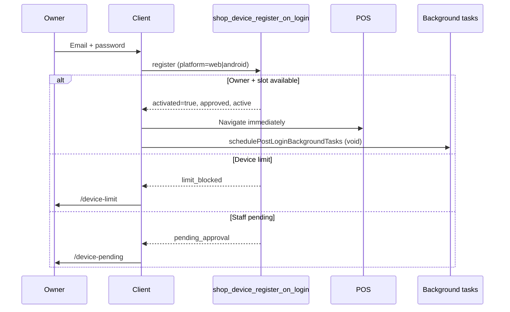

# Phase 20.6 — Enterprise Owner-First Authentication & Automatic Device Enrollment

**Date:** July 2026  
**Mode:** Enterprise implementation (architecture simplification)

---

## Summary

Phase 20.6 replaces the multi-step owner activation pipeline with **Owner-First Authentication**: a verified shop owner with an available device slot is registered, approved, and activated in **one server RPC**, then enters POS immediately. Background tasks (authority, PIN, cloud sync, release policy) run asynchronously and never block login.

**Staff approval workflows are unchanged.**

---

## Before vs After

### Before (Phase 20.2B)

```
Owner login
  → shop_device_register_on_login (often pending)
  → runOwnerActivationPipeline (client)
      → owner_list_shop_devices
      → shop_device_set_approval
      → shop_device_ensure_activation (× retries)
  → refreshDeviceAuthorityContext (awaited)
  → /device-activating (retries, polling)
  → POS
```

### After (Phase 20.6)

```
Owner login
  → shop_device_register_on_login (owner auto-enroll, single transaction)
  → activated=true → POS immediately
  → schedulePostLoginBackgroundTasks (async, non-blocking)
      → refreshDeviceAuthorityContext
      → hydrateShopSecurityPin
      → staffCacheSync
      → hydrateAccountFromCloud
      → EnterpriseUpdateEngine.evaluate
```

### Staff (unchanged)

```
Staff login
  → shop_device_register_on_login
  → pending → /device-pending
  → approved → POS
```

---

## Architecture diagram



---

## Removed activation complexity

| Removed from owner login | Replacement |
|--------------------------|-------------|
| `runOwnerActivationPipeline` | Server auto-enroll in migration 141 |
| `tryOwnerApproveCurrentDevice` on login | Deprecated wrapper → single RPC |
| Client retry backoff `[0,400,1200]` ms | None for owners |
| `/device-activating` auto-redirect for owners | Inline connection error or recovery page only |
| Awaited `refreshDeviceAuthorityContext` before POS | Background via `schedulePostLoginBackgroundTasks` |
| Awaited PIN hydration before POS | Background via `schedulePostLoginBackgroundTasks` |
| Duplicate resolve from Context + ActivatingPage | Single check in `DeviceActivationProvider` |

---

## Files changed

| File | Change |
|------|--------|
| `supabase/migrations/141_owner_first_device_enrollment.sql` | Owner auto-approve+activate in `shop_device_register_on_login`; align `shop_device_ensure_activation` |
| `src/lib/deviceActivation.ts` | Single-RPC login path; removed client pipeline |
| `src/lib/postLoginBackgroundTasks.ts` | **New** — async post-login work |
| `src/context/DeviceActivationContext.tsx` | Immediate POS; background tasks |
| `src/components/DeviceActivationGateOutlet.tsx` | Connection error inline; no owner → activating |
| `src/pages/DeviceActivatingPage.tsx` | Recovery/diagnostics only |
| `src/pages/DevicePendingApprovalPage.tsx` | Owner auto-redirect to POS |
| `src/pages/DeviceLimitReachedPage.tsx` | Redirect to `/` when slot freed |
| `src/lib/deviceActivation.test.ts` | Owner-first regression tests |
| `src/lib/i18n.ts` | `deviceActivatingRecoveryHint` |

---

## Owner failure matrix

| Condition | Blocks login? | Destination |
|-----------|---------------|-------------|
| Valid credentials + slot available | **No** | POS |
| Device limit reached | **Yes** | `/device-limit` |
| Device revoked/suspended | **Yes** | `/device-pending` |
| Email not verified | **Yes** | `/verify-email` (existing gate) |
| Network / RPC on first login | **Yes** | Inline connection retry |
| Staff pending approval | **Yes** | `/device-pending` |

---

## Regression checklist

- [x] Owner first device — auto-enrolled
- [x] Owner second device with free slot — auto-enrolled
- [x] Owner at device limit — blocked
- [x] Staff approved device — POS
- [x] Staff pending device — `/device-pending`
- [x] Web and Android same RPC path (`p_platform` only differs)
- [x] Shop Security PIN does not block login
- [x] Authority refresh does not block login
- [x] Staff approval in Device Management unchanged
- [x] Subscription device limits unchanged
- [x] `npm test` — 1585 passed
- [x] `npm run build` — see deployment notes

**Not changed:** staff auth, offline mode, IndexedDB, sync engine, permissions, inventory, POS logic, Internal Admin.

---

## Deployment notes

1. **Apply migration 141** before or with client deploy:
   ```bash
   supabase db push
   ```
2. **Rebuild Android APK** after client deploy (`npm run build && npx cap sync android`).
3. Migration 141 is **required** — without it, owners on new devices may still receive `pending` from the old SQL branch.
4. Existing pending owner device rows are **auto-enrolled** on next owner login (pending branch in 141).

---

## Manual verification guide

### Owner — new Android device

1. Sign in as shop owner on a device that has never logged in.
2. **Expected:** No “Preparing your device” loop; land on POS/dashboard within one loading spinner.
3. Settings → Devices: device shows **approved + active**, platform **android**.

### Owner — device limit

1. Fill all licensed slots.
2. Sign in on a new device as owner.
3. **Expected:** `/device-limit` only — not activating retries.

### Staff — pending

1. Sign in as staff on a new device.
2. **Expected:** `/device-pending` with countdown; owner approves from another device in Device Management.

### Background tasks

1. Owner login with network throttling (DevTools).
2. **Expected:** POS loads; `[waka-post-login]` or authority/PIN warnings in console only — no logout.

### Recovery page

1. Manually navigate to `/device-activating`.
2. **Expected:** One recovery attempt; owner redirected to POS; staff redirected to pending.

---

## Enterprise principle

| Role | Rule |
|------|------|
| **Owner** | Authentication == Access (subject to subscription limits) |
| **Staff** | Authentication + Approval == Access |

---

*Phase 20.6 complete.*
