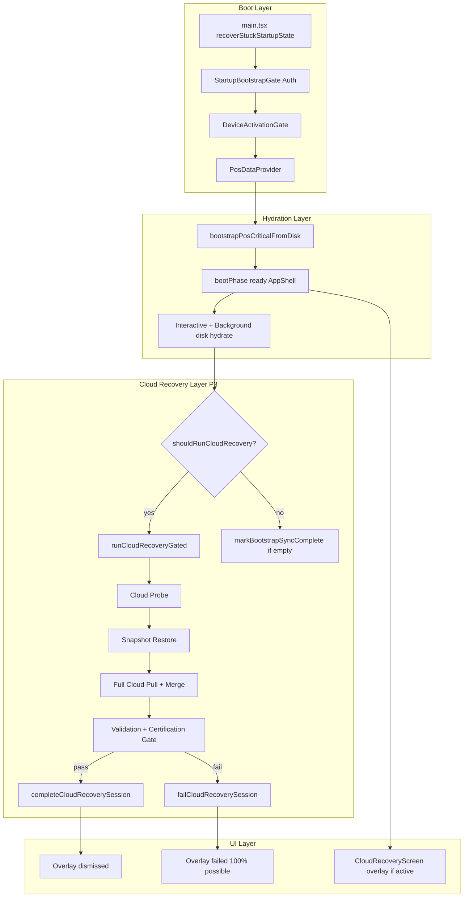
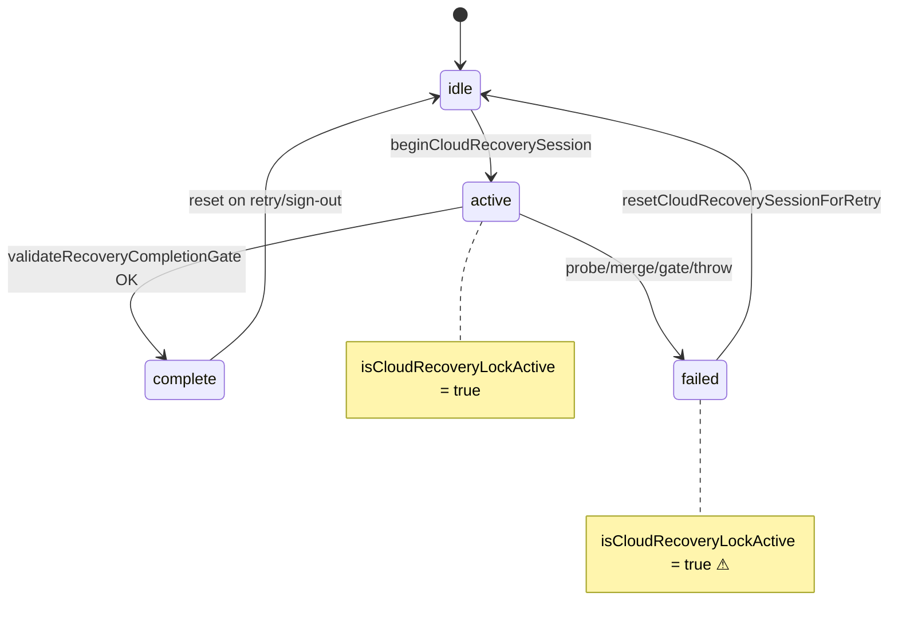

# Phase 24.1BA — Enterprise Cloud Recovery Forensic Certification

**Mode:** Read-only forensic audit (no code changes)  
**Date:** 2026-07-13  
**Builds on:** Phase 24.0 performance cert, Phase 24.1A instant shell, Phase 24.1B sync engine  
**Scope:** Complete cloud recovery pipeline — login, second device, empty bootstrap, reinstall, snapshot, incremental, background, retry, checkpoints, hydration, IndexedDB, progress UI, Android/Web/Windows

---

## Executive Summary

WAKA POS has a **sophisticated, fail-closed cloud recovery architecture** with snapshot acceleration, paginated full pull, multi-layer validation, cloud trust certification, and integrity diagnostics. It exceeds many mid-market POS systems in **diagnostic depth and data integrity rigor**.

However, it **does not yet behave like a tier-1 enterprise POS recovery engine** in three critical ways:

1. **Progress is decoupled from success** — the UI can show **100%** while recovery has not passed validation (Deliverable 4).
2. **Recovery still blocks POS operation** via a full-screen overlay and a lock that persists in **`failed`** state — even when substantial data was restored (Deliverables 3, 5).
3. **Recovery is monolithic** — modules are not independently committed, retried, or resumed; a late validation failure discards the user's perception of success even when IndexedDB already contains usable data (Deliverables 7–9).

**Overall Cloud Recovery Enterprise Readiness: 6.8 / 10**

| Dimension | Score | Notes |
|-----------|-------|-------|
| Data integrity / fail-closed | 9.0 / 10 | Strong gates, certification, parity rules |
| Diagnostic observability | 8.5 / 10 | Session state, integrity diagnostics, startup logs |
| Time-to-interactive POS | 7.5 / 10 | Phase 24.1A improved shell; overlay still blocks use |
| Progress honesty | 4.5 / 10 | 100% before validation completes |
| Resumability / partial success | 5.0 / 10 | Retry restarts from zero |
| Enterprise POS parity | 6.5 / 10 | Leading systems defer non-critical modules |

**Verdict: 🟡 Conditionally Certified — integrity-first, UX/resilience gap**

Target after Phase 24.1BB: **8.8–9.2 / 10** without redesigning offline-first architecture.

---

## Certification Methodology

1. Static code-path tracing across 40+ recovery modules
2. Promise-chain analysis (`runCloudRecoveryGated`, `pullCloudAndMergeIntoStore`, `applyRestoredSnapshotFromBackup`)
3. Gate and failure-string inventory (`failCloudRecoverySession`, i18n keys)
4. Cross-reference Phase 24.1A startup changes (`PosDataProvider`, staged hydration)
5. Test corpus review (`cloudRecoveryDeviceE2E`, `recoveryIntegrityFix`, `cloudRecoveryGate`)
6. Qualitative enterprise comparison (Shopify POS, Square, Toast, Lightspeed, Oracle MICROS)

**Not performed:** Live second-device recovery on Android hardware, Supabase RPC latency profiling, Windows desktop-specific runtime traces.

---

## Deliverable 1 — Recovery Architecture

### Complete recovery sequence (second device / empty local store)

```
App launch (main.tsx)
  ├─ recoverStuckStartupState() — clears stale "active" recovery session (>120s)
  ├─ theme, crash handlers, warmupLocalDb()
  └─ React mount

StartupBootstrapGate
  ├─ Auth session resolve (up to 6s)
  └─ 15s stall escape UI

ProtectedRoute + DeviceActivationGateOutlet
  ├─ Device approval / activation check
  └─ Blocks route tree until resolved

PosDataProvider.runBoot()
  ├─ bootstrapPosCriticalFromDisk()          ← Stage 1: essentials from IndexedDB
  ├─ bootPhase = "ready"                     ← Phase 24.1A: AppShell CAN render
  ├─ finishReady("critical_hydrate")
  └─ scheduleBackgroundHydration()
       ├─ P1: bootstrapPosInteractiveFromDisk()
       ├─ P2: bootstrapPosBackgroundFromDisk()
       └─ P3: shouldRunCloudRecoveryForAccount()?
            ├─ NO  → markFreshAccountBootstrapReady() if empty
            └─ YES → runRecovery()
                 └─ runCloudRecoveryGated({ forcePull: true })
                      ├─ evaluateCloudRecoveryLock()
                      ├─ beginCloudRecoverySession()
                      ├─ resolveCloudShopProbe()
                      ├─ ensureRecoverySessionActor()
                      ├─ runHydrateAccountFromCloudInner(recoveryMode: true)
                      │    ├─ [local empty] restoreShopFromCloudSnapshot()
                      │    │    ├─ applyRestoredSnapshotFromBackup()
                      │    │    └─ persistRestoredSnapshotToDisk()
                      │    ├─ runFullCloudPull()
                      │    │    └─ pullCloudAndMergeIntoStore(forceFull, cloudRecovery)
                      │    │         ├─ pullShopDataFromCloud() — paginated RPCs
                      │    │         ├─ merge OR applyRestoredSnapshotFromBackup (empty path)
                      │    │         ├─ persistRestoredSnapshotToDisk()
                      │    │         ├─ reconcileRecoveryInventoryLedger()
                      │    │         └─ pullAndMergeStaffAccountsForRecovery()
                      │    └─ scheduleShopRecovery("owner_login") — PIN/staff credentials
                      ├─ reportRecoveryStep("validation")  ⚠ before gate
                      ├─ buildCloudRecoverySimulationReport()
                      ├─ fetchCloudEntityCounts() + buildCloudTrustCertificationReport()
                      ├─ validateRecoveryCompletionGate()
                      ├─ assertRecoveryHydratedOrThrow()
                      ├─ markBootstrapSyncComplete()
                      ├─ pushShopPendingToCloud() + uploadShopCloudSnapshot(force)
                      └─ completeCloudRecoverySession() OR failCloudRecoverySession()

Recovery overlay (CloudRecoveryScreen, z-index 220)
  ├─ Covers AppShell — blocks interaction, not React mount
  └─ Dismissed only on success, Continue Offline, or Sign Out

Post-recovery background
  ├─ runPostBootstrapTasks() — blocked while isCloudRecoveryLockActive()
  ├─ scheduleBackgroundCloudSync()
  └─ Sales tail hydrate (bootstrapPosBackgroundFromDisk)
```

### Architecture diagram



### Recovery state machine



---

## Deliverable 2 — Recovery Classification

| Module | Critical for POS | Blocks login/overlay | Can retry later | Notes |
|--------|------------------|----------------------|-----------------|-------|
| **Authentication** | YES | YES (StartupBootstrapGate) | NO | Hard gate before PosDataProvider |
| **Device activation** | YES | YES (DeviceActivationGate) | NO | Enterprise device approval |
| **Products** | YES | YES (validation gate) | NO | `products_not_restored`, parity mismatch |
| **Customers** | YES | YES (core parity) | NO | Core entity parity enforced |
| **Sales** | YES | YES (core parity) | NO | Core entity parity enforced |
| **Inventory / stock** | YES | **SOMETIMES** | Partial | Critical integrity blocks; warnings don't |
| **Preferences / shop profile** | YES | NO (merged with essentials) | YES | Hydrated during recovery |
| **Staff accounts** | YES | **INDIRECT** | YES | Pulled late; actor required before hydrate |
| **Shifts** | YES (hospitality/retail) | NO (warning parity) | YES | Non-core parity = warning |
| **Day closes** | YES | NO (warning parity) | YES | Non-core parity = warning |
| **Cash records** | YES | NO (warning parity) | YES | Expenses, drawer opens |
| **Purchases / suppliers** | YES | NO (warning parity) | YES | Merged; non-core parity |
| **Returns** | YES | NO | YES | Merged during pull |
| **Stock movements** | YES | NO (warning) | YES | `stock_movement_count_mismatch` non-blocking |
| **Inventory counts** | YES | NO | YES | Sessions merged |
| **Debt payments** | YES | NO | YES | Debt integrity checked; warnings possible |
| **Audit logs** | NO | NO | YES | Recovery-mode audit pull optional |
| **Reports / analytics** | NO | NO | YES | Not part of recovery pull |
| **AI cache** | NO | NO | YES | Not in recovery path |
| **Cloud snapshot upload** | NO | NO | YES | Blocked during lock; runs after success |
| **Phase 21 PIN/staff credentials** | YES (security) | NO (banner post-unlock) | YES | Parallel `scheduleShopRecovery` |

### Optional modules that **currently block** recovery (misclassification)

| Module | Why it blocks | Severity |
|--------|---------------|----------|
| **Cloud trust certification (non-core mismatch promoted)** | `recovery_invariant_failed`, some certification codes | P0 — may block after download |
| **Inventory integrity (critical)** | `inventory_integrity_mismatch` when status = critical | P1 — legitimate but late |
| **Recovery session actor** | `ensureRecoverySessionActor()` failure | P0 — blocks before any pull |
| **Cloud probe (network)** | Fail-closed: `cloud_probe_failed` | P0 — blocks with 0% progress |
| **Failed session lock** | `status === "failed"` keeps `isCloudRecoveryLockActive()` | P0 — blocks sync even with local data |

**Core products/sales/customers parity** blocking is **correct enterprise behavior**.

---

## Deliverable 3 — Failure Map

Every path to **"Recovery could not finish"** (`recoveryFailedTitle` in `i18n.ts` → `CloudRecoveryScreen` when `failed=true`).

| # | errorKey / trigger | Source file | Function | Promise / RPC | Recoverable? | UI mapping |
|---|-------------------|-------------|----------|-----------------|--------------|------------|
| 1 | `cloud_probe_failed` | `postAuthCloudHydrate.ts` | `runCloudRecoveryGated` | `resolveCloudShopProbe()` → Supabase | YES (auto-retry 4s) | Probe UI, not "could not finish" |
| 2 | `cloud_merge_failed` | `postAuthCloudHydrate.ts` | `runFullCloudPull` | `pullCloudAndMergeIntoStore` returned false | YES (manual retry) | `recoveryFailedTitle` |
| 3 | `merge_produced_empty_store` | `cloudSync.ts` | `assertCloudRecoveryStoreHydrated` | Post-merge invariant | YES (retry full pull) | `recoveryFailedTitle` + errorKey |
| 4 | `RECOVERY_COMPLETED_WITH_EMPTY_STORE` | `recoveryHydration.ts` | `assertRecoveryHydratedOrThrow` | Post-gate invariant | YES | `recoveryFailedTitle` |
| 5 | `organization_blocked` | `postAuthCloudHydrate.ts` | `runHydrateAccountFromCloudInner` | Org deletion state | NO (sign out) | `recoveryFailedTitle` |
| 6 | Actor setup failure | `recoverySystemActor.ts` | `ensureRecoverySessionActor` | Local actor install | YES | `recoveryFailedTitle` |
| 7 | `cloud_snapshot_restore_failed` | `postAuthCloudHydrate.ts` | `runCloudDataRestore` | Snapshot download/parse | YES | `recoveryFailedTitle` |
| 8 | `shop_still_empty` | `cloudRecoveryGate.ts` | `validateRecoveryCompletionGate` | Local validation | YES | `recoveryFailedTitle` + gate message |
| 9 | `products_not_restored` | `cloudRecoveryGate.ts` | `validateRecoveryCompletionGate` | Local count check | YES | Same |
| 10 | `inventory_catalog_missing` | `cloudRecoveryGate.ts` | `validateRecoveryCompletionGate` | Local count check | YES | Same |
| 11 | `integrity_critical` | `cloudRecoveryGate.ts` | `validateRecoveryCompletionGate` | `cloudRecoveryValidator` | PARTIAL | Same |
| 12 | `inventory_integrity_mismatch` | `cloudRecoveryGate.ts` | certification critical | Inventory reconciliation | PARTIAL | Same + mismatch list |
| 13 | `recovery_invariant_failed` | `cloudRecoveryGate.ts` | certification | Trust center | PARTIAL | Same |
| 14 | `entity_count_mismatch_products/sales/customers` | `cloudRecoveryGate.ts` | certification parity | `fetchCloudEntityCounts` RPCs | YES (retry) | Same |
| 15 | `entity_count_mismatch_*` (non-core) | `recoveryEntityParity.ts` | certification | Various RPCs | Should NOT block — **warning only** | ⚠ Usually warning |
| 16 | `recovery_validation_failed` | `postAuthCloudHydrate.ts` | gate fallback | Composite | YES | Same |
| 17 | Generic catch | `postAuthCloudHydrate.ts` | `runCloudRecoveryGated` catch | Any thrown error | Depends | Same |
| 18 | RPC timeout (pull) | `cloudSync.ts` | `pullShopDataFromCloud` | Per-entity RPC | YES | May surface as merge_failed |
| 19 | `store_not_hydrated` | `cloudSync.ts` | `pullCloudAndMergeIntoStore` | Pre-merge check | YES | merge_failed |
| 20 | Session `failed` lock | `cloudRecoverySession.ts` | `isCloudRecoveryLockActive` | State | YES (retry/offline) | Overlay persists |

### Misclassified failures

| Failure | Issue |
|---------|-------|
| **`failed` lock after partial restore** | IndexedDB may contain full catalog; overlay + sync lock treat as total failure |
| **100% progress + validation fail** | User perceives completion before gate runs (see Deliverable 4) |
| **Probe fail-closed on transient network** | Correct for integrity, but conflated with "no cloud data" in UX timing |

---

## Deliverable 4 — 100% Failure Investigation

### Root cause (confirmed in code)

Progress is computed in `CloudRecoveryScreen.tsx`:

```typescript
const progressPct = Math.min(100, Math.round(((lastIdx + 1) / CLOUD_RECOVERY_STEP_ORDER.length) * 100));
```

`CLOUD_RECOVERY_STEP_ORDER` has **10 steps** ending with `"validation"`.

In `runCloudRecoveryGated()` (`postAuthCloudHydrate.ts` line ~404):

```typescript
reportRecoveryStep("validation");  // ← sets lastCompletedStep = "validation"
syncRestoredCountsFromStore();
// ... THEN validation + gate run ...
const gate = validateRecoveryCompletionGate(...);
if (!gate.ok) {
  failCloudRecoverySession(...);  // ← progress already 100%
}
```

### What progress measures vs. what it should measure

| Measures today | Does NOT measure |
|----------------|------------------|
| Last **reported** step index in `CLOUD_RECOVERY_STEP_ORDER` | Validation pass/fail |
| Download step completion (`reportRecoveryStep` during pull) | IndexedDB persist completion |
| `downloadedCounts` (display only) | Cloud trust certification pass |
| | `bootstrapComplete` checkpoint |
| | `completeCloudRecoverySession()` call |

### Timeline of a typical 100%-then-fail scenario

```
T0  Products/Sales/Customers downloaded     → progress ~40–70%
T1  Inventory/Shifts/Cash steps reported   → progress ~90%
T2  reportRecoveryStep("validation")       → progress 100%  ⚠
T3  buildCloudRecoverySimulationReport()   → running, UI shows 100%
T4  fetchCloudEntityCounts() (network)     → UI still 100%
T5  validateRecoveryCompletionGate FAIL    → failCloudRecoverySession
T6  CloudRecoveryScreen shows "Recovery could not finish" at 100%
```

### Additional progress honesty gaps

| Gap | Detail |
|-----|--------|
| **Snapshot step invisible in UI** | `DISPLAY_STEPS` omits probing/snapshot/validation from checklist |
| **Downloaded vs restored** | UI shows downloaded counts on step rows; restored counts in footer — can diverge |
| **`reportRecoveryStepsFromStore`** | After snapshot, all steps marked done instantly from store counts |
| **Staff/audit/returns steps** | Not in `CLOUD_RECOVERY_STEP_ORDER` — progress jumps |

**Conclusion:** Progress reaches **100% before recovery finishes** and **before validation/certification**. This is the primary UX defect for "100% failure."

---

## Deliverable 5 — Recovery Gate Audit

### Gates preventing AppShell render (hard)

| Gate | Location | Should block? | Phase 24.1A status |
|------|----------|---------------|-------------------|
| Auth initializing | `StartupBootstrapGate` | YES | Unchanged |
| Device activation | `DeviceActivationGateOutlet` | YES | Unchanged |
| `bootPhase !== "ready"` | `PosDataProvider` | Only critical disk | **Improved** — shorter |
| Boot error (pre-ready) | `PosDataProvider` | YES | Escape hatches exist |
| 12s boot timeout | `PosDataProvider` | Forces ready | Escape — good |

### Gates preventing POS **use** (soft overlay / lock)

| Gate | Location | Should block POS? | Assessment |
|------|----------|-------------------|------------|
| `recoveryOverlay` active | `PosDataProvider` | Core data only | **Overlay blocks all interaction** |
| `isCloudRecoveryLockActive()` failed | `cloudRecoverySession.ts` | NO — should allow read-only/offline | **P0 — unnecessary** |
| `shouldRequireRecoveryLock()` | Background sync skip | Partial | Correct for sync, not UI |
| Onboarding wizard incomplete | `OnboardingRouteGate` | Separate concern | OK |

### Recommended gate model (enterprise)

```
Authentication          → BLOCK
Device activation       → BLOCK
Critical local hydrate  → BLOCK (< 2s target)
Products + customers    → BLOCK overlay until present OR offline bypass
Sales / inventory       → BACKGROUND (degraded mode OK)
Staff credentials       → BACKGROUND (banner)
Reports / analytics     → NEVER BLOCK
Validation/certification→ NEVER BLOCK 100% (show warnings panel)
```

**Unnecessary gates still present:** full-screen overlay until **certification** passes; `failed` lock blocks sync/post-bootstrap.

---

## Deliverable 6 — Recovery Promise Graph

### Top-level: `runCloudRecoveryGated`

```
gatedRecoveryInFlight (single-flight dedupe)
  └─ evaluateCloudRecoveryLock()                    [await]
  └─ beginCloudRecoverySession()
  └─ resolveCloudShopProbe()                        [await]
  └─ runHydrateAccountFromCloudInner()              [await — monolithic]
       └─ withGlobalSyncMutex(hydrateAccountFromCloud)
            └─ ensureRecoverySessionActor()         [await]
            └─ hydrateLocalShopProfileFromCloud()   [await, catch swallow]
            └─ runCloudDataRestore()                [await]
                 ├─ restoreShopFromCloudSnapshot()  [await, try/catch throw]
                 └─ runFullCloudPull()              [await]
                      └─ pullCloudAndMergeIntoStore [await, throws in recoveryMode]
  └─ reportRecoveryStep("validation")
  └─ buildCloudRecoverySimulationReport()           [sync]
  └─ fetchCloudEntityCounts()                       [await — multiple RPCs]
  └─ buildCloudTrustCertificationReport()             [sync]
  └─ validateRecoveryCompletionGate()               [sync]
  └─ assertRecoveryHydratedOrThrow()                [throw]
  └─ markBootstrapSyncComplete()
  └─ Promise.all-ish: push + snapshot upload         [await sequential]
  └─ completeCloudRecoverySession()
```

### Critical observation

**One rejected promise aborts entire recovery** — the outer `try/catch` in `runCloudRecoveryGated` calls `failCloudRecoverySession` and `clearBootstrapSyncComplete()`.

There is **no `Promise.allSettled`** at the recovery orchestration level. Entity pulls inside `pullShopDataFromCloud` use `pullEntitySafe` (per-entity catch), but the **gate fails closed** on core mismatches.

### `pullCloudAndMergeIntoStore` (local empty path)

```
pullShopDataFromCloud()                    [await — sequential entity pulls]
applyRestoredSnapshotFromBackup()          [await — batched hydrate]
persistRestoredSnapshotToDisk()            [await — single IDB flush]
assertCloudRecoveryStoreHydrated()         [throw if empty]
reconcileRecoveryInventoryLedger()         [await, cloudRecovery only]
```

If persist succeeds but later gate fails → **data remains in IndexedDB** but session = failed.

---

## Deliverable 7 — Retry Architecture

| Mechanism | Type | Behavior | Resumes? |
|-----------|------|----------|----------|
| Manual Retry (`handleRetryRecovery`) | User | Resets session + re-runs full gated path | **NO — from zero** |
| Probe auto-retry (4s + online event) | Automatic | Re-runs `runCloudRecoveryGated` | From probe |
| `recoverStuckStartupState` | Crash | Clears active session on stale boot | Partial |
| 12s boot timeout escape | Automatic | Forces ready + resets recovery session | Bypass overlay |
| Continue Offline | User | 24h bypass flag, clears lock | Uses local IDB |
| `hydrateAccountFromCloud` cooldown | Background | 120s / 30s force | Debounced full hydrate |
| Per-entity `pullEntitySafe` | Pull | Logs error, continues other entities | Per-entity |
| Exponential backoff | Queue sync | `autoSync.ts` — post-recovery only | N/A during recovery |

### Modules restarting from zero

- Full gated recovery (snapshot + full pull + validation)
- `resetCloudRecoverySessionForRetry()` clears all counts/diagnostics
- No per-module checkpoint (e.g. "products restored, resume at sales")

---

## Deliverable 8 — Recovery Checkpoints

| Checkpoint | Storage | When set | When cleared |
|------------|---------|----------|--------------|
| `bootstrapComplete` | localStorage per account | After gate passes in gated recovery | Any gated failure |
| Incremental sync cursors | localStorage | Post-incremental pull (normal sync) | Not during recovery |
| `lastPullAt` / sync health | localStorage + Supabase | After cloud pull | — |
| Recovery session diagnostics | localStorage `waka.cloudRecovery.diagnostics.v1` | On complete/fail | Overwritten |
| Offline bypass | localStorage 24h | Continue Offline | Expires |
| First-time owner marker | localStorage | Post-auth destination | Manual clear |
| Hydration stage | Zustand `hydrationStage` | Staged bootstrap 24.1A | In-memory |

### Commit timing

**Successful modules are NOT checkpointed independently.** `markBootstrapSyncComplete()` runs only after **full validation**. During recovery merge, `shouldMarkBootstrap = cloudRecovery !== true` — bootstrap flag intentionally deferred.

---

## Deliverable 9 — IndexedDB Commit Strategy

### Current strategy: **batch commit after memory hydrate**

```
Cloud RPCs → in-memory Zustand merge/restore → flushFullSnapshotPersist (single write)
```

| Path | Commit pattern | Failure behavior |
|------|----------------|------------------|
| Snapshot restore | Memory batched → one `persistRestoredSnapshotToDisk` | Throw → fail session; memory may be partial |
| Empty-device full pull | `applyRestoredSnapshotFromBackup` → `persistRestoredSnapshotToDisk` | Same |
| Non-empty merge | Chunked merge to store → `flushFullSnapshotPersist` at end | Partial memory state; IDB from prior persist |
| Incremental (normal sync) | Chunked `setState` + `flushFullSnapshotPersist` | Prior IDB retained |

### Does one failure discard successful work?

| Layer | Discarded? |
|-------|------------|
| IndexedDB | **NO** — persist usually completed before gate |
| Zustand memory | **NO** — remains until sign-out |
| Session status | **YES** — marked `failed` |
| `bootstrapComplete` | **YES** — cleared on failure |
| User access | **YES** — overlay blocks despite local data |

**Enterprise gap:** No module-level durable checkpoints; **logical** discard via overlay/lock despite **physical** IDB success.

---

## Deliverable 10 — Startup Integration (Post 24.1A)

| Component | Role | Blocks render? | Blocks interaction? |
|-----------|------|----------------|---------------------|
| `PosDataProvider` | Boot orchestrator | Until critical disk only | Overlay when recovering |
| Instant Shell (24.1A) | `finishReady` after critical hydrate | **Improved** | Overlay still full-screen |
| `startupScheduler` | P1/P2/P3 queue | NO | NO |
| Recovery overlay | `CloudRecoveryScreen` | NO | **YES — z-220** |
| `StartupLoadingScreen` | Pre-ready spinner | YES (bootPhase disk) | YES |

### Phase 24.1A impact

**Before 24.1A:** AppShell blocked until full disk bootstrap + recovery.  
**After 24.1A:** AppShell renders after critical hydrate; recovery is overlay P3 task.

**Remaining unnecessary block:** Overlay covers entire AppShell until certification completes — user cannot sell despite having products in memory/IDB.

---

## Deliverable 11 — Background Recovery

### After AppShell (recovery success or bypass)

| Task | Runs when | Blocked by lock? |
|------|-----------|------------------|
| `bootstrapPosInteractiveFromDisk` | P1 startup | NO |
| `bootstrapPosBackgroundFromDisk` | P2 startup | NO |
| Sales tail hydrate | P2 | NO |
| `runPostBootstrapTasks` | After bootstrap | **YES** if lock active |
| `scheduleBackgroundCloudSync` | Post-bootstrap | **YES** |
| `scheduleShopRecovery` (PIN/staff) | Login/merge | NO (parallel) |
| Push/upload snapshot | Post-recovery success | Blocked during lock |

### During failed recovery

- Overlay remains; user must Retry, Continue Offline (if local data), or Sign Out
- Background sync **blocked** by `isCloudRecoveryLockActive()` including **`failed` state**
- Post-login `hydrateAccountFromCloud` may re-trigger gated path if lock required

---

## Deliverable 12 — Android Certification

| Area | Implementation | Risk |
|------|----------------|------|
| Capacitor lifecycle | `appStateChange` in sync (24.1B); recovery uses PosDataProvider timeout | Medium |
| Background resume | Recovery overlay persists; probe auto-retry on online | Low |
| App restart mid-recovery | `recoverStuckStartupState` clears active session | **May re-pull from zero** |
| WebView persistence | IndexedDB via Capacitor WebView | Good — IDB survives restart |
| Connectivity interruption | Probe fail-closed; merge throw | **High — full overlay** |
| Native splash | Hidden on ready; recovery overlay after | OK |
| 12s boot escape | Forces AppShell without recovery complete | Good escape; may leave inconsistent state |

### Android-specific issues

1. **Long full pull on mobile network** — monolithic merge blocks overlay with no partial unlock
2. **WebView kill during persist** — `recoverStuckStartupState` resets session; IDB may be partial (skipLastGood write)
3. **No WorkManager/native retry** — recovery retry is UI-timer based only

Windows/Web share the same PWA/Electron WebView behavior — no separate native recovery path.

---

## Deliverable 13 — Enterprise Comparison

| Capability | WAKA POS | Shopify POS | Square | Toast | Lightspeed | Oracle MICROS |
|------------|----------|-------------|--------|-------|------------|---------------|
| Blocks login until catalog | Overlay until certified | Partial catalog → sell | Partial → sell | Station register ASAP | Catalog sync background | Terminal bootstrap minimal |
| Second device restore | Full pull + certify | Cloud catalog first | Incremental | Cloud-first | Cloud sync | Enterprise provisioning |
| Progress honesty | **100% before validate** | Module-based | Per-resource | Station status | Sync % tied to readiness | Installer phases |
| Partial success / sell anyway | Continue Offline only | Yes (degraded) | Yes | Yes | Yes | Admin override |
| Background continuation | Limited (lock) | Yes | Yes | Yes | Yes | Yes |
| Retry/resume | Full restart | Incremental | Checkpoint | Reconnect resume | Sync cursor | Enterprise jobs |
| Integrity validation | **Strongest audited** | Moderate | Moderate | Strong | Strong | Strongest |
| Offline after partial restore | Yes (bypass) | Yes | Yes | Yes | Yes | Varies |

**WAKA leads on integrity diagnostics; trails on time-to-first-sale and progress/resume UX.**

---

## Deliverable 14 — Performance

### Estimated timeline (second device, medium shop, healthy network)

| Phase | Estimated duration | Dominant cost |
|-------|-------------------|---------------|
| Auth + device gate | 1–6s | Supabase session + device RPC |
| Critical disk hydrate | 0.3–2s | IDB manifest read |
| **First interactive (AppShell)** | **1–8s** | Phase 24.1A critical path |
| Cloud probe | 0.5–3s | Supabase snapshot + products count |
| Snapshot restore | 2–15s | Download + parse + IDB flush |
| Full paginated pull | 10–120s+ | Sales pagination, RPC count |
| Merge + persist | 5–30s | Sales chunk merge, IDB write |
| Validation + certification | 2–10s | Cloud entity count RPCs |
| **Full recovery complete** | **30s – 3min+** | Sales volume dependent |

### Largest delays

1. **Sales pagination** — `pullShopDataFromCloud` full mode
2. **Single flushFullSnapshotPersist** after large merge
3. **Cloud trust certification RPC fan-out** after download
4. **Sequential entity pulls** (not parallelized at orchestrator level)

---

## Deliverable 15 — Failure Matrix

| Failure | Current behavior | Enterprise behavior |
|---------|------------------|---------------------|
| Products fail to download | merge_failed / empty store → overlay fail | Retry products only; sell restricted assortment |
| Customers fail | Gate fail if core parity | Sell walk-in; retry customers background |
| Sales fail (partial pull) | Truncation flag; may fail parity | Open POS; sales history fills background |
| Reports fail | N/A — not in recovery | N/A |
| AI cache fail | N/A | N/A |
| Snapshot timeout | Falls through to full pull | Resume snapshot or skip to incremental |
| One RPC fails (non-core) | `pullEntitySafe` logs; may warn | Continue; retry entity |
| One RPC fails (core) | Gate fail on mismatch | Block catalog only |
| Validation slow | 100% shown, user waits | Progress = validating |
| Validation fail after download | **Failed at 100%** | Warnings + allow sell or restricted mode |
| Network drop mid-pull | Throw → failed session | Pause/resume from cursor |
| IDB persist fail | Throw → failed | Retry persist only |
| Actor setup fail | Block before pull | Defer staff; continue owner |

---

## Deliverable 16 — Root Cause Register

### P0 — Must fix (Phase 24.1BB)

| ID | Issue | Impact |
|----|-------|--------|
| RC-01 | Progress hits 100% before validation | False completion → "Recovery could not finish" confusion |
| RC-02 | `failed` session keeps `isCloudRecoveryLockActive()` | Blocks sync/background despite local IDB data |
| RC-03 | Overlay blocks POS until certification passes | Cannot sell when products already restored |
| RC-04 | `reportRecoveryStep("validation")` before gate | Direct cause of RC-01 |
| RC-05 | No partial-success unlock path (except offline bypass) | Enterprise POS allows degraded mode |

### P1 — Should fix

| ID | Issue | Impact |
|----|-------|--------|
| RC-06 | Full recovery restart on retry — no module resume | Wasted bandwidth/time on large shops |
| RC-07 | Certification RPC fan-out after full download | Adds 2–10s at end; triggers late failures |
| RC-08 | Monolithic `runHydrateAccountFromCloudInner` | One throw aborts all |
| RC-09 | `downloadedCounts` vs `restoredCounts` UI divergence | Misleading step checklist |
| RC-10 | Android WebView kill → session reset, possible re-pull | Poor mobile resilience |

### P2 — Future optimization

| ID | Issue | Impact |
|----|-------|--------|
| RC-11 | Sequential entity pulls | Pull latency |
| RC-12 | Single flushFullSnapshotPersist for large stores | IDB write pause |
| RC-13 | Staff/audit steps omitted from progress order | Progress jumps |
| RC-14 | No native background recovery job (Android WorkManager) | Offline retry UX |
| RC-15 | Windows/desktop same as web — no OS-integrated recovery | Desktop enterprise expectation |

---

## Deliverable 17 — Phase 24.1BB Blueprint

**Objective:** Minimal, surgical improvements — **no recovery redesign**. Preserve offline-first, checkpoints, sync, security, device activation.

### 24.1BB-1 — Honest progress (P0, ~1 day)

- Move `reportRecoveryStep("validation")` to **after** gate passes (or add distinct `certifying` step excluded from 100%)
- Cap progress at **90%** until `completeCloudRecoverySession()`
- Add UI phase: "Verifying data…" between download and complete

### 24.1BB-2 — Partial success unlock (P0, ~2–3 days)

- New gate tier: **operational unlock** vs **certified complete**
- If `storeHasCoreRecoveryData()` AND products > 0 → dismiss overlay, allow POS
- Run certification in background; show non-blocking banner for warnings
- Keep fail-closed for true empty store / probe fail / org blocked

### 24.1BB-3 — Failed lock semantics (P0, ~0.5 day)

- Change `isCloudRecoveryLockActive()` to **active only** (not failed)
- Failed state: block snapshot upload but **allow** push/pull and POS via Continue Offline auto-offer

### 24.1BB-4 — Module commit markers (P1, ~2 days)

- After each critical module persist, write `recoveryModuleCheckpoint` to localStorage:
  `{ products: done, sales: done, ... }`
- On retry, skip completed modules if IDB counts match
- Do not alter Supabase schema

### 24.1BB-5 — Certification decoupling (P1, ~1–2 days)

- Move `fetchCloudEntityCounts` + trust certification to **post-unlock background**
- Gate only on local `storeHasCoreRecoveryData` + critical validator failures
- Parity mismatches → warning banner, not overlay block (except core entities)

### 24.1BB-6 — Retry intelligence (P1, ~1 day)

- Probe failure: keep existing auto-retry
- Merge failure: offer "Retry from last checkpoint" vs "Full re-download"
- Persist `lastCompletedRecoveryStep` in diagnostics for resume

### 24.1BB-7 — Android resume (P1, ~1 day)

- On `appStateChange` active during recovery: resume in-flight pull from pagination cursor (already in sync checkpoints) instead of session reset

### Explicit non-goals (24.1BB)

- No SQL migrations
- No redesign of `pullCloudAndMergeIntoStore` merge logic
- No change to device activation or org deletion gates
- No removal of core entity parity fail-closed

### Success criteria (24.1BB)

- [ ] Progress never shows 100% until recovery succeeds
- [ ] User can reach POS within critical hydrate + products available (~15s target)
- [ ] Failed certification does not block sell when local catalog exists
- [ ] Retry resumes from last module checkpoint
- [ ] `npm run build` && `npm test` pass
- [ ] No regression in recovery integrity tests

---

## Verification Statement

This certification was performed **read-only**. No code, SQL, migrations, tests, or dependencies were modified.

**Files audited (representative):**

- `src/providers/PosDataProvider.tsx`
- `src/lib/postAuthCloudHydrate.ts`
- `src/lib/cloudRecoverySession.ts`
- `src/lib/cloudRecoveryGate.ts`
- `src/lib/cloudRecoveryValidator.ts`
- `src/lib/recoveryEntityParity.ts`
- `src/lib/firstTimeOwnerDevice.ts`
- `src/lib/cloudSnapshotSync.ts`
- `src/offline/cloudSync.ts`
- `src/store/usePosStore.ts`
- `src/components/recovery/CloudRecoveryScreen.tsx`
- `src/lib/startupDiagnostics.ts`
- `src/lib/syncCheckpoints.ts`

---

## Certification Goal — Final Determination

| Question | Answer |
|----------|--------|
| Does WAKA recovery behave like an enterprise POS engine? | **Partially** — integrity exceeds average; UX/resume trails leaders |
| Why can recovery reach 100% and fail? | **`validation` step reported before gate passes** |
| Why does recovery still block POS entry? | **Full-screen overlay + failed lock until certification succeeds** |
| Architectural bottleneck | **Monolithic gated path with late certification and no partial unlock** |
| Recommended next phase | **24.1BB — honest progress, partial unlock, failed lock fix, module checkpoints** |

**Cloud Recovery Forensic Certification: 🟡 CONDITIONALLY CERTIFIED at 6.8 / 10**

Integrity posture is enterprise-grade. Recovery **resilience and operator UX** require Phase 24.1BB to reach tier-1 parity.
