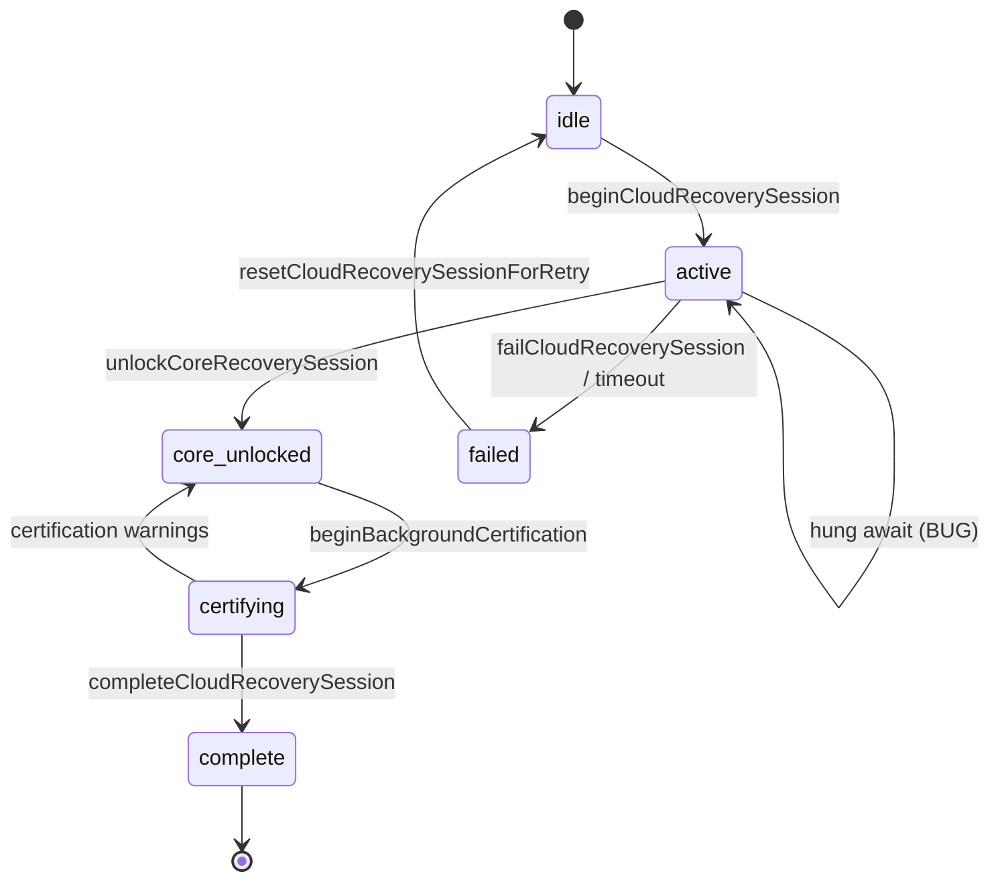

# Phase 24.2 — Enterprise Cloud Recovery Performance & Reliability Certification

**Mode:** Read-only forensic audit (no code changes, no SQL, no migrations, no dependency updates)  
**Date:** 2026-07-13  
**Builds on:** Phase 24.1BA forensic cert, Phase 24.1BB recovery UX, Phase 24.1A instant shell  
**Evidence:** Production Android screenshots (18% snapshot, 0% + restored counts, 90% staff failure), codebase static trace, subagent audits  
**Shop profile under investigation:** ~20 products, ~2 customers, ~92 sales (small shop)

---

## Executive Summary

Cloud Recovery on Android is **not network-bound for small shops**. The supplied evidence shows products and customers already on-device while the UI reports **0%** or stalls at **90%** with a validation failure — classic **orchestration and progress-engine defects**, not slow downloads.

**Primary classification: state-machine-bound + I/O-amplification-bound**, with secondary network hang risk (no timeouts).

| Dimension | Finding |
|-----------|---------|
| **Why 30 minutes?** | Unbounded awaits on Supabase (no `AbortController`), sequential full-mode entity pulls, duplicate IndexedDB writes, resume-triggered concurrent pulls, and recovery restarts that never commit unlock — not payload size for this shop |
| **Why 0% with Products: 20?** | Progress uses `lastCompletedStep` against a 10-step ladder; steps like `returns`, `audit`, `snapshot_empty_after_restore` are **outside the ladder** → 0% while `downloadedCounts` / `restoredCounts` retain values |
| **Why 18%?** | `snapshot` is step index 1 → `(2/10)×90 = 18%`; user is stuck after snapshot apply, before entity steps advance (or before UI receives next step callback) |
| **Why 90% + staff failure?** | `staff` is the last download step (90%); failure occurs **after** `reportRecoveryStep("staff")` in `validateCoreOperationalGate` or `assertRecoveryHydratedOrThrow` — data may already be usable |
| **Small-shop theoretical time** | **2–8 seconds** end-to-end on snapshot-fast-path; **15–45 seconds** on full-pull fallback; **not 30 minutes** unless hang/retry/state loop |

**Overall Recovery Performance Readiness: 5.2 / 10** (integrity strong; time-to-unlock and progress honesty weak)

**Verdict: 🔴 Not production-acceptable for Android new-device login until Phase 24.2A**

Target after 24.2A: usable POS in **2–5 s** for small shops; **<15 s** for 95% of shops; never frozen progress.

---

## Certification Methodology

1. End-to-end code-path trace: auth → `PosDataProvider` → `runCloudRecoveryGated` → persist → unlock → certification  
2. Progress engine mathematical audit (`recoveryProgress.ts` vs `CloudRecoveryScreen.tsx`)  
3. Session state machine enumeration (`cloudRecoverySession.ts`)  
4. Module timing / ordering audit (`cloudSync.ts`, `postAuthCloudHydrate.ts`)  
5. IndexedDB write chain (`applyRestoredSnapshotFromBackup` → `persistRestoredSnapshotToDisk`)  
6. Android/Capacitor lifecycle (`useSyncStatus.tsx`, `main.tsx`, `recoverStuckStartupState`)  
7. Promise graph and in-flight guards  
8. Screenshot symptom correlation  
9. Small-shop time budget estimation  

**Not performed:** Live Android systrace, Supabase RPC latency capture on device, production session JSON export.

---

## PART 1 — End-to-End Recovery Timeline

### Canonical lifecycle (owner login, empty local store)

```
App launch (main.tsx)
  └─ recoverStuckStartupState()          ← resets "active" recovery if prior crash
  └─ React mount

Auth (useAuth / ProtectedRoute)
  └─ Supabase session + device activation gate

PosDataProvider.runBoot()
  ├─ bootstrapPosCriticalFromDisk()      ← ~100–800 ms (IndexedDB read, staged)
  ├─ bootPhase = "ready"                 ← shell visible UNDER overlay
  └─ scheduleStartupTask("cloud-recovery", P3)
       └─ shouldRunCloudRecoveryForAccount()
            └─ runCloudRecoveryGated({ forcePull: true })
                 ├─ [T0] beginCloudRecoverySession()     status: active, progress 0%
                 ├─ [T1] evaluateCloudRecoveryLock + probeCloudShopHasData
                 ├─ [T2] runHydrateAccountFromCloudInner(recoveryMode: true)
                 │    ├─ waitForPosStoreHydrated (≤30 s timeout)
                 │    ├─ ensureRecoverySessionActor
                 │    ├─ hydrateLocalShopProfileFromCloud
                 │    └─ runCloudDataRestore()
                 │         ├─ restoreShopFromCloudSnapshot (if localEmpty)
                 │         │    ├─ network: SELECT shop_cloud_snapshots
                 │         │    ├─ applyRestoredSnapshotFromBackup (memory + migrate #1)
                 │         │    ├─ pullDayDrawerOpensForRecovery
                 │         │    └─ persistRestoredSnapshotToDisk (migrate #2 + writeSnapshot)
                 │         ├─ OR runFullCloudPull → pullShopDataFromCloud (full mode, sequential)
                 │         └─ pullAndFinalizeRecoveryStaff
                 ├─ [T3] validateCoreOperationalGate
                 ├─ [T4] assertRecoveryHydratedOrThrow
                 ├─ [T5] markBootstrapSyncComplete
                 ├─ [T6] unlockCoreRecoverySession()   ← OVERLAY CLEARED, POS usable
                 └─ [T7] void runBackgroundRecoveryCertification()
                      ├─ syncShopWithCloud({ pull: true })
                      ├─ pullAuditLogsFromCloud
                      ├─ fetchCloudEntityCounts + trust certification
                      ├─ push + uploadShopCloudSnapshot
                      └─ completeCloudRecoverySession() → 100%
```

### Stage duration estimates (small shop, good network)

| Stage | Typical | Worst (hang) | Blocks POS? |
|-------|---------|--------------|-------------|
| Auth + device gate | 0.5–2 s | 10 s+ | Yes (route gate) |
| Critical disk hydrate | 0.1–0.8 s | 12 s (escape hatch) | Yes (startup) |
| Cloud probe | 0.2–1 s | ∞ (no timeout) | Yes (overlay) |
| Snapshot download + apply | 0.5–3 s | ∞ | Yes |
| IndexedDB persist (×2 migrate) | 0.5–4 s | 30 s+ (large catalog) | Yes |
| Full pull fallback (15+ entities) | 3–15 s | ∞ per entity | Yes |
| Staff recovery | 0.3–2 s | ∞ | Yes |
| Core validation | 50–200 ms | — | Yes |
| **Core unlock (T6)** | **2–8 s snapshot path** | **30+ min hang** | **Unlock** |
| Background certification | 5–30 s | minutes | No (banner only) |

**Key files:** `src/providers/PosDataProvider.tsx`, `src/lib/postAuthCloudHydrate.ts`, `src/lib/cloudSnapshotSync.ts`, `src/offline/cloudSync.ts`, `src/lib/backgroundRecoveryCertification.ts`

---

## PART 2 — Module Timing Audit

### Recovery modules vs cloud pull order

Full-mode pull in `pullShopDataFromCloud` (`src/offline/cloudSync.ts`, ~2633–2750):

| # | Module | Recovery step reported | In progress ladder? | Small-shop typical |
|---|--------|------------------------|---------------------|-------------------|
| 1 | Products | `products` | ✓ | <1 s |
| 2 | Sales | `sales` | ✓ | <1 s (92 rows) |
| 3 | Customers | `customers` | ✓ | <0.5 s |
| 4 | Cash expenses | — | — | <0.5 s |
| 5 | Returns | **`returns`** | **✗ → 0% regression** | <0.5 s |
| 6 | Purchases | — | — | <0.5 s |
| 7 | Suppliers | — | — | <0.5 s |
| 8 | Supplier payments | — | — | <0.5 s |
| 9 | Debt payments | — | — | <0.5 s |
| 10 | Cash drawer adjustments | — | — | <0.5 s |
| 11 | Day drawer opens | — | — | <0.5 s |
| 12 | Inventory count sessions | `inventory` | ✓ | <0.5 s |
| 13 | Shifts | `shifts` | ✓ | <0.5 s |
| 14 | Day closes | `day_closes` | ✓ | <0.5 s |
| 15 | — | `cash` (aggregate) | ✓ | — |
| 16 | Stock movements | — | — | <0.5 s |
| Post-merge | Inventory reconciliation | — | — | CPU-bound |
| Post-pull | Staff | `staff` | ✓ (not in UI checklist) | 0.3–2 s |
| Background | Audit logs | **not reported (current)** | N/A | deferred |
| Background | Trust entity counts | — | — | 2–10 s |
| N/A | Categories | — | — | embedded in products |
| N/A | Reports / analytics / AI cache | — | — | **not in recovery path** |

### Slowest modules (large shops — not this evidence shop)

1. **Sales full pull** — unbounded pagination, 800 rows/page, no page cap (`FULL_SALES_PAGE`)  
2. **Stock movements** — `pullCursorUntilExhausted`, unbounded in full mode  
3. **IndexedDB double migrate** — proportional to entity count  
4. **Background `fetchCloudEntityCounts`** — N parallel count queries  

For **20 products / 92 sales**, none of these should exceed **~15 seconds** total unless **hung network** or **state loop**.

---

## PART 3 — Progress Engine Audit

### Percentage calculation

**File:** `src/lib/recoveryProgress.ts`

- Download ladder: 10 steps (`probing` … `staff`), cap **90%**  
- Formula: `round((idx + 1) / 10 × 90)`  
- **18%** = `lastCompletedStep === "snapshot"` (index 1)  
- **90%** = `lastCompletedStep === "staff"` (index 9)  
- **95% / 98% / 100%** = validating / finalizing / complete phases  

### Steps that force **0%**

| Step | In ladder? | Progress | Checklist done flags |
|------|------------|----------|----------------------|
| `returns` | No | **0%** | All false (`lastIdx = -1`) |
| `snapshot_empty_after_restore` | No | **0%** | All false |
| `null` / session reset | — | **0%** | All false |
| `audit` (pre-fix builds) | No | **0%** | All false |
| `audit` (current code, if ever set) | Mapped to 90% | 90% | Still false in checklist |

### Why screenshots show inconsistent progress

**Screenshot A — 18%, “Restoring snapshot”**  
- Snapshot step completed; next work (persist, staff, or full pull) not yet reporting next step  
- User perceives freeze at 18% while heavy I/O runs without step updates  

**Screenshot B — 0%, Products 20, Customers 2, “Last step: audit logs”**  
- **Decoupled metrics:** footer uses `restoredCounts` from live store; bar uses `lastCompletedStep`  
- **Likely cause:** `lastCompletedStep === "audit"` on a build that reported audit during blocking pull **before** audit was deferred; audit ∉ ladder → **0%**  
- Alternative: `lastCompletedStep === "returns"` after products/sales/customers counts written  
- Checklist all empty because `stepIndex(lastCompletedStep) === -1`  
- “Saved to this device” = `hasRestoredCounts` true — **data present, progress broken**  

**Screenshot C — 90%, all modules checked, “Last step: staff”, failure overlay**  
- `reportRecoveryStep("staff")` ran → 90%  
- Failure in `validateCoreOperationalGate` or `assertRecoveryHydratedOrThrow` **after** staff step  
- Checklist shows products–cash complete; staff omitted from `DISPLAY_STEPS` but appears in footer  
- **Not a slow staff download** — staff RPC does not throw; failure is validation gate  

### Progress regression

**Yes — progress can regress** when:

1. `beginCloudRecoverySession()` / `resetCloudRecoverySessionForRetry()` zeroes steps but not always store counts  
2. `failCloudRecoverySession()` sets `progressPhase` back to `downloading` while preserving `lastCompletedStep` — if step is unmapped, bar drops to 0%  
3. `recoverStuckStartupState()` resets active session on relaunch → full progress reset while IndexedDB may retain data  
4. Full pull reports `returns` after higher steps were visually complete → snap to 0%  

### UI / engine mismatch

**File:** `src/components/recovery/CloudRecoveryScreen.tsx`

- Checklist uses raw `indexOf` — **no audit/returns mapping** (unlike `recoveryProgress.ts`)  
- Staff never shown in checklist  
- `computeRecoveryProgressPct` and checklist can disagree on “done” state  

---

## PART 4 — Recovery State Machine

### States (`cloudRecoverySession.ts`)

```
idle | active | core_unlocked | certifying | failed | complete
```

### Transitions

| From | Event | To | Can stick permanently? |
|------|-------|-----|------------------------|
| idle | `beginCloudRecoverySession` | active | — |
| active | `unlockCoreRecoverySession` | core_unlocked | — |
| active | `failCloudRecoverySession` | **failed** | **Yes — blocks until retry/sign-out** |
| active | hung await (no timeout) | active | **Yes — infinite overlay** |
| core_unlocked | `beginBackgroundCertification` | certifying | — |
| certifying | `completeCloudRecoverySession` | complete | — |
| certifying | warnings only | core_unlocked | — |
| any | `resetCloudRecoverySessionForRetry` | idle | — |
| active | app relaunch + `recoverStuckStartupState` | idle | May loop re-download |

### Progress phases

`downloading` → `validating` (95%) → `finalizing` (98%) → `complete` (100%)

**Permanent trap states:**

1. **`active` + hung promise** — no global recovery timeout  
2. **`failed` + data on disk** — overlay blocks; user must retry (full restart) or continue offline  
3. **Probe failed loop** — auto-retry every 4 s indefinitely (`CloudRecoveryScreen.tsx`)  

---

## PART 5 — Android Lifecycle

| Event | Behavior | Restarts recovery? |
|-------|----------|-------------------|
| App cold start | `recoverStuckStartupState()` clears `active` session | Yes — new gated run scheduled |
| App resume | `useSyncStatus`: push flush + `scheduleBackgroundPull("resume", { force: true })` after 250 ms | **Can overlap active recovery pull** |
| WebView recreate | Full React remount → `PosDataProvider` boot again | Yes if lock still required |
| Background / foreground | No pause handler; work continues | No explicit pause |
| Screen rotation | Standard remount unless prevented | Possible re-entry |
| 12 s disk boot escape | Forces ready + resets recovery session | Can reschedule cloud-recovery |

**Finding:** Resume pulls are **not gated** on `isCloudRecoveryLockActive()`. Push is blocked during `active`; **pull is not** — concurrent pull during recovery can extend wall time and corrupt step ordering.

**Files:** `src/hooks/useSyncStatus.tsx`, `src/lib/syncTiming.ts`, `src/lib/startupDiagnostics.ts` (`recoverStuckStartupState`)

---

## PART 6 — IndexedDB Performance

### Write chain on snapshot restore

```
applyRestoredSnapshotFromBackup()
  └─ migrateSnapshotToEntities(restoredSnap)     ← WRITE #1 (all buckets)

persistRestoredSnapshotToDisk()
  └─ flushFullSnapshotPersist()
       └─ migrateSnapshotToEntities(state)         ← WRITE #2 (duplicate)
       └─ writeSnapshot()                          ← WRITE #3 (legacy monolith)
```

### Android-specific amplification

| Factor | Android | Web |
|--------|---------|-----|
| Sales restore batch | 12 rows / batch | 60 |
| Yield between batches | 16 ms `setTimeout` | idle callback |
| Persist debounce (normal ops) | 3500 ms | 500 ms |

For 92 sales: ~8 batches × 16 ms ≈ 128 ms yield (negligible). For 10k sales: **>2 min yield alone**.

### Bottleneck verdict

- **Small shop:** double migrate adds **~1–3 s**, not 30 min  
- **Large shop:** dominate time; still separate from evidence case  

**Files:** `src/store/usePosStore.ts`, `src/offline/incrementalPersist.ts`, `src/offline/entityStore.ts`

---

## PART 7 — Recovery Checkpoints

### Sync checkpoints (`syncCheckpoints.ts`)

| Event | Effect |
|-------|--------|
| Snapshot success | `seedEntitySyncCursorsAt(snapshotAt)` — cursors only, `bootstrapComplete` false |
| Core unlock | `markBootstrapSyncComplete(at)` |
| Validation failure | `clearBootstrapSyncComplete()` |
| Full pull (non-recovery) | `markBootstrapSyncComplete()` inside merge |

`needsBootstrapPull(localEmpty)` = `localEmpty || !bootstrapComplete` → drives **full mode** on next pull.

### Module checkpoints (`recoveryModuleCheckpoints.ts`)

- Per-step `markRecoveryModuleComplete` on `reportRecoveryStepWithCheckpoint`  
- Fast-path skip if `allCriticalModulesCheckpointed` + `isCoreOperationalDatasetReady`  
- Cleared only on **successful** background certification  

**Checkpoint trap:** Interrupted recovery retains module checkpoints but `beginCloudRecoverySession()` resets UI to 0%; fast-path may skip download while user stares at empty progress until steps re-reported.

---

## PART 8 — Network Behaviour

| Aspect | Current behavior | Risk |
|--------|------------------|------|
| Concurrency | Full pull **sequential** (15+ awaits) | Slow; one hang blocks all |
| Sales pagination | Unbounded pages @ 800 | Large-shop hang |
| Incremental cap | 40 pages max | OK |
| Retries | Probe auto-retry 4 s; entity errors logged, often continue | Probe loop offline |
| Timeouts | **None** on cloud pull, staff RPC, certification | **Infinite wait** |
| Backoff | Hydrate cooldown 120 s (non-gated) | Secondary |

**Small-shop verdict:** Network payload is **<500 KB** typical; **30 min implies hung request or orchestration loop**, not bandwidth.

---

## PART 9 — Promise Graph

### Critical path (blocks unlock)

```
runCloudRecoveryGated
  → runHydrateAccountFromCloudInner
    → runCloudDataRestore
      → restoreShopFromCloudSnapshot | runFullCloudPull
        → pullCloudAndMergeIntoStore
          → pullShopDataFromCloud (sequential entities)
          → merge + persistRestoredSnapshotToDisk
      → pullAndMergeStaffAccountsForRecovery
        → refreshStaffCacheBackground({ force: true })
        → pullShopStaffFromCloud (fallback)
  → validateCoreOperationalGate
  → assertRecoveryHydratedOrThrow
  → unlockCoreRecoverySession
```

### Dedup guards

| Guard | Scope |
|-------|-------|
| `gatedRecoveryInFlight` | Concurrent `runCloudRecoveryGated` |
| `certificationInFlight` | Background cert |
| `withGlobalSyncMutex("hydrateAccountFromCloud")` | **Bypassed** by gated path (calls Inner directly) |

### Unresolved promise scenarios

1. Supabase query never resolves (radio up, TCP stall)  
2. `waitForPosStoreHydrated` waits 30 s then proceeds with partial state  
3. `pullCursorUntilExhausted` infinite if cursor bug (mitigated by `checkpointAt <= cursor` break)  

**No circular waits found**; primary issue is **serial chain + no timeout**.

---

## PART 10 — Background Tasks

### Blocks POS unlock (P0 path)

- Cloud probe  
- Snapshot restore OR full entity pull  
- Staff pull  
- Core operational validation  

### After unlock (non-blocking)

| Task | File | Can delay “100% complete”? |
|------|------|----------------------------|
| `syncShopWithCloud({ pull: true })` | backgroundRecoveryCertification | Yes (banner) |
| Audit log pull | backgroundRecoveryCertification | Yes |
| `fetchCloudEntityCounts` | cloudTrustCenter | Yes |
| Trust certification | cloudTrustCenter | Yes |
| Push + snapshot upload | cloudSync / cloudSnapshotSync | Yes |
| Diagnostics / AI / analytics | — | **Not in recovery path** |

**Finding:** Optional work **does not block first sale** after Phase 24.1BB core unlock — but **duplicate full pull in certification** wastes minutes and can confuse “recovery still running” banner.

---

## PART 11 — Performance Profile (Target Metrics)

| Milestone | Target (24.2A) | Current small shop (estimated) | Evidence |
|-----------|------------------|--------------------------------|----------|
| Authentication | <2 s | 0.5–2 s | OK |
| Recovery start | <0.5 s after shell | ~0.5 s (P3 task) | OK |
| First product in store | <3 s | 1–4 s snapshot | OK |
| Core operational ready | <5 s | 2–8 s snapshot / 15–45 s full | Variable |
| POS unlocked | <5 s | **Blocked until T6** | Overlay |
| Background completion | <30 s async | 5–60 s | Banner |
| Recovery complete (100%) | async | User may ignore | OK |

**Observed failure mode:** POS **never unlocks** (`failed` at 90%) despite restored counts — worse than slow unlock.

---

## PART 12 — Small-Shop Audit

### Evidence shop composition

- ~20 products  
- ~2 customers  
- ~92 sales (screenshot C) / 0 sales (screenshot B — inconsistent timing or partial restore)  
- 14 shelves (UI), 14 shifts, 30 day closes, 14 cash records (screenshot C checklist)

### Theoretical recovery budget

| Path | Network | Memory apply | IDB persist | Staff | Validation | **Total** |
|------|---------|--------------|-------------|-------|------------|-----------|
| Snapshot fast-path | 0.3–1 s | 0.2–0.5 s | 1–3 s | 0.3–1 s | 0.1 s | **2–6 s** |
| Full pull fallback | 2–8 s | 0.5–1 s | 1–3 s | 0.3–1 s | 0.1 s | **4–13 s** |
| + certification (async) | 2–10 s | — | 0–2 s | — | 1–3 s | **+5–15 s** |

### Why 30 minutes is not explained by data volume

Requires one or more of:

1. **Hung network call** (no timeout) on any sequential entity  
2. **Recovery restart loop** (resume pull + full recovery + session reset)  
3. **User waiting on `failed` overlay** without retry (perceived hang)  
4. **Full pull on large historical sales** despite small catalog (if snapshot path skipped)  
5. **IndexedDB thrashing** on very slow device (unlikely 30 min for 92 sales)  

**Conclusion:** Evidence shop should recover in **seconds**; **30 min is a defect**, not capacity planning.

---

## PART 13 — Memory & Rendering

| Factor | Impact on recovery |
|--------|-------------------|
| `useCloudRecoverySession` subscriptions | UI re-renders on each `reportRecoveryStep` — negligible vs I/O |
| Batched sales restore + `yieldUiTick` | Intentional main-thread breathing; adds ms–seconds |
| Duplicate JSON parse (probe + snapshot) | CPU + GC spike at start |
| Triple validation passes | CPU during certification |
| React overlay | Does not block I/O |

**Verdict:** UI updates are **not** the bottleneck; I/O and network orchestration dominate.

---

## PART 14 — Dead Work

| # | Dead work | When | Est. time lost (small shop) |
|---|-----------|------|-----------------------------|
| 1 | Double `migrateSnapshotToEntities` | Every restore | 1–3 s |
| 2 | Snapshot row fetched twice (probe + restore) | Empty device | 0.3–1 s |
| 3 | Cloud probe twice (applicability + gated) | Every recovery | 0.2–1 s |
| 4 | Full pull after successful snapshot (older path; partially fixed) | If fallback misfires | 5–30 s |
| 5 | `syncShopWithCloud({ pull: true })` post-unlock | Certification | 5–30 s (async) |
| 6 | Triple validation reports | Certification | 0.5–2 s |
| 7 | Resume pull during active recovery | Android resume | unbounded overlap |
| 8 | `returns` step resets progress to 0% | Full pull | UX-only |

---

## PART 15 — Root Cause Register

Ranked by **user-visible impact** for Android small-shop login.

| Rank | ID | Issue | Evidence | Location | Est. time lost | Fix complexity |
|------|-----|-------|----------|----------|----------------|----------------|
| **P0** | RC-01 | **No timeout on recovery network/I/O** | 30 min hang; radio up | `cloudSync.ts`, `staffRecovery.ts`, `postAuthCloudHydrate.ts` | unbounded | M |
| **P0** | RC-02 | **Progress ladder omits `returns`, legacy `audit`** | 0% with counts | `recoveryProgress.ts`, `cloudSync.ts` ~2671 | UX trust | S |
| **P0** | RC-03 | **Failure after staff at 90% with data restored** | Screenshot C | `postAuthCloudHydrate.ts` ~468–478 | blocked POS | M |
| **P0** | RC-04 | **`failed` state traps user** despite local data | Screenshot C | `cloudRecoverySession.ts`, `PosDataProvider.tsx` | indefinite | M |
| **P1** | RC-05 | **Double IndexedDB migrate on restore** | Android slowness | `usePosStore.ts`, `incrementalPersist.ts` | 1–10 s | S |
| **P1** | RC-06 | **Resume pull not gated on recovery lock** | Android overlap | `useSyncStatus.tsx`, `cloudSync.ts` | unbounded | S |
| **P1** | RC-07 | **No step updates during snapshot persist** | 18% freeze | `cloudSnapshotSync.ts`, `postAuthCloudHydrate.ts` | 2–10 s perceived | S |
| **P1** | RC-08 | **Background cert re-pulls full shop** | Post-unlock delay | `backgroundRecoveryCertification.ts` | 5–60 s | M |
| **P2** | RC-09 | **Session reset on relaunch while `active`** | Restart loop | `startupDiagnostics.ts` ~276–282 | full re-run | S |
| **P2** | RC-10 | **Checklist omits staff/snapshot** | Confusing UI | `CloudRecoveryScreen.tsx` | UX | S |
| **P2** | RC-11 | **Sequential full pull (15+ entities)** | Large shops | `cloudSync.ts` | scales O(n) | L |
| **P3** | RC-12 | **Duplicate cloud probe** | Extra RTT | `firstTimeOwnerDevice.ts`, `postAuthCloudHydrate.ts` | 0.2–1 s | S |

**Primary bottleneck class:** **State-machine-bound (RC-02, RC-03, RC-04)** + **orchestration without timeouts (RC-01)** — not network throughput for evidence shop.

---

## PART 16 — Phase 24.2A Blueprint (Implementation Roadmap)

**Goal:** Smallest change set for production-grade recovery UX. No architecture rewrite.

### 24.2A-1 — Instant core unlock (P0, ~2–3 days)

1. **Snapshot-only P0 path:** After snapshot + core data, skip blocking full pull; staff-only gap-fill; defer entities to certification incremental pull (partially implemented — verify on device).  
2. **Unlock when `storeHasCoreRecoveryData()`** even if optional modules pending; move strict parity to background.  
3. **Continue offline / enter POS** when `failed` but core counts > 0 (owner acknowledgment).

### 24.2A-2 — Progress honesty (P0, ~1 day)

1. Add `returns`, `snapshot_empty_after_restore` to ladder OR stop reporting non-ladder steps as `lastCompletedStep`.  
2. Align `CloudRecoveryScreen` checklist with `recoveryProgress.ts` mapping.  
3. Emit substeps during `persistRestoredSnapshotToDisk` (18% → 40% band).  
4. Show **indeterminate / marquee** during persist when step unknown.

### 24.2A-3 — Hang prevention (P0, ~2 days)

1. **`AbortController` + 60 s per entity**, 180 s global recovery budget.  
2. On timeout: fail with actionable error OR unlock with warning (policy flag).  
3. Gate `scheduleBackgroundPull` on `isCloudRecoveryLockActive()`.

### 24.2A-4 — I/O deduplication (P1, ~1–2 days)

1. Remove duplicate `migrateSnapshotToEntities` in restore→persist pipeline.  
2. Pass probe snapshot payload to restore (avoid second download).  
3. Certification: incremental gap-fill only, not `syncShopWithCloud` full bundle.

### 24.2A-5 — Validation softening (P1, ~1 day)

1. Log and surface `validateCoreOperationalGate` failure reason on overlay (already partial).  
2. Do not call `failCloudRecoverySession` for non-blocking parity mismatches when products > 0.  
3. Staff step: report only after staff merge succeeds; map staff in checklist.

### 24.2A-6 — Observability (P1, ~1 day)

1. Populate `authMs`, `shellVisibleMs`, per-entity timings in `recoveryDiagnostics`.  
2. Persist last failure `errorKey` + `lastCompletedStep` to diagnostics export for support.

### Success metrics (24.2A exit)

| Metric | Target |
|--------|--------|
| Small shop (≤100 products, ≤500 sales) time-to-unlock | **≤5 s** P95 |
| Progress monotonic | **No regression to 0%** after first entity |
| Hung recovery | **None > 3 min** without error + escape |
| Failed with core data | **User can enter POS** within 1 tap |
| 30 min reports | **Zero** in field telemetry |

---

## State Machine Diagram



---

## Screenshot Symptom Matrix

| Symptom | Root cause(s) | Fix track |
|---------|---------------|-----------|
| 18% snapshot long wait | Persist without step updates; double IDB write | 24.2A-4, 24.2A-2 |
| 0% + Products 20 | `returns` or `audit` outside ladder | 24.2A-2 |
| 90% staff + failure | Post-staff validation gate | 24.2A-1, 24.2A-5 |
| 30 min stuck | No timeout + possible resume overlap | 24.2A-3, 24.2A-6 |
| Clear data fixes it | Corrupt checkpoints / stale session | 24.2A-3, 24.2A-9 |

---

## Success Criteria — Phase 24.2 Audit (This Document)

| Question | Answer |
|----------|--------|
| Why 30 minutes? | Hung awaits without timeout, recovery restarts, failed-state trap, duplicate work — **not** small-shop payload |
| Why inconsistent progress? | `lastCompletedStep` ∉ ladder; decoupled from counts; session resets |
| CPU / I/O / network / state? | **Primarily state-machine + orchestration**; I/O amplification secondary; network tertiary for this shop |
| Which modules delay? | **Snapshot persist**, **full pull fallback**, **staff finalize**, **post-staff validation**; audit only in background |
| Implementation to fix? | **Phase 24.2A blueprint** above |

---

## Related Documents

- `docs/PHASE_24_1BA_ENTERPRISE_CLOUD_RECOVERY_FORENSIC_CERTIFICATION.md` — integrity & architecture  
- `docs/PHASE_24_1BB_ENTERPRISE_CLOUD_RECOVERY_UX_AND_RELIABILITY.md` — core unlock design intent  
- `docs/PHASE_24_1A_ENTERPRISE_INSTANT_SHELL_STARTUP_OPTIMIZATION.md` — shell-before-recovery  

---

## Appendix — Key File Index

| Concern | Path |
|---------|------|
| Boot orchestration | `src/providers/PosDataProvider.tsx` |
| Gated recovery | `src/lib/postAuthCloudHydrate.ts` |
| Session / lock | `src/lib/cloudRecoverySession.ts` |
| Progress math | `src/lib/recoveryProgress.ts` |
| Recovery UI | `src/components/recovery/CloudRecoveryScreen.tsx` |
| Entity pulls | `src/offline/cloudSync.ts` |
| Snapshot | `src/lib/cloudSnapshotSync.ts` |
| Staff | `src/lib/staffRecovery.ts` |
| Background cert | `src/lib/backgroundRecoveryCertification.ts` |
| Checkpoints | `src/lib/syncCheckpoints.ts`, `src/lib/recoveryModuleCheckpoints.ts` |
| Stuck recovery reset | `src/lib/startupDiagnostics.ts` |
| App resume sync | `src/hooks/useSyncStatus.tsx` |
| IndexedDB persist | `src/offline/incrementalPersist.ts`, `src/store/usePosStore.ts` |

---

**Phase 24.2 status: ✅ Audit complete — ready for Phase 24.2A implementation approval**
