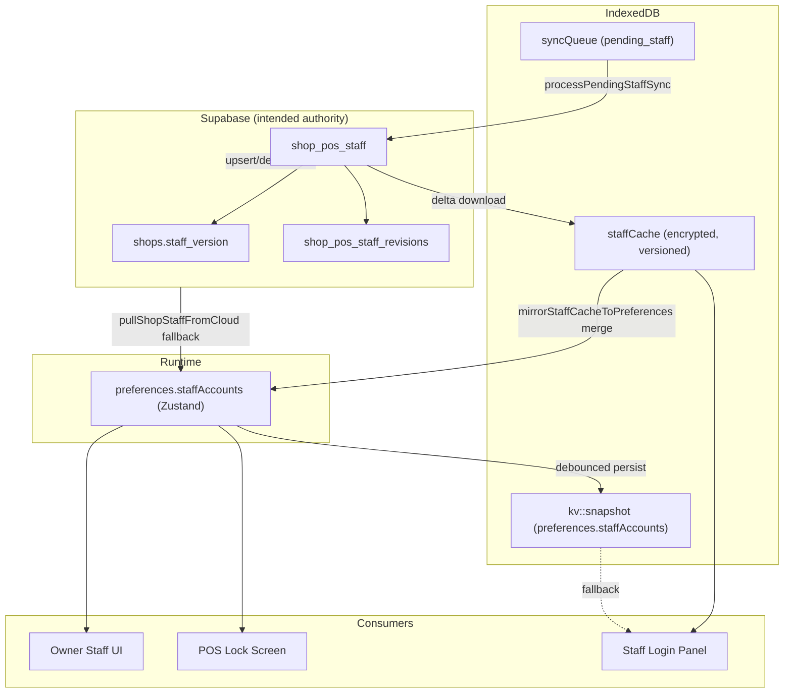

# Phase 25.0 — Enterprise Staff Identity Platform Certification

**Mode:** Read-only forensic certification (no code changes, no SQL, no migrations, no dependency updates)  
**Date:** 2026-07-13  
**Builds on:** Phases 12–13 (staff auth), 21.4 (staff sync reliability), 24.1B (real-time sync engine), 24.1BB (recovery UX)  
**Scope:** Staff identity architecture, lifecycle, synchronization, offline behaviour, multi-device, security, dead code

---

## Executive Summary

The WAKA POS Staff Platform is **architecturally intended to be cloud-authoritative** (`shop_pos_staff`, versioned delta distribution in migration `125_staff_version_distribution.sql`) but **operates as a hybrid identity system in practice**. Staff data flows through **three competing local layers** — Supabase cloud, encrypted IndexedDB `staffCache`, and `preferences.staffAccounts` in the shop snapshot — with **different merge rules, different consumers, and asymmetric propagation paths**.

This explains the observed symptoms:

| Symptom | Confirmed? | Primary cause |
|---------|------------|---------------|
| Staff created on one device temporarily disappear | **Yes** | Merge-only policy + cache/preferences divergence; UI reads preferences while login reads cache |
| Staff not immediately available on another device | **Yes** | No staff-specific realtime; 45s staff pull throttle; `hydrateStaffTeamFromCloud` skips full pull when any local staff exist |
| Staff creation feels local-sync-first | **Partially** | Create is cloud-first (`createStaffInCloudFirst`), but updates/deletes are local-first with async push |
| Staff lifecycle less reliable than owner auth | **Yes** | Owner auth is session-bound to Supabase; staff uses offline cache + additive merge + multi-path hydration |

**Verdict: 🔴 Not Certified as Enterprise Cloud-Authoritative Identity**

The platform has strong foundations (encrypted offline cache, cloud-first create, versioned delta RPCs, device authorization gates, PIN hashing) but **does not yet behave like owner authentication** — created once, immediately visible everywhere, never disappearing.

**Staff Identity Reliability Score: 6.2 / 10**  
**Owner Authentication Reliability (reference): ~9.0 / 10**

Target after Phase 25.1: **9.0+ / 10** — staff accounts behave as cloud identities with offline cache as accelerator only.

---

## Certification Methodology

1. **Static code-path tracing** — create → cloud → cache → IndexedDB → recovery → hydration → realtime → UI
2. **Lifecycle matrix** — every CRUD/security operation mapped to cloud, local, sync, and recovery paths
3. **Source-of-truth analysis** — which layer each consumer reads and when stale data wins
4. **Multi-device timeline modelling** — Device A create → Device B/C visibility conditions
5. **Regression test corpus review** — `staffRecovery.test.ts`, `staffSyncApply.test.ts`, `staffCacheSync.test.ts`, Phase 21.4 documentation
6. **Dead code scan** — unused exports, duplicate converters, legacy paths
7. **Enterprise comparison** — qualitative vs Shopify POS, Square, Lightspeed, Toast POS staff management models

**Not performed:** Live multi-device latency measurement, Supabase RPC timing profiles, Android staff-login Systrace.

---

## Part 1 — Staff Architecture

### End-to-end flow (as implemented)

```
┌─────────────────────────────────────────────────────────────────────────────┐
│                           OWNER / MANAGEMENT UI                              │
│  StaffAccessPage → StaffCreateWizard / StaffTeamList                        │
│  Reads: preferences.staffAccounts (Zustand)                                  │
└───────────────────────────────────┬─────────────────────────────────────────┘
                                    │
                    addStaffAccount / updateStaffAccount / removeStaffAccount
                                    │
          ┌─────────────────────────┼─────────────────────────┐
          ▼                         ▼                         ▼
   createStaffInCloudFirst    pushStaffToCloud (async)   local set() first
   (cloud-first create)       or pending_staff queue     (edit/delete/suspend)
          │                         │                         │
          ▼                         ▼                         │
   shop_pos_staff_upsert RPC   syncEngine flush          IndexedDB snapshot
   (shopStaffCloud.ts)         (pending_staff P1)        (debounced persist)
          │                         │
          ▼                         ▼
   shops.staff_version++     refreshStaffCacheAfterOwnerMutation
   (DB trigger)              (staffCacheSync.ts)
          │                         │
          ▼                         ▼
   shop_pos_staff_download    encrypted staffCache (IndexedDB)
   (delta RPC)                 mirrorStaffCacheToPreferences → merge
          │                         │
          └─────────────┬───────────┘
                        ▼
              preferences.staffAccounts
                        │
          ┌─────────────┴─────────────┐
          ▼                           ▼
   Owner UI / Lock screen        Staff login panel
   (preferences)                (staffCache first → snapshot fallback)
```

### Architecture diagram — data layers



### Key modules

| Module | Role |
|--------|------|
| `src/lib/shopStaffCloud.ts` | Supabase RPCs: list, upsert, delete, import, login, unlock, security events |
| `src/lib/staffSyncQueue.ts` | Cloud-first create, offline queue, queue processor |
| `src/lib/staffCacheSync.ts` | Versioned delta download, cache apply, cache→preferences mirror |
| `src/lib/offlineStaffCache.ts` | AES-GCM encrypted `staffCache` IndexedDB store |
| `src/lib/staffRecovery.ts` | Merge policy, cloud pull during sync, hydration, recovery |
| `src/lib/staffSyncApply.ts` | Canonical merge-only writer to `preferences.staffAccounts` |
| `src/lib/staffOfflineAuth.ts` | Staff login — **cache-first**, snapshot fallback |
| `src/store/usePosStore.ts` | Staff CRUD mutations (L1850–2415) |
| `src/lib/postAuthCloudHydrate.ts` | Recovery staff step via `pullAndMergeStaffAccountsForRecovery` |
| `src/lib/postLoginBackgroundTasks.ts` | Idle staff cache provisioning after owner login |
| `supabase/migrations/125_staff_version_distribution.sql` | Version counter + delta download RPC |

### Ownership summary

| Layer | Owner | Purpose |
|-------|-------|---------|
| `shop_pos_staff` | Cloud / Supabase | Canonical staff rows, hashes, lockout, soft-delete |
| `staffCache` | Per-device encrypted cache | **Primary source for staff login** |
| `preferences.staffAccounts` | Zustand + snapshot | **Primary source for owner UI and lock screen** |
| `pending_staff` queue | IndexedDB sync queue | Durability for offline/failed mutations |

**Critical architectural tension:** Login and management UI do not read the same primary layer.

---

## Part 2 — Staff Lifecycle

### Lifecycle matrix

| Operation | Local path | Cloud path | Sync path | Recovery path |
|-----------|------------|------------|-----------|---------------|
| **Create** | Local mode: direct insert to preferences (`usePosStore.ts` L1931–1938). Supabase mode: **no local insert until cloud confirms**; on queue failure upsert with `pendingCloudSync: true` (L1946–1948) | `createStaffInCloudFirst` → `pushStaffToCloud` → `shop_pos_staff_upsert` | On success: `refreshStaffCacheAfterOwnerMutation` + `upsertStaffAccountInStore`. On fail: `pending_staff` queue (P1 immediate push via Phase 24.1B) | `pullAndMergeStaffAccountsForRecovery` merges cache or full cloud list |
| **Edit** (name, phone, username) | Immediate `set()` on preferences (L1988–2018) | Async `pushStaffToCloud` or `pending_staff` update (L2039–2044) | Cache refresh only when queue processor succeeds — **not on every edit** | Merge from cache/cloud on pull |
| **Delete** | Immediate filter from preferences (L2258–2263) | `deleteCloudStaff` or queued delete (L2270–2278) | **No explicit cache invalidation** — relies on next delta pull | Delta `removedClientIds` removes from cache only |
| **Suspend** | Same as edit (`active: false`) | Full upsert with `is_active: false` | Same as edit | Same |
| **Activate** | Same as edit | Full upsert with `is_active: true` | Same as edit | Same |
| **Reset PIN** | Hash locally, update preferences (`resetStaffSecret` L2307–2339) | `pushStaffToCloud` (L2343–2344) | No immediate cache write | Credential recovery may strip hashes |
| **Reset password** | Same as PIN | Same | Same | Same |
| **Unlock** | Local lockout fields cleared (L2373–2386) | `unlockCloudStaffAccount` RPC + `unlockStaffAccountLocal` patches cache | Cache updated via `persistStaffToCache` | Recovery preserves identity, may clear credentials |
| **Role change** | `updateStaffAccount` + permission resolve (L1999–2016) | `pushStaffToCloud` full row | Same as edit | Same |
| **Custom role CRUD** | `preferences.customStaffRoles` only | **No cloud sync found in staff modules** | N/A | Local snapshot only |

### Create flow detail (Supabase mode)

```
StaffCreateWizard
  → addStaffAccount()
  → createStaffInCloudFirst(row)          [staffSyncQueue.ts L53–78]
       ├─ online: pushStaffToCloud()
       │    ├─ success → refreshStaffCacheAfterOwnerMutation()
       │    │              → downloadStaffDelta → staffCache → mirror merge
       │    └─ fail → enqueuePendingStaffSync({ action: "create" })
       └─ offline: enqueuePendingStaffSync → return error to UI
  → upsertStaffAccountInStore()           [only after cloud confirm or queue fallback]
```

**Evidence:** Create is genuinely cloud-first for Supabase shops. Updates and deletes invert the order (local-first).

---

## Part 3 — Identity Model

### Classification: **Hybrid (cloud-intended, locally-governed)**

| Model element | Cloud identity expectation | WAKA current behaviour |
|---------------|---------------------------|------------------------|
| Create authority | Cloud assigns identity; device receives | Cloud-first create ✓; client generates UUID before push |
| Read authority | All devices read same cloud roster | Three layers with different freshness |
| Update authority | Cloud wins; local is cache | Local-first edit; cloud catches up async |
| Delete authority | Cloud tombstone removes everywhere | Cache removes; preferences merge **preserves local-only rows** |
| Offline login | Cache accelerates; cloud is truth | Cache is **primary** for login; can block if empty offline |
| Conflict resolution | Server wins | `pickNewerStaffAccount` by `updatedAt`; cloud wins on tie |

### Enterprise expectation gap

Owner authentication:
- Session token from Supabase Auth
- Single session store
- No local roster merge ambiguity

Staff authentication:
- No Supabase Auth session per staff member
- PIN verified against **encrypted local cache**
- Roster merged additively — **local-only staff never auto-deleted** (`staffRecovery.test.ts` L26–30)

The architecture **explicitly preserves local-only staff indefinitely**, which is correct for offline-first durability but **incorrect for cloud-authoritative identity** when cloud has deleted or never received a row.

---

## Part 4 — Synchronization

### Push paths

| Trigger | Mechanism | Priority | Coalesce |
|---------|-----------|----------|----------|
| `enqueuePendingStaffSync` | `syncEngine.enqueueSync` → `scheduleImmediateSyncForKind("pending_staff")` | P1 | **None** — duplicate queue entries possible |
| `updateStaffAccount` | Direct `pushStaffToCloud` (not via queue unless fail) | Immediate RPC | N/A |
| `createStaffInCloudFirst` | Direct RPC, queue on fail | Immediate | N/A |

**Evidence:** `syncQueuePriority.ts` L22 — `pending_staff` is P1. `coalesceKeyForOp` returns `null` for staff (L40–51).

### Pull paths

| Trigger | Staff-specific? | Mechanism |
|---------|-----------------|-----------|
| Supabase Realtime | **No** | `realtimeSyncPull.ts` watches `shop_activity` and `sync_health` only — staff version bumps do **not** trigger dedicated pull |
| Upload ACK | **No** | Sales trigger `scheduleImmediatePull("sale_ack")`; staff push has no equivalent |
| Network reconnect | Indirect | Generic incremental cloud pull bundle includes staff |
| App foreground | Indirect | Same |
| Safety polling | Indirect | `scheduleIncrementalCloudPull("safety_poll")` → `runCloudPullBundle` |
| Owner login | Yes | `scheduleStaffCacheProvisioning` (idle, 500ms) |
| Staff page visit | Yes | `hydrateStaffTeamFromCloud({ force: true })` |
| Cloud pull bundle | Yes | `pullAndMergeStaffDuringCloudSync` — **45s throttle** |

**Evidence:** `staffRecovery.ts` L64–73 — `STAFF_SYNC_MIN_INTERVAL_MS = 45_000`.

### Merge

Canonical chain:
1. `mergeStaffAccountsForCloudSync` — additive; preserves local-only rows (`staffRecovery.ts` L42–45)
2. `dedupeStaffAccountsById` — newer wins per ID (`staffSyncApply.ts` L35–56)
3. `applyStaffAccountsMergeToStore` — never blind replace (`staffSyncApply.ts` L98–128)

Cache delta apply (`applyStaffDeltaToCache`) **does** honour `removedClientIds` (L128–130) but mirror to preferences uses merge-only — **deletions in cache do not remove from preferences if row exists locally**.

### Sync risk measurements (estimated)

| Metric | Healthy network | Degraded / typical |
|--------|-----------------|-------------------|
| Create → visible on Device B | 0–45s (pull bundle throttle) + cache reconcile | Up to 45s+ unless Staff page opened |
| Create → staff login on Device B | Requires cache refresh; 0–45s+ | Offline login fails until cache populated |
| Duplicate risk | Medium — no queue coalesce, retry with new UUID | Medium |
| Disappearance risk | Medium — merge/cache divergence, credential recovery | Medium–High |
| Merge conflict risk | Low — timestamp-based | Low |

---

## Part 5 — Source of Truth

### Competing authorities

| Store | Authoritative for | Can overwrite newer cloud? |
|-------|-------------------|----------------------------|
| **Supabase `shop_pos_staff`** | Cloud shops (by design) | N/A — source |
| **`staffCache` (IndexedDB)** | Staff login | Preferences can lag behind cache |
| **`preferences.staffAccounts`** | Owner UI, lock screen, permissions after login | **Yes** — local-first edits write here before cloud; additive merge preserves stale rows |
| **Snapshot (`kv`)** | Cold boot hydration | Loads via `normalizeStaffAccounts` **without dedupe** (L374–420) |
| **In-memory Zustand** | Active session | Debounced to snapshot |

### Recommended single authoritative model (Phase 25.1)

```
Supabase shop_pos_staff  (sole authority)
        │
        ▼
staffCache (encrypted, versioned, read-through cache)
        │
        ▼
preferences.staffAccounts (derived mirror — never divergent)
        │
        ▼
UI + offline login
```

Rules:
1. **Cloud wins always** on conflict (including deletions).
2. Local mutations are **optimistic UI only** until cloud ACK + cache refresh.
3. `staffCache` is the **only** offline login source; preferences must match after every cache write.
4. Tombstones propagate: `removedClientIds` must remove from preferences, not only cache.

---

## Part 6 — Offline Behaviour

### Offline login

| Component | Behaviour | Evidence |
|-----------|-----------|----------|
| Shop resolution | Business name → cached shop list from snapshots + cache | `staffOfflineAuth.ts` L157–189 |
| Staff roster | **Cache-first**; snapshot fallback | L111–135 |
| Missing cache offline | `StaffCacheMissingError` — blocks login | L241–243 |
| PIN verification | Local hash compare against cache row | `staffSecret.ts`, `authenticateOfflineStaff` |
| Lockout | Local + cloud RPC when online | `staffLoginSecurity.ts` |

### Offline permissions

Permissions stored on `StaffAccount.permissions` in cache/snapshot. No separate permission cache. Custom roles in `preferences.customStaffRoles` — **local only**, not in staff cache download.

### Offline cache as accelerator vs authority

| Scenario | Intended | Actual |
|----------|----------|--------|
| Online create on Device A | Cloud authoritative | ✓ Cloud-first |
| Device B online, never opened Staff page | Cache catches up via background pull | ⚠ Throttled; may lag 45s |
| Device B offline | Cache allows login | ✓ If cache populated |
| Device B offline, cache empty | Should fail gracefully | ✓ `StaffCacheMissingError` |
| Device B has stale preferences, fresh cache | Preferences should reconcile | ⚠ `reconcileStaffCacheToPreferencesIfNeeded` helps but not guaranteed on all paths |
| Admin credential recovery | Strip secrets, keep identities | Cache cleared; login blocked until re-provisioned |

**Offline capability remains strong.** The problem is not offline login — it is **online multi-device consistency** and **cache/preferences divergence**.

---

## Part 7 — Multi-Device Certification

### Scenario: Device A creates cashier → Device B login

```
Timeline (Supabase shop, healthy network):

T+0ms    Device A: addStaffAccount()
         → createStaffInCloudFirst()
         → pushStaffToCloud() SUCCESS
         → shops.staff_version++
         → refreshStaffCacheAfterOwnerMutation()
         → staffCache updated on Device A
         → upsertStaffAccountInStore() on Device A

T+0ms    Device B: (no staff-specific realtime event)
         staff_version bump does NOT hit shop_activity realtime channel

T+0–800ms Device B: Phase 24.1B push/pull may run for other reasons
         pullAndMergeStaffDuringCloudSync()
         IF lastStaffSyncAt within 45s → SKIPPED [staffRecovery.ts L73]
         ELSE refreshStaffCacheBackground()
         IF localVersion >= cloudVersion → SKIPPED [staffCacheSync.ts L201–203]

T+0–45s  Device B: staff may NOT appear in owner UI or login cache

T+user   Device B: owner opens Staff Access page
         hydrateStaffTeamFromCloud({ force: true })
         → refreshStaffCacheBackground({ force: true })
         → reconcileStaffCacheToPreferencesIfNeeded()
         IF localCount > 0 → STOPS (no full recovery pull) [L139–142]
         BUT cache refresh may still add new staff via mirror merge

T+45s+   Device B: next pullAndMergeStaffDuringCloudSync passes throttle
         → cache download → mirror merge → staff visible
```

### Visibility conditions on Device B

| Condition | Staff visible in owner UI? | Staff login works? |
|-----------|---------------------------|-------------------|
| Cache refreshed + mirror merged | Yes | Yes (if credentials in cache) |
| Preferences stale, cache empty, online | Maybe after pull | No until cache populated |
| `localCount > 0`, stale roster, no cache refresh | **May show old roster only** | Depends on cache |
| Pending create stuck in Device A queue | No | No |
| Device B never online after create | No | No (until cache provisioned) |

### Platform matrix

| Platform | Provisioning path | Notes |
|----------|-------------------|-------|
| **Windows/Web** | Owner login → `scheduleStaffCacheProvisioning`; cloud pull bundle | Same throttle applies |
| **Android** | Same + Capacitor resume triggers generic pull (Phase 24.1B) | Staff not prioritized in pull bundle |
| **Fresh install Device B** | Cloud recovery → `pullAndMergeStaffAccountsForRecovery` | Works if recovery runs |
| **Second device with partial local data** | `hydrateStaffTeamFromCloud` early return | **May not full-resync** |

---

## Part 8 — Realtime Behaviour

### Current state

| Mechanism | Used for staff? | Evidence |
|-----------|-----------------|----------|
| `shop_activity` Realtime | Indirect only | `realtimeSyncPull.ts` — no staff table subscription |
| `sync_health` Realtime | Indirect only | Same |
| `shops.staff_version` | **Not subscribed** | Version RPC polled on pull/cache refresh |
| Post-push staff pull | **No** | Unlike sales `sale_ack` pull |
| Staff page hydration | Yes | `StaffAccessPage.tsx` L63–72 |
| Background cache provisioning | Yes | `scheduleStaffCacheProvisioning` — idle 500ms |

**Conclusion:** Staff roster updates are **primarily timer/throttle-driven**, not event-driven. Phase 24.1B real-time engine benefits staff only when generic cloud pull runs and staff throttle permits.

---

## Part 9 — Recovery Behaviour

### Cloud recovery (gated)

```
runCloudRecoveryGated
  → runFullCloudPull (core entities)
  → pullAndMergeStaffAccountsForRecovery()   [postAuthCloudHydrate.ts L187–194]
       → refreshStaffCacheBackground({ force: true })
       → if cache empty: pullShopStaffFromCloud → merge
       → else: merge cache.staff into preferences
```

**Certified:** Full recovery path restores staff when cache or cloud has data.

### Incremental pull (normal operation)

`pullAndMergeStaffDuringCloudSync` in `runCloudPullBundle` — subject to 45s throttle.

### Fresh install / second device

| Path | Staff restored? |
|------|-----------------|
| Empty local + cloud recovery | Yes — dedicated recovery step |
| Partial local (old staff in preferences) | **Unreliable** — `hydrateStaffTeamFromCloud` returns early |
| Admin credential recovery | Identities kept, secrets stripped, cache cleared |

### Recovery after reinstall

Works if owner completes cloud recovery. Staff login requires cache re-provisioning via owner login or online cache refresh.

---

## Part 10 — IndexedDB

### Stores

| Store | Key pattern | Staff content |
|-------|-------------|---------------|
| `staffCache` | `{accountKey}::{shopId}` | Encrypted versioned roster (hashes only) |
| `kv` | `{accountKey}::snapshot` | Full preferences including `staffAccounts` |
| `syncQueue` | operation id | `pending_staff` payloads |

### Stale overwrite risk

| Scenario | Can stale IDB overwrite newer cloud? |
|----------|--------------------------------------|
| Snapshot load on boot | **Partial risk** — `normalizeStaffAccounts` assigns new UUID if id missing (L391); no dedupe on load |
| Cache → preferences mirror | Merge-only — does not shrink list; stale local preserved |
| Cache delta with removals | Removes from cache; **may not remove from preferences** |
| `localVersion >= cloudVersion` skip | **Can skip needed download** if version desynced (L201–203) |
| Debounced snapshot persist | Older snapshot can persist after merge if race | Low risk |

**Highest risk:** Additive merge policy + deletion not propagating to preferences + hydration early return on non-empty local roster.

---

## Part 11 — Enterprise Comparison

### How enterprise POS systems treat staff identities

| System | Model | Multi-device | Offline staff login |
|--------|-------|--------------|---------------------|
| **Shopify POS** | Cloud-centralized staff in Shopify admin; POS pulls staff/permissions; location-scoped roles | Real-time sync across locations via Shopify platform | Limited offline; staff PIN at register with cached permissions |
| **Square** | Team members in cloud dashboard; permissions sync to all devices | Immediate propagation via Square cloud | Offline mode with cached team; cloud reconciles on reconnect |
| **Lightspeed** | BackOffice staff list authoritative; POS app receives employee records | Central employee management, register codes synced | Register login from cached employee list after sync |
| **Toast** | Cloud employee management; roles/permissions centralized | Multi-location team management in cloud | Offline-capable with cloud reconciliation |

### WAKA vs enterprise pattern

| Dimension | Enterprise norm | WAKA Phase 25.0 |
|-----------|-----------------|-----------------|
| Authority | Cloud roster is truth | Hybrid — cloud intended, local merge governs |
| Propagation | Near-immediate after create | Throttled + page-dependent |
| Login source | Same roster as management | **Different primary layer** (cache vs preferences) |
| Deletion | Removes everywhere | Cache yes; preferences merge may retain |
| Realtime | Platform sync / webhooks | Generic pull only; no staff channel |
| Offline | Cache of cloud truth | Cache can become de facto authority |

---

## Part 12 — Performance

### Latency model (code-derived, not live-measured)

| Operation | Dominant cost | Typical range |
|-----------|---------------|---------------|
| **Create** | `shop_pos_staff_upsert` RPC + cache refresh | 200ms–2s online |
| **Create → Device B visibility** | Pull throttle + cache download | **0–45s+** (not sub-second) |
| **Edit** | Local instant; cloud async | UI immediate; sync 200ms–2s |
| **Staff login** | Cache read + hash verify | 50–300ms |
| **Hydration (Staff page)** | `refreshStaffCacheBackground` + merge | 200ms–3s |
| **Recovery staff step** | Force cache + merge or full list | 1–5s |

### Bottlenecks

1. `STAFF_SYNC_MIN_INTERVAL_MS = 45_000` — hard cap on pull frequency
2. No staff-specific post-push pull
3. `hydrateStaffTeamFromCloud` early return — skips full recovery pull
4. Version skip when `localVersion >= cloudVersion` — may miss updates if version stale

---

## Part 13 — Security Certification

### PIN / password

| Control | Status | Evidence |
|---------|--------|----------|
| PIN hashing | ✓ | `hashStaffSecretAsync` in `staffSecret.ts` |
| Plaintext not in cache | ✓ | `sanitizeStaffForCache` nulls pin/password |
| Cloud stores hashes only | ✓ | `staffToCloudJson` sends `pin_hash`, `password_hash` |
| Lockout / progressive delay | ✓ | `staffLoginSecurity.ts`, `staffLoginLimiter.ts` |
| Device authorization for mutations | ✓ | `shop_device_can_manage_staff`, `device_not_authorized` gate |
| Unlock requires owner | ✓ | `unlockCloudStaffAccount` RPC + device gate |
| Admin credential recovery | ✓ | Strips hashes, clears cache, audit logged |
| Security events | ✓ | `shop_pos_staff_record_security_event` |

### Security gaps (identity consistency, not cryptography)

| Gap | Risk |
|-----|------|
| Stale roster on lock screen | Suspended/deleted staff may appear until merge |
| Local-only staff preserved forever | Orphan identities not in cloud |
| Custom roles not cloud-synced | Permission drift across devices |
| `syncStaffAccountsWithCloud` dead code | Maintenance confusion, not runtime risk |

**Security verdict: 🟢 Cryptographic and access controls are sound. 🟡 Identity consistency across devices is not.**

---

## Part 14 — Dead Code

| Symbol | File | Call sites | Recommendation |
|--------|------|------------|----------------|
| `syncStaffAccountsWithCloud` | `shopStaffCloud.ts` L236–252 | **Zero** | Safe remove in 25.1 |
| `setCloudStaffActive` | `shopStaffCloud.ts` L119–129 | **Zero** | Safe remove or wire for suspend |
| `mergeStaffAccountsFromCloudPull` | `staffRecovery.ts` L50–52 | Alias only, never imported | Safe remove |
| `cloudRowToStaff` (duplicate) | `shopStaffCloud.ts` + `staffCacheSync.ts` | Both active | Consolidate to single module |
| `lovable-import/.../staff-store.ts` | Legacy import tree | Not in production app | Ignore / delete in cleanup |
| Plaintext `pin` in `normalizeStaffAccounts` | `usePosStore.ts` L398 | Legacy snapshot compat | Migrate-on-read only; document |

### Legacy paths still active

| Path | Purpose | 25.1 action |
|------|---------|-------------|
| `importLocalStaffToCloud` | Seed cloud from local when cloud empty | Keep for migration; gate behind explicit bootstrap |
| Snapshot fallback in `staffOfflineAuth` | Login when cache empty | Keep as last resort; prefer cache provisioning |
| `pendingCloudSync` rows | Offline durability | Keep; tighten lifecycle |

---

## Part 15 — Root Cause Register

### RC-1: Dual primary caches (preferences vs staffCache)

**Symptom:** Staff visible to owner but not login (or vice versa).  
**Evidence:** `staffOfflineAuth.ts` L111–135 cache-first; owner UI reads `preferences.staffAccounts`.  
**Mechanism:** Mirror merge is async and may not run; layers diverge.

### RC-2: Additive merge never removes cloud-deleted staff from preferences

**Symptom:** Deleted staff reappear; suspended staff remain on lock screen.  
**Evidence:** `mergeStaffAccountsForCloudSync` L42–45 preserves all local-only rows; `applyStaffDeltaToCache` removes from cache but mirror uses merge-only.  
**Mechanism:** Deletion is cache-local; preferences override cloud tombstones.

### RC-3: `hydrateStaffTeamFromCloud` early return

**Symptom:** Device with stale partial roster never full-resyncs.  
**Evidence:** `staffRecovery.ts` L139–142 — `if (localCount > 0) return localCount` even with `force: true`.  
**Mechanism:** Non-empty preferences skip `pullAndMergeStaffAccountsForRecovery`.

### RC-4: 45-second staff pull throttle

**Symptom:** Up to 45s delay before staff appear on other devices.  
**Evidence:** `staffRecovery.ts` L64–73.  
**Mechanism:** `pullAndMergeStaffDuringCloudSync` no-ops within window.

### RC-5: No staff-specific realtime or post-push pull

**Symptom:** Staff not immediately available despite Phase 24.1B sync engine.  
**Evidence:** `realtimeSyncPull.ts` — no staff table; no `sale_ack` equivalent for staff.  
**Mechanism:** Staff depends on generic throttled pull bundle.

### RC-6: Local-first updates vs cloud-first creates

**Symptom:** Staff creation feels sync-dependent; edits feel instant locally but drift remotely.  
**Evidence:** `updateStaffAccount` L1988 local-first; `addStaffAccount` cloud-first.  
**Mechanism:** Inconsistent authority model per operation type.

### RC-7: No coalesce on `pending_staff` queue

**Symptom:** Duplicate staff rows or redundant uploads on retry.  
**Evidence:** `syncQueuePriority.ts` L40–51 — no coalesce key for staff.  
**Mechanism:** Multiple queue entries for same staff ID.

### RC-8: `normalizeStaffAccounts` without dedupe on snapshot load

**Symptom:** Duplicate IDs in UI after corrupt/partial snapshot.  
**Evidence:** `usePosStore.ts` L374–420 — dedupe only on merge paths.  
**Mechanism:** Boot hydration can load duplicates.

### RC-9: Admin credential recovery clears cache without immediate re-provision

**Symptom:** Staff "disappear" from login after recovery signal.  
**Evidence:** `shopRecoverySignals.ts` L165–166 clears cache; staff rows remain but without hashes.  
**Mechanism:** Expected security behaviour; feels like disappearance to users.

### RC-10: Custom roles local-only

**Symptom:** Role permissions differ across devices.  
**Evidence:** No cloud sync for `customStaffRoles` in staff modules.  
**Mechanism:** Permissions partially local.

---

## Part 16 — Phase 25.1 Blueprint

**Objective:** Smallest implementation to make staff **cloud-authoritative identities** while preserving offline login, offline PIN, offline permissions, and existing security.

### P0 — Identity authority (must ship)

| # | Change | Files | Preserves |
|---|--------|-------|-----------|
| 1 | **Tombstone propagation** — when cache delta has `removedClientIds`, remove from preferences (not merge-preserve) | `staffSyncApply.ts`, `staffCacheSync.ts` | Offline queue durability |
| 2 | **Fix `hydrateStaffTeamFromCloud`** — `force: true` must always refresh cache + reconcile; remove `localCount > 0` early return | `staffRecovery.ts` | Performance via delta |
| 3 | **Staff push ACK pull** — after successful `pushStaffToCloud` / `processPendingStaffSync`, schedule staff cache refresh + `scheduleImmediatePull("staff_ack")` | `staffSyncQueue.ts`, `immediateSync.ts` | Existing pull mutex |
| 4 | **Remove 45s throttle for event-driven pulls** — throttle only routine bundle; bypass on `staff_ack`, realtime, reconnect | `staffRecovery.ts` | Safety on background |
| 5 | **Unify read path** — after every cache write, synchronous mirror to preferences; lock screen reads from same derived state | `staffCacheSync.ts`, `EnterpriseStaffLockScreen.tsx` | Offline login |

### P1 — Propagation reliability

| # | Change | Files |
|---|--------|-------|
| 6 | **Staff version realtime** — subscribe to `shops` UPDATE on `staff_version` OR bump `shop_activity` in staff trigger | migration + `realtimeSyncPull.ts` |
| 7 | **Coalesce `pending_staff` queue** by `staff:${id}` | `syncQueuePriority.ts` |
| 8 | **Dedupe on snapshot load** | `normalizeStaffAccounts` in `usePosStore.ts` |
| 9 | **Remove dead code** | `syncStaffAccountsWithCloud`, `setCloudStaffActive`, alias merge |

### P2 — Enterprise completeness

| # | Change | Files |
|---|--------|-------|
| 10 | **Cloud sync for custom roles** (or document as shop-scoped local) | TBD — preferences sync |
| 11 | **`[waka-staff-sync]` timeline diagnostics** — create → cloud ACK → cache → visible | `staffSyncDiagnostics.ts` |
| 12 | **Consolidate `cloudRowToStaff`** | single module |

### Phase 25.1 architecture target

```
Owner mutation
  → cloud RPC (authority)
  → staff_version++
  → staff_ack pull (immediate, all devices via realtime or pull)
  → staffCache delta
  → preferences mirror (deterministic)
  → UI + login (same roster)

Offline mutation
  → pending_staff queue
  → on ACK: same path as above

Deletion
  → cloud soft-delete
  → delta removedClientIds
  → remove from cache AND preferences
```

### Regression protection (must not change)

- Offline PIN verification against cached hashes
- Device authorization gates
- Encrypted staff cache
- Admin credential recovery security
- Cloud-first create for Supabase shops
- Existing RPC payloads and RLS

### Verification plan

```bash
npm run build
npm test
```

Manual multi-device matrix:
1. Device A create → Device B visible < 1s (online)
2. Device A suspend → Device B lock screen updated
3. Device A delete → removed from Device B owner UI and login
4. Offline create → queues → propagates on reconnect
5. Recovery → all staff restored with correct roles
6. Admin credential clear → login blocked until PIN reset (expected)

---

## Success Criteria Checklist

| Criterion | Phase 25.0 finding |
|-----------|-------------------|
| Is staff platform cloud-authoritative? | **No — hybrid with local merge governance** |
| Why staff disappear? | Merge preservation, cache clear on recovery, cache/preferences divergence |
| Why staff fail on other devices? | 45s throttle, no staff realtime, hydration early return |
| Can IndexedDB overwrite newer cloud? | **Preferences can retain stale rows; cache version skip can delay updates** |
| Matches enterprise identity systems? | **Partially — offline model is strong; propagation model is not** |
| Exact 25.1 implementation known? | **Yes — P0–P2 blueprint above** |

---

## Appendix — Key File Index

| Path | Lines / symbols of interest |
|------|----------------------------|
| `src/store/usePosStore.ts` | `addStaffAccount` L1850, `updateStaffAccount` L1963, `removeStaffAccount` L2232, `normalizeStaffAccounts` L374 |
| `src/lib/staffRecovery.ts` | `mergeStaffAccountsForCloudSync` L23, throttle L64, `hydrateStaffTeamFromCloud` L125 |
| `src/lib/staffCacheSync.ts` | `refreshStaffCacheBackground` L185, `mirrorStaffCacheToPreferences` L144 |
| `src/lib/staffSyncApply.ts` | `applyStaffAccountsMergeToStore` L98 |
| `src/lib/staffSyncQueue.ts` | `createStaffInCloudFirst` L53, `processPendingStaffSync` L28 |
| `src/lib/staffOfflineAuth.ts` | `resolveStaffRowsForShop` L111, `authenticateOfflineStaff` L202 |
| `src/lib/shopStaffCloud.ts` | `pushStaffToCloud` L99, dead exports L119, L236 |
| `src/lib/realtimeSyncPull.ts` | No staff subscription |
| `src/lib/syncQueuePriority.ts` | `pending_staff` P1, no coalesce |
| `src/lib/postAuthCloudHydrate.ts` | Recovery staff L187–194 |
| `src/pages/StaffAccessPage.tsx` | Hydration L50–72 |
| `supabase/migrations/125_staff_version_distribution.sql` | Version + delta RPC |

---

**Phase 25.0 complete.** No code, SQL, migrations, or dependencies were modified. Proceed to Phase 25.1 implementation when approved.
