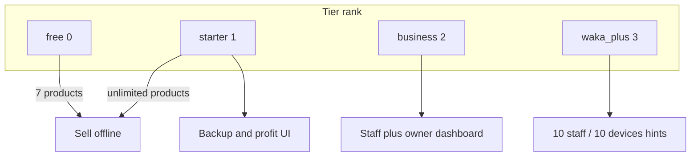

# Waka POS — Subscription Plan Redesign (Implementation Proposal)

**Status:** Implemented in app (May 2026). Apply migration `066_subscription_plan_repackaging.sql` in Supabase before release.  
**Scope:** Reorganize plans, copy, limits, and upgrade messaging only (no new product features)  
**Related audit:** [WAKA_POS_SUBSCRIPTION_AUDIT_REPORT.md](./WAKA_POS_SUBSCRIPTION_AUDIT_REPORT.md)

---

## 1. Updated plan comparison table (target state)

| | **Free Mode** | **Starter** | **Business** | **Waka Plus** |
|---|:---:|:---:|:---:|:---:|
| **Monthly** | UGX 0 | UGX 25,000 | UGX 49,000 | UGX 99,000 |
| **Yearly** | — | UGX 250,000 | UGX 490,000 | UGX 990,000 |
| **Yearly savings** | — | **Save UGX 50,000** | **Save UGX 98,000** | **Save UGX 198,000** |
| *(vs 12× monthly)* | | 300k → 250k | 588k → 490k | 1,188k → 990k |
| **Target** | Testing, kiosks, very small shops | Boutiques, salons, mini shops, grocery | Busy shops, pharmacies, supermarkets with staff | Wholesalers, larger businesses |
| **Tagline** | Perfect for trying Waka POS and running a very small shop. | For business owners who run the shop themselves. | Manage staff, monitor sales, and grow your business. | Higher limits and priority support for larger operations. |

### Features (only what exists today)

| Capability | Free | Starter | Business | Waka Plus |
|------------|:----:|:-------:|:--------:|:-----------:|
| Sales (POS) | ✓ | ✓ | ✓ | ✓ |
| Inventory / stock | ✓ | ✓ | ✓ | ✓ |
| Customers | ✓ | ✓ | ✓ | ✓ |
| Debt tracking (sell + list) | ✓ | ✓ | ✓ | ✓ |
| Receipts (print/share) | ✓ | ✓ | ✓ | ✓ |
| Offline mode (local save) | ✓ | ✓ | ✓ | ✓ |
| Basic reports (today/week/month) | ✓ | ✓ | ✓ | ✓ |
| Suppliers & restock | ✓* | ✓ | ✓ | ✓ |
| **Max products** | **7** | Unlimited | Unlimited | Unlimited |
| **Devices** | 1 | 1 | 3 | 10 |
| **Users** | 1 (owner only) | 1 (owner only) | 3 staff | 10 staff |
| Profit report (`/office/profit`, profit blocks in reports) | ✗ | ✓ | ✓ | ✓ |
| Backup & restore (export/import + cloud snapshot UI) | ✗ | ✓ | ✓ | ✓ |
| Staff accounts + POS staff switch | ✗ | ✗ | ✓ | ✓ |
| Owner dashboard | ✗ | ✗ | ✓ | ✓ |
| Staff activity log | ✗ | ✗ | ✓ | ✓ |
| Cash history (owner) | ✗ | ✗ | ✓ | ✓ |
| Shop/receipt/selling settings (full) | ✗ | ✗ | ✓ | ✓ |
| Priority support (messaging) | — | — | — | ✓ (process, not in-app SLA) |
| “Advanced backups” | — | — | — | ✓ (= same backup UI + copy; no separate product) |
| “Early access” | — | — | — | ✓ (messaging only until features ship) |

\*Suppliers/restock already available on free by **role**; Starter **marketing** can list “supplier management” as included (no new gate required unless you want to hide suppliers on free — **not recommended** for adoption).

### Explicitly removed from all plan marketing

| Removed claim | Reason |
|---------------|--------|
| Multi-branch support | Not implemented (`branchCardTitle` = coming soon) |
| MTN MoMo / Airtel in-app payment | Not implemented (`upgradePaymentPrep`) |
| “Cloud backup” on free while sync is open | Misleading — align copy with gates |
| Custom annual pricing card | Replaced by fixed yearly prices |
| Enterprise / “talk to support for annual” as primary CTA | Replaced by published yearly table |

---

## 2. “Why upgrade?” block (Upgrade page)

Add a section **above** plan cards:

| Question | Answer |
|----------|--------|
| Need more than **7 products**? | → **Starter** |
| Need **backup & restore** or **profit reports**? | → **Starter** |
| Need **staff accounts** or **staff switching** on the POS? | → **Business** |
| Need **more than one device** (up to 3)? | → **Business** |
| Need **more staff/devices** (up to 10) or **priority support**? | → **Waka Plus** |

Focus: business problems, not bullet count.

---

## 3. Yearly billing UI (replace annual request card)

**Remove** from `UpgradePage.tsx`:

- Dashed “Annual business pricing” card
- `requestAnnualPlanSupport()` button
- `upgradeAnnualPrice: "Custom yearly price"`
- `officeEnterpriseHint` on upgrade page

**Add** static subsection (still contact support to **pay**, unless MoMo ships later):

| Plan | Yearly price | Savings line |
|------|--------------|--------------|
| Starter | UGX 250,000/year | Save UGX 50,000 |
| Business | UGX 490,000/year | Save UGX 98,000 |
| Waka Plus | UGX 990,000/year | Save UGX 198,000 |

CTA remains: **Contact support to activate** (same as today’s paid activation flow). Copy change only — no payment integration.

Optional: keep `org_billing_offers` card when admin sends a custom invoice (existing `OfficePremiumSection` / upgrade banner).

---

## 4. Screens and files to update

### 4.1 Entitlements & limits (required for honest packaging)

| File | Changes |
|------|---------|
| `src/lib/subscriptionEntitlements.ts` | `FREE_PLAN_PRODUCT_LIMIT`: 5 → **7**; `maxDevicesHintForTier`: business **3**, waka_plus **10**; `maxStaffAccountsForTier`: business **3**, waka_plus **10**; add **`STARTER_PLUS`** capability/permission set for backup + profit; keep **`BUSINESS_PLUS`** for staff/owner/settings; add helpers e.g. `tierMeetsMinimum(tier, 'starter')`, `canUseBackupRestore(tier)`, `canUseProfitReports(tier)` |
| `src/lib/productPlanLock.ts` | Uses limit from entitlements (automatic once constant changes) |
| `src/pages/PosPage.tsx` | Product cap display uses 7 |
| `src/pages/StockPage.tsx` | Same; fallback `?? 10` → `?? 7` in templates |
| `src/pages/StaffAccessPage.tsx` | **Enforce** `maxStaffAccountsForTier` on create (count existing staff) |
| `src/components/layout/AppShell.tsx` | Staff switcher: keep **business+** only |
| `src/pages/ShopOnboardingPage.tsx` | Staff step visibility unchanged (business+) |

### 4.2 Gating existing surfaces (re-packaging, not new features)

| File | Gate |
|------|------|
| `src/pages/OfficeHubPage.tsx` | Backup card: **starter+**; Profit card: **starter+**; Owner/staff cards: **business+** (unchanged) |
| `src/pages/BackupSyncPage.tsx` | If tier &lt; starter: upsell panel + link `/upgrade` (read-only sync status OK on free optional) |
| `src/components/BackupSettingsCard.tsx` | Disable import/export/restore buttons when &lt; starter |
| `src/lib/cloudSnapshotSync.ts` | Optional: block **upload** snapshot on free (pull remains for recovery of existing paid downgrade — policy decision) |
| `src/pages/ReportsPage.tsx` | `canProfit` via **starter+** not role-only |
| `src/pages/ProfitPage.tsx` | Route guard or in-page upsell if &lt; starter |
| `src/pages/DashboardPage.tsx` | Activity feed stays business+ |
| `src/components/RoleProtectedRoute.tsx` | **Recommended:** wrap sensitive routes with subscription check OR duplicate upsell in page — today owners bypass nav on free |

### 4.3 Copy & pricing (i18n)

| File | Changes |
|------|---------|
| `src/lib/i18n.ts` (EN + LG sections) | All keys below |
| `src/lib/i18n/swOverrides.ts` | Mirror critical plan/upgrade strings if used |

**Price keys**

| Key | New value |
|-----|-----------|
| `planStarterPrice` | UGX 25,000 / month *(unchanged)* |
| `planBusinessPrice` | **UGX 49,000 / month** (was 56,000) |
| `planWakaPlusPrice` | **UGX 99,000 / month** (was 110,000) |

**New keys (suggested)**

- `planStarterAnnual`, `planBusinessAnnual`, `planWakaPlusAnnual`
- `planStarterAnnualSave`, `planBusinessAnnualSave`, `planWakaPlusAnnualSave`
- `upgradeWhyTitle`, `upgradeWhyMoreProducts`, `upgradeWhyBackup`, `upgradeWhyStaff`, `upgradeWhyDevices`, `upgradeWhyPlus`
- `free_blurb`, `starter_blurb`, `business_blurb`, `wakaPlus_blurb` — per spec messaging
- `free_features`, `starter_features`, `business_features`, `wakaPlus_features` — per tables in §1
- `free_note`: **1 device · 1 user · up to 7 products**
- `starter_note`: **1 device · 1 user**
- `business_note`: **Up to 3 devices · 3 staff**
- `wakaPlus_note`: **Up to 10 devices · 10 staff**
- Remove / rewrite `upgradePaymentPrep` → “Contact Waka support on WhatsApp to activate your plan.”
- `officePremiumSub`, `upgradeSub`, `upgradeTitle` — align with 7-product free + clear ladder
- `officeAnnualTitle` → “Pay yearly and save”
- Deprecate on upgrade page: `officeEnterpriseHint`, `upgradeAnnualFeature*`, `officeAnnualRequest`

### 4.4 Upgrade & account UI

| File | Changes |
|------|---------|
| `src/pages/UpgradePage.tsx` | “Why upgrade?” section; yearly savings table; remove annual-request card; show annual prices on each paid plan card; remove MoMo “coming soon” footer or replace |
| `src/components/office/OfficePremiumSection.tsx` | Treat **starter** as paid (not grouped with free in `isFree` if you want starter renewal copy later) |
| `src/pages/AccountPage.tsx` | Show monthly + optional annual list link |

### 4.5 Marketing & legal

| File | Changes |
|------|---------|
| `src/pages/MarketingHomePage.tsx` | Pricing section if present; remove unimplemented claims |
| `src/pages/public/AboutPage.tsx` | Plan limits copy |
| `src/pages/LegalPolicyPage.tsx` | Subscription section: 7 products, new prices |
| `src/pages/SupportPage.tsx` | Topics still valid |

### 4.6 Settings / misc copy

| File | Changes |
|------|---------|
| `src/pages/SettingsHubPage.tsx` | `settingsUpgradeTeaserSub` |
| `src/components/ProductLockedModal.tsx` | Body text: “7 products on Free Mode” |
| `src/pages/DashboardPage.tsx` | Any free-limit teasers |

### 4.7 Internal admin (ops must match public prices)

| File | Changes |
|------|---------|
| `supabase/migrations/066_subscription_plan_repackaging.sql` | Upsert plan prices & features JSON |
| `src/pages/InternalShopOpsPage.tsx` | Display prices if hardcoded |
| `lovable-import/lovable-ui/...` | `PLAN_PRICES` 56000→49000, 110000→99000 *(optional cleanup)* |
| `src/components/internal-admin/v2/pages/AdminBillingPage.tsx` | Labels only |

### 4.8 Do not change (unless product asks)

| Area | Note |
|------|------|
| Agent referral RPCs | Plan codes unchanged |
| `hasActivePaidSubscription` | Decide: include **starter** as paid for renewal banner |
| Trial → effective **free** | Keep or document; trials still don’t get starter gates until approved |
| Device hard enforcement | **Not in scope** without device registry (messaging + hints only) |
| `branchCardTitle` | Hide from settings hub or rewrite as internal roadmap, not plan card |

---

## 5. Database entitlement changes

### 5.1 New migration (proposed `066_subscription_plan_repackaging.sql`)

```sql
-- Upsert catalog (do not rename plan codes)
UPDATE subscription_plans SET
  monthly_price_ugx = 0, annual_price_ugx = 0,
  max_shops = 1, max_pos_users = 1,
  features = '{"tier":"free","devices":1,"staff":0,"users":1,"products":7}'::jsonb
WHERE code = 'free';

UPDATE subscription_plans SET
  monthly_price_ugx = 25000, annual_price_ugx = 250000,
  annual_savings_note = 'Save UGX 50,000 vs paying monthly',
  max_shops = 1, max_pos_users = 1,
  features = '{"tier":"starter","devices":1,"staff":0,"users":1,"products":null}'::jsonb
WHERE code = 'starter';

UPDATE subscription_plans SET
  monthly_price_ugx = 49000, annual_price_ugx = 490000,
  annual_savings_note = 'Save UGX 98,000 vs paying monthly',
  max_shops = 3, max_pos_users = 3,
  features = '{"tier":"business","devices":3,"staff":3,"users":3}'::jsonb
WHERE code = 'business';

UPDATE subscription_plans SET
  monthly_price_ugx = 99000, annual_price_ugx = 990000,
  annual_savings_note = 'Save UGX 198,000 vs paying monthly',
  max_shops = 999, max_pos_users = 10,
  features = '{"tier":"waka_plus","devices":10,"staff":10,"users":10}'::jsonb
WHERE code = 'waka_plus';
```

Also update `041_admin_vip_plan_control.sql` **free** seed `products:10` → **7** in the migration file for fresh installs (or rely on 066 only).

### 5.2 Client ↔ DB alignment

| Field | Today | Target |
|-------|-------|--------|
| App product limit | 5 | **7** |
| DB free `features.products` | 10 | **7** |
| Business monthly UGX | 56,000 | **49,000** |
| Waka Plus monthly UGX | 110,000 | **99,000** |
| Business annual UGX | 560,000 | **490,000** |
| Waka Plus annual UGX | 1,100,000 | **990,000** |
| Waka Plus device hint | 8 | **10** |
| Business staff hint | 5 | **3** |

### 5.3 Optional RPC enforcement (phase 2 — discuss before build)

| RPC / check | Purpose |
|-------------|---------|
| Staff create in `StaffAccessPage` only | Already client-side in proposal |
| `max_pos_users` on bootstrap | Server reject N+1 staff |
| Device activation RPC | Not available without new schema — **defer** |

---

## 6. Proposed entitlement model (code design)



**`STARTER_PLUS` permissions / capabilities** (new set in `subscriptionEntitlements.ts`):

- Access backup page actions (export/import/restore)
- `reports.profit` effective permission at tier ≥ starter

**`BUSINESS_PLUS`** (unchanged permissions):

- `settings.shop`, `owner.dashboard`, `owner.activity`, `owner.cash_history`

**`hasActivePaidSubscription`:** Recommend including **`starter`** so Starter customers see correct “paid plan” state in admin/renewal (optional product call).

---

## 7. Existing customer migration impact

| Segment | Count driver | Impact | Recommended policy |
|---------|--------------|--------|-------------------|
| **Free, ≤7 products** | Majority new signups | Neutral / positive | No action |
| **Free, 6–7 products** (was 5 cap) | Small | **Gain** 2 SKUs | Communicate “Free now includes 7 products” |
| **Free, 8+ products** | Had starter or legacy | **Friction** if gate enforced | Grandfather 30 days **or** auto-upgrade request to Starter |
| **Paying Starter @ 25k** | Active | Gains backup/profit gates if previously open | Positive value add |
| **Paying Business @ 56k** | Active | Price **decrease** to 49k | Honor旧 price until renewal **or** migrate to new price with thank-you message |
| **Paying Waka Plus @ 110k** | Active | Price **decrease** to 99k | Same as business |
| **DB trial / business trial** | Effective **free** in app today | No change unless trial rules updated | Document separately |
| **Agent-granted 30-day plans** | RPC | Unaffected | No migration |
| **Annual custom offers** | `org_billing_offers` | Keep valid | Do not overwrite custom amounts |

### Communication template (support)

1. **Free:** “You can run up to 7 products on Free Mode. Need more? Starter is UGX 25,000/month.”  
2. **Starter:** “Backup, profit reports, and unlimited products are included.”  
3. **Business:** “Staff and up to 3 devices — UGX 49,000/month (UGX 490,000/year saves 98,000).”  
4. **Waka Plus:** “Up to 10 staff and 10 devices — UGX 99,000/month.”

### Rollout order (recommended)

1. Deploy DB price upsert (066)  
2. Deploy client copy + upgrade page  
3. Deploy `FREE_PLAN_PRODUCT_LIMIT = 7`  
4. Deploy starter gates (backup/profit) with **7-day grace** on free backup users  
5. Enforce staff caps on Business/Waka Plus  
6. Internal admin training on new matrix  

---

## 8. Final before / after plan matrix

### 8.1 Pricing & limits

| Attribute | **Before** | **After** |
|-----------|------------|-----------|
| Free products (app) | 5 | **7** |
| Free products (DB JSON) | 10 | **7** |
| Starter monthly | 25,000 | 25,000 |
| Starter annual | 250,000 | 250,000 (save 50k **published**) |
| Business monthly | 56,000 | **49,000** |
| Business annual | 560,000 | **490,000** (save 98k) |
| Waka Plus monthly | 110,000 | **99,000** |
| Waka Plus annual | 1,100,000 | **990,000** (save 198k) |
| Business devices (hint) | 3 | 3 |
| Waka Plus devices (hint) | 8 | **10** |
| Business staff (hint) | 5 | **3** |
| Waka Plus staff (hint) | 10 | 10 |

### 8.2 Feature packaging (effective access)

| Feature | **Before (effective)** | **After (effective)** |
|---------|------------------------|---------------------|
| Sell / inventory / debt / receipts | All tiers | All tiers |
| Basic reports | All tiers | All tiers |
| Max products | Free: 5; paid: ∞ | Free: **7**; Starter+: ∞ |
| Profit reports | Role-based, all tiers | **Starter+** |
| Backup & restore UI | All owners (open) | **Starter+** |
| Staff + owner dashboard | Business+ nav | **Unchanged** (Business+) |
| Staff switch on POS | Business+ | **Unchanged** |
| Cloud sync (technical) | All supabase | **Unchanged** (market as Starter+ backup) |
| Multi-branch | Advertised on Waka Plus | **Removed from marketing** |
| MoMo payment | “Coming soon” on upgrade | **Removed** |
| Annual pricing UX | “Request annual” | **Fixed yearly prices + savings** |

### 8.3 Marketing claims (Waka Plus example)

| **Before `wakaPlus_features`** | **After `wakaPlus_features`** (suggested) |
|--------------------------------|---------------------------------------------|
| Everything in Business | Everything in Business |
| Multi-branch support | **Removed** |
| Priority support | Priority support |
| Advanced backups | Advanced backups *(same backup feature)* |
| More devices | Up to 10 devices · 10 staff |
| — | Early access to new features *(wording only)* |

---

## 9. Implementation checklist (engineering)

- [ ] Review & approve this proposal  
- [ ] Migration `066_subscription_plan_repackaging.sql`  
- [ ] `subscriptionEntitlements.ts` limits + STARTER_PLUS gates  
- [ ] `UpgradePage.tsx` layout (why upgrade + yearly savings)  
- [ ] i18n EN + LG full pass  
- [ ] Office hub + backup/profit gates  
- [ ] Staff create enforcement  
- [ ] Internal admin price displays  
- [ ] Support macro / WhatsApp scripts  
- [ ] Grandfathering rules for free shops with 8+ products  
- [ ] QA matrix: free 7 products, starter backup, business staff×3, waka plus hints  
- [ ] **Do not deploy** until product sign-off  

---

## 10. Open decisions for product sign-off

1. **Free shops with 8+ products today:** hard lock vs grace period?  
2. **Block cloud snapshot upload on free** or only hide UI?  
3. **Count `starter` in `hasActivePaidSubscription`?**  
4. **Suppliers on free:** keep open (recommended) or market as Starter-only?  
5. **Existing Business @ 56k:** auto-migrate price on next renewal or grandfather?  
6. **Hide `branchCardTitle` in settings** entirely until branches ship?  

---

*End of implementation proposal — no code or database changes applied.*
