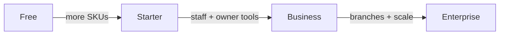

# Waka POS — Complete Feature Audit & VIP Plan Redesign (Planning)

**Date:** 2026-05-28  
**Scope:** Codebase audit + subscription strategy recommendations  
**Status:** Analysis only — **no pricing or feature changes implemented**

---

## Executive summary

Waka POS is a **feature-rich, offline-first retail POS** with cloud sync, role-based access, and a four-tier SaaS catalog (`free`, `starter`, `business`, `waka_plus`). **VIP** in product language maps to **Waka Plus** (`waka_plus`). There is **no `enterprise` plan** in code today.

**Critical findings:**

1. **Subscription gates are narrow but confusing:** Only **5 products on free**, **four permissions at business+**, and **staff switcher at business+** are reliably enforced. Most capabilities (selling, debt, reports, backup, sync) are **not tier-gated** in code.
2. **Starter is a weak paid tier:** Paying for `starter` does **not** unlock business features in the app; `trial`/`trialing` DB rows resolve to **effective free**. Marketing copy promises “unlimited products” for starter, but **business+ permissions** still require `business` or `waka_plus`.
3. **DB limits ≠ app limits:** `max_shops`, `max_pos_users` from `subscription_plans` are **loaded but not enforced** client-side. Staff creation is **not capped** after onboarding.
4. **Route vs nav mismatch:** `RoleProtectedRoute` checks **roles only**; owners on free can open `/staff-access`, `/settings/shop`, `/owner` via direct URL even when Office hub hides those cards.
5. **Free plan can be genuinely useful** if product cap is raised and cloud backup messaging matches reality (backup page is not hard-blocked today).

**Recommended direction:** Four plans (**Free → Starter → Business → Enterprise**), with **clear “money features”** (staff, cloud backup, owner intelligence, multi-device) at Business+, and **branch/multi-shop** at Enterprise. Keep core selling, receipts, and basic stock **free or starter** to drive adoption in Uganda.

---

# PHASE 1 — Complete feature inventory

Legend:

| Status | Meaning |
|--------|---------|
| **Live** | Implemented and reachable in production UI |
| **Partial** | Works but stub, admin-only, or incomplete |
| **Hidden** | In DB/code but no shop-facing UI |
| **Planned** | Copy/refs only (“coming soon”) |

**Gating legend:**

| Gate | Meaning |
|------|---------|
| **None** | Role or auth only |
| **Free cap** | 5-product limit (`FREE_PLAN_PRODUCT_LIMIT`) |
| **Business+** | `hasEffectivePermission` requires `business` or `waka_plus` |
| **Business+ UI** | Staff switcher in `AppShell` |
| **Paid DB** | Subscription row; may still resolve to effective **free** if trial/expired |

---

## 1. POS features

| Feature | Description | Status | Where in app | Subscription gated? | Current access |
|---------|-------------|--------|--------------|---------------------|----------------|
| Product grid sell | Search, categories, favorites, quick-add | Live | `/pos` `PosPage.tsx` | Free: **5 products** | All tiers; free capped |
| Draft cart | Multi-line cart, qty edit, offline persist | Live | `usePosStore`, `draftStorage.ts` | None | All |
| Line discount | Per-line price reduction / % presets | Live | `DiscountLineModal.tsx` | None | All |
| Cart-level discount | Whole-sale UGX or % off subtotal | Live | `CartSaleDiscountModal.tsx` | None | All |
| Checkout — cash | Cash tender, change due | Live | `PosPage` checkout overlay | None | All |
| Checkout — mobile/ATM | Full payment methods | Live | `PosPage` | None | All |
| Checkout — credit/debt | Customer debt on sale | Live | `finalizeDraftSale` | None | All |
| Checkout — mixed | Partial cash + debt | Live | `PosPage` | None | All |
| Receipt after sale | Print/share HTML/text receipt | Live | `receiptPrint.ts`, `PosPage` | None | All |
| Quick add product on POS | Add catalog item while selling | Live | `PosPage`, `quickAddProduct` | Free cap | All; free capped |
| POS lock | Lock terminal; PIN unlock | Live | `AppShell`, `lockPos.ts` | None | All |
| Staff session / switch | Switch cashier on device | Live | `LoginPage`, `AppShell` | **Business+ UI** | business, waka_plus |
| Shift auto-start/end | Shift on unlock/close | Live | `AppShell`, `preferences.shifts` | None | All |
| Shift close + cash count | Count vs expected cash | Live | `ShiftCloseModal.tsx` | None | All |
| Kiosk quick sell mode | Simplified sell UI pref | Live | `preferences.kioskQuickSell` | None | All |
| Barcode scan | Scanner integration | **Partial** | `barcodeAdapter.ts` stub; POS “scanner soon” | None | UI only |
| Haptics / sale sound | Native feedback | Live | `nativeFeedback.ts` | None | All |
| First-sale celebration | Onboarding moment | Live | `PosPage` | None | All |
| Virtualized product grid | Performance for large catalogs | Live | `VirtualizedProductGrid.tsx` | Free cap | Paid unlimited products |

---

## 2. Inventory features

| Feature | Description | Status | Where | Gated? | Access |
|---------|-------------|--------|-------|--------|--------|
| Stock hub | Overview, list, movements, low stock | Live | `/stock` `StockPage.tsx` | Free cap | All |
| Add product (wizard/quick) | Catalog CRUD | Live | `SimpleAddProductWizard`, stock modals | Free cap | All |
| Edit product | Price, units, packs, presets | Live | `StockProductEditModal` | Free cap | All |
| Stock adjust | Delta + movement log | Live | `adjustStock` | None | Roles: stock+ |
| Remove product | Delete from catalog | Live | `removeProduct` | Free cap | owner/manager |
| Stock movements history | Audit of in/out | Live | `StockMovementsPanel` | None | stock.view |
| Low stock alerts | Threshold warnings | Live | product `minimumStockAlert` | None | All |
| Starter product pack | Bulk add common items | Live | onboarding/stock | Free cap | All |
| Smart product guess | Category/units inference | Live | `smartProductGuess.ts` | None | All |
| Plan-locked products | Extra products visible but locked | Live | `productPlanLock.ts` | **Free cap** | free only |
| Weighted cost on purchase | COGS from restock | Live | `recordPurchase` | None | All |
| OCR stock import | Scan paper stock list | **Planned** | i18n strings only | — | Not built |

---

## 3. Customer features

| Feature | Description | Status | Where | Gated? | Access |
|---------|-------------|--------|-------|--------|--------|
| Customer directory | Name, phone, list | Live | `/customers` `CustomersPage.tsx` | None | customers.view |
| Add customer at POS | Attach to credit sale | Live | `PosPage`, `addCustomer` | None | All sellers |
| Customer on receipt | Balance snippet | Live | receipt builder | None | All |

---

## 4. Debt / credit features

| Feature | Description | Status | Where | Gated? | Access |
|---------|-------------|--------|-------|--------|--------|
| Credit sale at POS | `debtUgx` on sale | Live | `PosPage` | **None** | All tiers |
| Customer debt balance | Running balance per customer | Live | `customers.debtBalanceUgx` | None | All |
| Debt repayment | Record payment | Live | `CustomersPage`, `addDebtPayment` | **Role:** owner only (`customers.debt`) | Not tier-gated |
| Debt in reports | Today/week debt totals | Live | `ReportsPage`, `useShopReporting` | None | reports.view |
| Debt in day close | Cash vs credit summary | Live | `CloseDayPage` | None | day.close |
| Supplier debt | Pay supplier balance | Live | `SuppliersPage` | None | suppliers |

---

## 5. Reporting features

| Feature | Description | Status | Where | Gated? | Access |
|---------|-------------|--------|-------|--------|--------|
| Dashboard today card | Local + server sales summary | Live | `DashboardPage.tsx` | None | All |
| Reports — daily/weekly/monthly | Cash, debt, trends | Live | `/reports` | None | reports.view |
| Top / slow products | Merchandising insight | Live | `ReportsPage` | None | reports.view |
| Profit sections | Margin views in reports | Live | `ReportsPage` | Role only (`reports.profit`) | manager+ |
| Profit office page | Category profit | Live | `/office/profit` | Role | owner/manager/supervisor |
| Monthly business report | PDF/Word/CSV export | Live | `MonthlyReportsPage.tsx` | None | reports.view |
| Owner dashboard | Pulse, alerts, trust scores | Live | `/owner` | **Nav: Business+**; route role-only | business+ in hub |
| Staff activity feed | Audit narrative | Live | `/owner/activity` | **Nav: Business+** | business+ in hub |
| Server reporting RPCs | Cloud aggregates | Live | `061_shop_server_reporting.sql` | None (auth shop) | Supabase shops |
| Sale returns in reporting | Return-aware totals | Live | `064_reporting_sale_returns.sql` | None | Supabase |
| Expenses tracking | Supplier payments → expenses table | **Partial** | `cloudSync` pull; UI “future” banner | None | Sync only |
| Export daily report | Share text | Live | `reportExport.ts` | None | reports.view |
| Include archived toggle | Historical accuracy | Live | `IncludeArchivedFilter` | None | reports.view |

---

## 6. Cloud sync features

| Feature | Description | Status | Where | Gated? | Access |
|---------|-------------|--------|-------|--------|--------|
| Offline-first store | IndexedDB persist | Live | `localDb.ts`, `entityStore.ts` | None | All |
| Sync queue | Push sales, products, audit | Live | `syncEngine.ts`, `cloudSync.ts` | None | Supabase |
| Incremental pull | Checkpoint cursors | Live | `syncCheckpoints.ts` | None | Supabase |
| Transactional sale push | `shop_push_sale_complete` RPC | Live | `063_*.sql`, `cloudSync.ts` | None | Supabase |
| Cloud snapshot | Full shop backup to cloud | Live | `cloudSnapshotSync.ts` (8MB cap) | **Marketing:** paid; **code:** not blocked | All supabase |
| Post-auth hydrate | Pull if local empty | Live | `postAuthCloudHydrate.ts` | None | Supabase |
| Sync status UI | Header health | Live | `useSyncStatus.tsx`, `SyncHealthCard` | None | All |
| Multi-device consistency | LWW / queue retry | Live | docs + `cloudSync.ts` | None | All (conflict risk documented) |

---

## 7. Backup features

| Feature | Description | Status | Where | Gated? | Access |
|---------|-------------|--------|-------|--------|--------|
| Manual export/import | JSON envelope backup | Live | `backupEngine.ts`, `BackupSettingsCard` | None | settings |
| Auto daily backup | 28 rotating local backups | Live | `backupEngine.ts` | None | All |
| Restore from backup | Full snapshot restore | Live | `backupRestoreSession.ts` | None | settings.shop role |
| Archive old data | Move to archived tables | Live | `ArchiveDataPage`, `runDataArchive` | Nav business+ | owner |
| Data retention settings | Archive thresholds | Live | `SettingsDataRetentionPage` | Nav business+ | owner |

---

## 8. User management features

| Feature | Description | Status | Where | Gated? | Access |
|---------|-------------|--------|-------|--------|--------|
| Owner Supabase account | Email/phone signup | Live | `RegisterPage`, `useAuth` | None | — |
| Google sign-in | OAuth | Live | `useAuth` | None | — |
| Staff local accounts | PIN/password per device | Live | `StaffAccessPage` | **Onboarding:** tier staff slots; **create:** not enforced | business+ intended |
| Roles | owner, manager, supervisor, cashier, stock_keeper | Live | `permissions.ts` | None | Metadata / staff |
| POS role from metadata | `pos_role` in Supabase | Live | `resolveAuthRole` | None | — |
| Back-office PIN | Extra gate for sensitive routes | Live | `BackOfficeRouteGuard` | None | All with PIN |
| Dev role simulator | Owner-only debug | Live | `canUseDevRoleSimulator` | None | owner |
| Shop members (DB) | `shop_members` table | Live | migration `013` | **Hidden** | Not wired to client staff list |

---

## 9. Agent / referral features

| Feature | Description | Status | Where | Gated? | Access |
|---------|-------------|--------|-------|--------|--------|
| Referral code at registration | Optional validate + apply | Live | `RegisterPage`, `065_*.sql` | None | Public |
| Referral link `?ref=` | Pre-filled code | Live | `buildAgentReferralRegisterUrl` | None | Public |
| Apply referral post-login | After workspace bootstrap | Live | `applyPendingReferralForSession` | None | Referred shops |
| Marketing agent portal | Code, list, map, upgrade plans | Live | `/agent` | Agent role | Agents only |
| Agent grant starter/business/waka_plus | 30-day periods | Live | `marketing_agent_upgrade_referral_plan` | N/A | vip_agent / trial_agent |
| Internal agent admin | Create/grant/delete agents | Live | `/internal/waka/agents` | Internal staff | Waka staff |
| Referral count / commission | List + count RPC | Live | `list_agent_referrals` | None | **No commission engine in app** |

---

## 10. Subscription features

| Feature | Description | Status | Where | Gated? | Access |
|---------|-------------|--------|-------|--------|--------|
| Plan catalog | free, starter, business, waka_plus | Live | `017`, `041` migrations | — | DB |
| Free onboarding default | New shops → free active | Live | `044`, `save_owner_business_profile_bundle` | — | New signups |
| Upgrade page | Compare plans, limits | Live | `/upgrade` `UpgradePage.tsx` | — | All |
| Subscription requests | Owner requests plan change | Live | `subscription_requests` + internal approve | — | Supabase |
| Org billing offers | Custom annual pricing | Live | `org_billing_offers`, `039` | — | Per org |
| Admin VIP control | Set plan + days | Live | `admin_shop_set_subscription_plan` | Internal | Waka admin |
| Renewal countdown | VIP/Business days left | Live | `getPaidPlanRenewalCountdown` | business/waka_plus active | Paid |
| MoMo / Airtel pay | In-app payment | **Planned** | i18n “coming soon” | — | Support activation |
| Legacy plans | small_shop, wholesale, supermarket | **Hidden** | `009_seed` | — | DB only; app maps unknown → starter |
| Local demo auth | Full entitlements offline | Live | `authMode === "local"` → waka_plus | — | `/demo` |

---

## 11. Multi-shop features

| Feature | Description | Status | Where | Gated? | Access |
|---------|-------------|--------|-------|--------|--------|
| Organization + shops schema | Multi-shop data model | Live | `003_organizations_and_shops.sql` | DB `max_shops` | Not enforced UI |
| Primary shop per user | Single active shop | Live | `fetchShopSubscription.ts` | None | 1 shop UX |
| Branch switcher | Multi-location UI | **Planned** | i18n “Branches (coming soon)” | — | Not built |
| max_shops per plan | 1 / 3 / 999 in catalog | Live | `017`, `041` | **Not enforced** | — |

---

## 12. Admin features (Waka internal)

| Feature | Description | Status | Where |
|---------|-------------|--------|-------|
| Internal ops dashboard | Queues, metrics | Live | `/internal/waka` |
| Shop browser + detail | Per-shop ops | Live | `/internal/waka/shops`, `shop/:id` |
| Billing / subscriptions | Approve requests, plans | Live | `AdminBillingPage` |
| Activation queue | Business activation requests | Live | `InternalActivationOpsPage` |
| Marketing agents admin | Grant/revoke agents | Live | `InternalMarketingAgents` |
| Field map | Referral/shop pins | **Partial** | map components |
| Support tools | Password reset, recovery | Live | support panels |
| Permanent shop delete | super_admin | Live | edge function + RPC |
| Live metrics / MRR estimates | Plan stats | Live | `wakaInternalAdmin.ts` |

*Not subscription-gated — internal RBAC only.*

---

## 13. Settings features

| Feature | Description | Status | Where | Gated? |
|---------|-------------|--------|-------|--------|
| Shop profile | Name, district, phone | Live | `/settings/shop` | Nav **Business+** |
| Receipt branding | Header/footer, paper size | Live | `/settings/receipt` | Nav Business+ |
| Selling prefs | Quick sell, presets | Live | `/settings/selling` | Nav Business+ |
| Back-office PIN | PIN setup | Live | `/settings/pin` | Nav Business+ |
| Password change | Owner password | Live | `/settings/password` | Nav Business+ |
| Notifications | Prefs | Live | `/settings/notifications` | settings.view |
| Hardware / test print | Printer capabilities | Live | `/office/hardware` | Partial stub |
| Account / plan display | Current tier | Live | `/office/account` | None |
| Business activation | Request unlock | Live | `/activate` | Separate licensing gate |
| Support page | Help contact | Live | `/support` | None |

---

## 14. Security features

| Feature | Description | Status | Where |
|---------|-------------|--------|-------|
| Supabase RLS | Row-level security | Live | `008`, `029`, many migrations |
| Role permissions matrix | Client RBAC | Live | `permissions.ts` |
| Staff secret hashing | PIN/password | Live | `staffSecret.ts` |
| Auth trigger hardening | Signup safety | Live | `015_*.sql` |
| Account recovery | Phone/email recovery RPCs | Live | `046`, `049` |
| Crash reporting | Sentry integration | Live | `crashReporting.ts`, `MONITORING.md` |
| Audit logs | sale, void, discount, shift | Live | `auditLogs` in store + sync |
| Session actor | Who performed action | Live | `SessionActorContext` |
| Internal admin separation | No POS bootstrap on `/internal` | Live | `InternalAdminOutlet` |

---

## 15. Hidden / unfinished features

| Item | Evidence | Impact |
|------|----------|--------|
| Barcode scanner | `barcodeAdapter.ts` stub | Sell search manual only |
| OCR stock import | i18n only | No competitive import story |
| Branches UI | “coming soon” card | Multi-shop is DB-only |
| In-app MoMo payment | upgrade copy | Upgrades need manual support |
| `ai_stock_assistant` entitlement | `032`, `038` migrations | **Zero client usage** |
| `shop_members` cloud roles | DB exists | Staff is device-local only |
| Expenses UI | Reports “future” banner | Payments sync as expenses without UI |
| Lovable import admin | `lovable-import/` | Parallel legacy admin, not main app |
| Enterprise plan | — | Not in codebase |
| Waka Plus-only permissions | `WAKA_PLUS_ONLY` empty set | No tier above business in gates |

---

# PHASE 2 — Current VIP / subscription structure

## Plan catalog (canonical)

| Code | Display | Monthly (UGX) | Annual (UGX) | Trial days | max_shops (DB) | max_pos_users (DB) | features JSON (DB) |
|------|---------|---------------|--------------|------------|----------------|---------------------|-------------------|
| `free` | Free Mode | 0 | 0 | 0 | 1 | 1 | devices:1, staff:0, products:**10** |
| `starter` | Starter | 25,000 | 250,000 | 0 | 1 | 1 | devices:1, staff:0 |
| `business` | Business | 56,000 | 560,000 | 30 | 3 | 5 | devices:3, staff:5 |
| `waka_plus` | Waka Plus (**VIP**) | 110,000 | 1,100,000 | 0 | 999 | 9999 | devices:999, staff:999 |

**Legacy seeds (`009`):** `small_shop`, `wholesale`, `supermarket` — not used in client normalization (unknown codes → `starter`).

## Client-enforced limits (`subscriptionEntitlements.ts`)

| Limit | free | starter | business | waka_plus | local demo |
|-------|------|---------|----------|-----------|------------|
| Products | **5** | ∞ | ∞ | ∞ | ∞ |
| Staff (hint / onboarding) | 0 | 0 | 5 | 10 | ∞ |
| Devices (hint / upgrade UI) | 1 | 1 | 3 | 8 | — |
| Business+ permissions | ✗ | ✗ | ✓ | ✓ | ✓ |
| Staff switcher on POS | ✗ | ✗ | ✓ | ✓ | ✓ |
| Paid renewal countdown | ✗ | ✗ | ✓ | ✓ | — |

## Effective tier resolution (important)

| DB state | Effective tier in app |
|----------|----------------------|
| `trial` / `trialing` | **free** |
| `expired` or past `current_period_end` | **free** |
| `active` + plan code | normalized plan |
| `starter` active | starter rank but **same gates as free** for BUSINESS_PLUS |
| `hasActivePaidSubscription` | Only **business** or **waka_plus** + active |

## Marketing copy vs code (`i18n.ts`)

| Plan | Promised highlights |
|------|---------------------|
| Free | Products, sales, receipts, offline, basic reports — “1 device · no cloud backup · no staff” |
| Starter | Unlimited products, stock, debt, reports, backup support |
| Business | Staff, cloud backup, owner dashboard, multi-worker |
| Waka Plus | Multi-branch, priority support, advanced backups, more devices |

---

## Feature × plan matrix (what users get **today**)

| Feature area | Free | Starter | Business | Waka Plus (VIP) | Other |
|--------------|:----:|:-------:|:--------:|:---------------:|-------|
| Sell / checkout / debt at POS | ✓ (5 products) | ✓ unlimited products* | ✓ | ✓ | Demo: full |
| Line + cart discounts | ✓ | ✓ | ✓ | ✓ | |
| Voids & returns | ✓ | ✓ | ✓ | ✓ | |
| Receipts print/share | ✓ | ✓ | ✓ | ✓ | |
| Stock & restock | ✓ (cap) | ✓ | ✓ | ✓ | |
| Suppliers & purchases | ✓ | ✓ | ✓ | ✓ | |
| Customers & credit sales | ✓ | ✓ | ✓ | ✓ | |
| Reports (standard) | ✓ | ✓ | ✓ | ✓ | |
| Profit report sections | role | role | role | role | |
| Owner dashboard | ✗ nav | ✗ nav | ✓ | ✓ | URL bypass possible |
| Staff activity | ✗ nav | ✗ nav | ✓ | ✓ | |
| Shop/receipt settings | ✗ nav | ✗ nav | ✓ | ✓ | URL bypass |
| Staff accounts | ✗ | ✗ | ✓ (not enforced) | ✓ | |
| Staff switch on POS | ✗ | ✗ | ✓ | ✓ | |
| Cloud sync | ✓** | ✓** | ✓** | ✓** | **Not blocked in code |
| Local + cloud backup UI | ✓ | ✓ | ✓ | ✓ | Marketed as paid |
| Multi-branch UI | ✗ | ✗ | ✗ | ✗ (copy only) | Coming soon |
| Agent referral upgrades | — | — | — | — | Agents grant plans |
| In-app payment | ✗ | ✗ | ✗ | ✗ | Support manual |

\*Starter **marketing** says unlimited products; **BUSINESS_PLUS** features still require business tier.  
\*\*Sync runs for all Supabase shops regardless of tier.

---

# PHASE 3 — Problems with current structure

## 1. Too restricted (frustration / churn risk)

| Issue | Why it hurts (Uganda context) |
|-------|--------------------------------|
| **5 products on free** | A kiosk sells 10–30 SKUs day one; hits wall immediately |
| **Owner dashboard business-only** | Solo owners on free cannot see staff theft signals |
| **Trial → effective free** | Business trial in DB feels like bait-and-switch in app |
| **Starter paid but no business features** | Paying 25k UGX/month without staff/dashboard/cloud story |
| **“No cloud backup” on free** | Sync actually works — messaging distrust |

## 2. Should be free (adoption)

| Feature | Rationale |
|---------|-----------|
| Core sell + receipt + offline | Table stakes for APK/WhatsApp distribution |
| Credit sales + customer list | Cultural norm; blocking kills trust |
| Basic stock + low-stock alert | Needed from day 1 |
| 15–25 products on free | Typical duka size without pain |

## 3. Underpriced (revenue left on table)

| Feature | Rationale |
|---------|-----------|
| Unlimited products + full reports on starter | Should sit at business tier |
| Cloud snapshot + multi-device sync | High infra value; should be business+ |
| Owner intelligence / activity feed | Strong owner willingness to pay |
| Monthly PDF business pack | Accountant-friendly; premium |

## 4. Overexposed (paid differentiation weak)

| Feature | Rationale |
|---------|-----------|
| Full reporting on free | Little reason to upgrade |
| Debt/credit on free | OK for adoption; pair with limits later |
| Backup page ungated | Undermines “cloud backup” sell |

## 5. Unlikely to drive payment alone

| Feature | Rationale |
|---------|-----------|
| Barcode (unfinished) | Cannot sell what is not live |
| Branches (not built) | Waka Plus promises undelivered |
| AI stock assistant (DB only) | No UI |
| Device hint numbers | Not enforced |

## 6. Strong upgrade pressure (if gated properly)

| Feature | Rationale |
|---------|-----------|
| Staff accounts + switcher | Multi-cashier shops are common |
| Owner dashboard + activity | Fear of theft drives payment |
| Unlimited catalog | Supermarkets/pharmacies |
| Multi-device sync reliability | Second phone / tablet |
| Cloud backup + restore | Fear of phone loss |

## 7. Customer frustration hotspots

| Symptom | Cause |
|---------|-------|
| “I paid Starter but no staff” | Tier does not unlock BUSINESS_PLUS |
| “VIP but no branches” | Marketing overpromise |
| Locked products confusing | Can see but not sell SKUs 6+ |
| Direct URL to settings on free | Nav hides but route allows |

## Risk summary

| Risk type | Severity | Driver |
|-----------|----------|--------|
| **Adoption** | High | 5-product cap; activation friction |
| **Conversion** | High | Starter value gap; trial→free |
| **Retention** | Medium | Expired → hard free cliff without graceful downgrade |
| **Trust** | Medium | Marketing vs actual sync/backup behavior |
| **Support load** | High | Manual MoMo activation; plan confusion |

---

# PHASE 4 — Business value scoring

Scores 1–10 (10 = essential). Classification: **Core / Growth / Premium / Enterprise**.

| Feature group | Small shop | Super-market | Wholesaler | Pharmacy | Hardware | Class |
|---------------|:----------:|:------------:|:----------:|:--------:|:--------:|-------|
| Offline sell + receipts | 10 | 8 | 9 | 9 | 9 | **Core** |
| Product catalog / stock | 9 | 10 | 10 | 10 | 10 | **Core** |
| Credit/debt customers | 8 | 6 | 9 | 5 | 8 | **Core** |
| Cash change / multi-pay | 9 | 8 | 8 | 8 | 8 | **Core** |
| Line/cart discounts | 8 | 9 | 9 | 7 | 8 | **Core** |
| Voids/returns | 8 | 9 | 8 | 9 | 7 | **Core** |
| Day close / cash count | 9 | 10 | 9 | 8 | 8 | **Growth** |
| Basic reports | 8 | 9 | 9 | 8 | 8 | **Growth** |
| Staff roles + switcher | 4 | 10 | 9 | 9 | 8 | **Premium** |
| Owner dashboard/alerts | 5 | 10 | 9 | 9 | 8 | **Premium** |
| Cloud sync / backup | 6 | 10 | 10 | 9 | 9 | **Premium** |
| Supplier/restock | 7 | 9 | 10 | 8 | 10 | **Growth** |
| Profit analytics | 5 | 9 | 9 | 8 | 8 | **Premium** |
| Monthly export pack | 4 | 9 | 8 | 8 | 7 | **Premium** |
| Multi-branch | 2 | 10 | 9 | 8 | 7 | **Enterprise** |
| Barcode scanning | 5 | 10 | 8 | 10 | 9 | **Growth** |
| Agent/referral network | 6 | 5 | 6 | 5 | 5 | **Growth** |
| Internal admin/ops | 1 | 2 | 2 | 2 | 2 | **Enterprise** (Waka-only) |

---

# PHASE 5 — Recommended new subscription structure

**Rename/clarify:** Keep **Waka Plus** as premium tier OR introduce **Enterprise** for chains; below uses four customer-facing names aligned to your brief.

## FREE — “Start selling today”

**Target:** New duuka, market stall, pilot APK installs, agent referrals.

| Included | Limits |
|----------|--------|
| Unlimited sales, receipts, offline | — |
| **20 products** (raise from 5) | Soft cap with upgrade CTA |
| 1 device | Enforce later via device registry |
| Stock adjust, low stock | — |
| Customers + credit sales | Max **50 customers** optional |
| Basic reports (today/week, cash/debt) | No export pack |
| Local backup export | No cloud restore |

**Upgrade reason:** “Add more products and protect data in the cloud.”

---

## STARTER — “Growing shop” (UGX ~25k)

**Target:** Boutique, salon, mini-mart with growing SKU count.

| Included | Limits |
|----------|--------|
| Everything in Free | — |
| **Unlimited products** | — |
| Stock movements history | — |
| Debt tracking + repay (owner) | — |
| Better reports + top products | — |
| Email/support onboarding | — |

**Not included:** Staff accounts, owner dashboard, cloud restore, multi-device.

**Upgrade reason:** “Hire cashiers and monitor them from your phone.”

---

## BUSINESS — “Team shop” (UGX ~56k)

**Target:** Busy retail with 2–5 staff, owner not always on floor.

| Included | Limits |
|----------|--------|
| Everything in Starter | — |
| **3 staff accounts** (enforce) | + paid add-ons |
| **3 devices** (enforce) | |
| Owner dashboard + activity feed | — |
| Shop/receipt settings | — |
| Cloud sync + **cloud snapshot restore** | — |
| Shift close + cash variance | — |
| Profit views + monthly export | — |
| POS staff switcher | — |

**Upgrade reason:** “Second branch or more devices and priority support.”

---

## ENTERPRISE — “Chain / wholesale” (UGX ~110k+, custom)

*Maps from today’s **Waka Plus / VIP** promise.*

**Target:** Supermarkets, pharmacies, wholesalers, multi-branch.

| Included | Limits |
|----------|--------|
| Everything in Business | — |
| **Multi-branch** (when built) | e.g. 5–25 shops per org |
| **10+ staff**, **8+ devices** | Contracted |
| Priority support + SLA | — |
| Advanced backup retention | — |
| Optional: API/export, agent territory tools | Roadmap |

**Upgrade reason:** Custom pricing, dedicated onboarding, field ops.

---

## Upgrade path (natural ladder)

**Principles for Africa:**

- Let **credit and offline sell** stay low-tier (trust).
- Gate **visibility and control** (owner dashboard, staff) at Business — aligns with “fear of theft.”
- Gate **data safety** (cloud restore, multi-device) at Business — aligns with phone-loss anxiety.
- Use **annual prepay** discount (already in DB) with MoMo when live.

---

# PHASE 6 — Revenue optimization

## 1. Features that should drive upgrades

1. Unlimited products (Free → Starter)  
2. Staff accounts + POS switcher (Starter → Business)  
3. Owner dashboard + staff activity (Starter → Business)  
4. Cloud backup restore + multi-device sync (Starter → Business)  
5. Monthly accountant export pack (Business stickiness)  
6. Multi-branch (Business → Enterprise)  
7. Higher device/staff caps (Enterprise)  
8. Priority support (Enterprise)

## 2. Never lock (retention / viral growth)

- Offline selling and local save  
- Receipt generation (share/print)  
- Basic cash sale checkout  
- Credit sale capture (can limit **reporting** not capture)  
- Agent referral attribution  

## 3. Highest perceived value (Uganda)

1. **Staff monitoring** (owner dashboard)  
2. **Cloud backup** when phone dies  
3. **Unlimited products**  
4. **Debt tracking**  
5. **Daily sales summary** (already valued — TODAY card fix)  

## 4. Stickiness drivers

- Cloud snapshot + restore  
- Staff PINs and audit trail  
- Historical sales archive  
- Monthly export to accountant  
- Weighted cost / profit (once trusted)  

## 5. Retention drivers

- Data accumulated in Waka (switching cost)  
- Staff trained on POS  
- Referral/agent relationship  
- Annual billing offer  

## Top 10 features most likely to make a shop pay

| Rank | Feature | Why |
|------|---------|-----|
| 1 | Staff accounts + switcher | Extra cashiers = paid need |
| 2 | Owner dashboard | Owner away from shop |
| 3 | Unlimited products | SKU count growth |
| 4 | Cloud backup/restore | Phone loss fear |
| 5 | Staff activity / void audit | Theft suspicion |
| 6 | Multi-device sync | Tablet + phone |
| 7 | Profit/monthly reports | Tax/accountant |
| 8 | Higher reliability SLA | Busy supermarket |
| 9 | Multi-branch | Chains |
| 10 | Priority WhatsApp support | When stuck at month-end |

---

# PHASE 7 — Implementation impact (before any change)

## Database

| Change | Risk |
|--------|------|
| New `enterprise` plan row (or rename `waka_plus`) | Low if code normalized |
| Align `free.features.products` 10 → 20 with app | Low |
| Enforce `max_pos_users` / `max_shops` server-side | **Medium** — needs RPC checks on staff create, device register |
| Device registration table | **Medium** — new schema |
| Branch/shop switcher schema | **High** — greenfield UI |
| Grandfather existing subscriptions | **High** — migration script per org |
| Trial behavior: map trial to starter not free | **Medium** — changes `resolveEffectivePlanTier` |

## Frontend

| Change | Files impacted |
|--------|----------------|
| Product limit 5 → 20 | `subscriptionEntitlements.ts`, `productPlanLock`, i18n |
| Enforce staff cap | `StaffAccessPage`, `usePosStore.addStaffAccount` |
| Route guards + subscription | `RoleProtectedRoute` or wrapper using `hasEffectivePermission` |
| Block cloud restore on free | `BackupSyncPage`, `cloudSnapshotSync` |
| Starter unlock matrix | `BUSINESS_PLUS` set — split starter vs business permissions |
| Enterprise branch UI | New pages + org context |
| Upgrade/pay MoMo | `UpgradePage`, payment edge function |

## Backend (Supabase)

| Change | Notes |
|--------|-------|
| RLS policies for device limits | New |
| `shop_register_device` RPC | Count vs plan |
| `create_staff_member` cap | vs `max_pos_users` |
| Subscription webhook / payment | MoMo integration |
| Internal admin plan tools | Already in `041` |

## Migration risks

| Risk | Mitigation |
|------|------------|
| Active starter customers lose/ gain features | Grandfather table; comms in app |
| Trial users suddenly see business features | Phased rollout flag |
| Free users at 6–10 products today | One-time amnesty or hard lock with grace |
| Agent-granted 30-day plans | Keep RPC; align with new tier names |

## Existing customer impact

- **Free shops:** More products = positive; stricter cloud = negative if sync blocked.  
- **Starter paying:** Must receive **clear new value** (unlimited products only) or price drop.  
- **Business/VIP:** Mostly naming + enforcement alignment.  
- **Agents:** Upgrade RPC plan codes must stay compatible.

## Subscription compatibility

- `normalizePlanCode` fallback to `starter` for legacy codes — document mapping.  
- `hasActivePaidSubscription` should include **starter** if starter becomes true paid tier.  
- `OfficePremiumSection` treats starter as free — must update.  
- Reporting RPCs independent of plan — no change unless adding plan-gated exports server-side.

---

# Migration strategy (recommended sequence)

1. **Align truth** — Fix marketing copy vs sync; document 5 vs 10 product mismatch.  
2. **Measure** — Log product count, staff count, sync usage per tier (analytics).  
3. **Soft launch** — Raise free to 20 products; add route guards (no feature removal).  
4. **Enforce Business+** — Staff cap, cloud restore, dashboard routes.  
5. **Payments** — MoMo activation reduces support load.  
6. **Enterprise** — Ship branch MVP before selling multi-branch.  
7. **Grandfather** — 90-day legacy plan mapping for paying starter users.

---

# Appendix — Key source files

| Topic | Path |
|-------|------|
| Entitlements | `src/lib/subscriptionEntitlements.ts` |
| Permissions | `src/lib/permissions.ts` |
| Subscription context | `src/context/SubscriptionContext.tsx` |
| Upgrade UI | `src/pages/UpgradePage.tsx` |
| Plans seed | `supabase/migrations/017_*.sql`, `041_admin_vip_plan_control.sql` |
| Free onboarding | `supabase/migrations/044_*.sql` |
| Agent referrals | `supabase/migrations/057_*.sql`, `065_*.sql` |
| Pilot referral/discount | `docs/REFERRAL_DISCOUNT_PILOT_TEST_REPORT.md` |

---

*End of report — planning only. No code or pricing was changed.*
